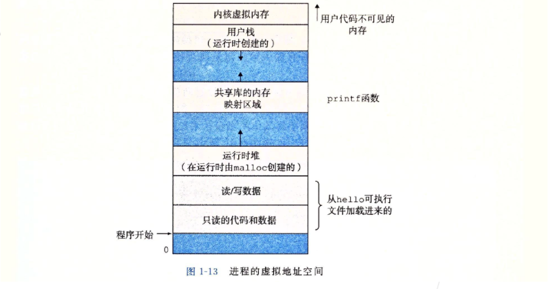

# 计算机系统漫游

**信息就是： 位数据+上下文**

表示方法基本思想：系统中的所有信息(磁盘文件、内存中的程序、内存中存放的用户数据、网络上传送的数据)都是由一串比特表示.区分不同数据对象的唯一方法就是数据对象的上下文.

- 在一串数字中，0x90表示154
- 在一串机器码中，0x90表示nop指令
- 在 一串字符串中，0x90表示一个特殊的字符

**程序被其他程序翻译成不同格式**

hello程序生命从高级C语言程序开始，C语言能被人读懂.为在系统运行hello.c程序C语言每局都必须被其他程序转化成一系列低级机器语言指令.然后指令按照一种称为可执行目标程序格式打包，并以二进制磁盘文件形式存放.目标程序也被称为可执行目标文件.

- **预处理阶段**: 预处理器(cpp)根据`#`开头的预处理命令，插入或隐藏部分代码。修改后的源代码以`.i`为后缀
- **编译阶段**:编译器(ccl)将`.i`文件编译为汇编代码`.s`文件
- **汇编阶段**:汇编器(as)读取`.s`文件并将其转换为机器语言指令，打包生成一种*可重定位目标指令*的格式，并将其保存在`.o`文件中。
- **链接阶段**:有些`.o`文件调用了某个库函数，但这个库函数的实现在另一个`.o`文件中。因此链接器(ld)需要将各种`.o`文件链接，最终生成可执行文件。

**处理器读并解释存储在内存中的指令**

在Linux运行可执行文件，将文件名输入到称为shell应用程序中.

shell是一个命令解释器，输出提示符，等待输入命令行，执行命令.如果命令行第一个单词不是内置shell命令，shell会假设是一个可执行文件名字，并加载运行这个文件.

**系统硬件组成**

1. 总线：贯穿系统的电子管道，携带信息字节并负责在各个部件传递.通常传输定长的字节块，也就是字.大多数机器字长8个字节(64位).

2. I/O设备：是系统与外界联系通道.示例系统包括4个I/O设备：用户输入的键盘鼠标，用户输出的显示器，用于长期存储数据和程序的磁盘驱动器.每个I/O设备通过控制器或适配器与I/O总线相连.控制器是I/O本身系统的主印制电路板(主板)上的芯片组.适配器是插在主板上的卡，功能在I/O总线和I/O设备间传递信息.

3. 主存：临时存储设备，在处理程序时，用来存放程序和程序处理的数据.物理上来说：主存是一组动态随机存取存储器(DRAM)芯片组成.逻辑上存储器是线性字节数组，每个字节都有唯一的地址，地址从0开始.
4. 中央处理器(CPU):是解释或执行存储在主存中的指令引擎.处理器核心是一个大小为一个字的存储设备(寄存器),称为程序计数器(PC).任何时刻，PC都指向主存中的某条机器语言指令.寄存器文件是一个小的存储设备，由一些单个字长的寄存器组成，每个寄存器有唯一的名字.ALU计算新的数据和地址值.
   - 处理器执行的操作会围绕寄存器文件(register file)和算术/逻辑单元(ALU)进行。
   - 处理器在指令的要求下可能会执行*加载、存储、操作、跳转*等操作

**运行hello程序**

1.键盘上读取hello命令：shell程序等待输入命令，shell程序将字符逐一读入寄存器，在放入内存.

2.从磁盘加载可执行文件到主内存：回车后，shell执行指令加载可执行hello文件，指令将hello文件代码和数据从磁盘直接复制到主存.(直接利用存储器存取DMA，数据可以不通过处理器直接从磁盘到达主存.)

3.输出字符串从存取器到显示器：hello代码和数据加载到主存，处理器开始执行hello程序main程序中的机器指令，在从寄存器文件复制到显示设备上.

**高速缓存**

- 处理器的运行速度很快，但数据从主存运送到CPU里却相当的慢。这其中速度可能相差百倍以上，大大拖累了CPU的速度。针对这种处理器与主存之间的差异，系统设计者引入了更小更快的存储设备——*高速缓存存储器*(cache)，这其中利用了高速缓存的*局部性原理*。

  较大的存储设备比较小的存储设备运行慢，快速的设备造价高于同类的低速设备.

**存储设备形成的层次结构**

在处理器和较大设备之间插入一个较小存储设备.每个计算机系统中的存储设备被组织成一个存储器层次结构.

存储器层次结构主要思想：上一层存储器作为低一层存储器的高速缓存.

**操作系统管理硬件**

操作系统：应用程序和硬件之间插入的软件.所有应用程序对硬件的操作必须通过操作系统.

- 操作系统的基本功能
  - 防止硬件被失控的应用程序滥用。
  - 向应用程序提供简单一致的机制来控制复杂而又通常大不相同的低级硬件设备。
- 文件是对I/O设备的抽象表示，虚拟内存是对主存和磁盘I/O设备的抽象表示。进程则是对处理器、主存和I/O设备的抽象表示。

**进程**

- 进程是操作系统对一个正在运行的程序的一种抽象。而*并发运行*，则是一个进程的指令和另一个进程的指令交错进行。
- 操作系统实现这种进程交错指令的机制称为*上下文切换*。*上下文*是操作系统保持跟踪进程运行所需的所有状态信息。

**线程**

+ 一个进程实际上可以由多个称为*线程*的执行单位组成

- 每个线程都运行在进程的上下文中，并共享同样代码和全局数据。
- 多线程之间比多进程之间更容易共享数据。线程一般来说也比进程更高效。

**虚拟内存**

操作系统为每个进程提供一个假象，每个进程独自占有整个内存空间，进程看到的内存都是一样的称为虚拟地址空间.

下图为 Linux 的虚拟地址空间，从下往上看，地址是增大的。最下面是 0 地址。

- 程序代码和数据。其中的数据包括全局变量与只读变量（例如字符串）
- 堆内存。当调用内存分配或释放函数时。对可以在运行时动态地扩展和收缩。
- 共享库。地址中间部分是一块用来存放像C标准库和数学库这样地共享库代码和数据的区域。
- 栈内存。位于用户虚拟地址空间顶部的是用户栈，编译器用它来实现函数调用。
- 内核虚拟内存。地址空间最顶部的区域是为内核保留的。不允许应用程序读/写/执行这个区域的内容。应用程序只能调用内核来执行这些操作。

**文件**

Linux系统的哲学思想是：一切皆为文件.

所有IO设备包括键盘，磁盘，显示器，甚至网络这些文件都可以看成文件，系统中所有的输入和输出都可以通过读写文件来完成.

虽然文件概念非常简单，但强.例如︰当程序员需要处理读写磁盘上的文件时，他们不需要了解具体的磁盘技术，同一个程序，可以在不同磁盘技术上的不同系统上运行

**系统之间利用网络通信**

系统来看，网络也可以视为一个IO设备.

随着互联网的发展，从一台计算机发送消息到另外一台计算机已经成为非常普遍的应用。《深入理解计算机系统》中讲述了如何使用本地计算机上的 telnet 客户端连接远程主机上的 telnet 服务器。

  由于 telnet 的安全性问题，目前 ssh 的连接方式的更加普遍。当我们在 ssh 的客户端中输人 hello 字符串并且敲下回车之后，客户端的软件就会通过网络将字符串发送到 ssh 服务端，ssh 服务端从网络端接收到这个字符串以后，会将这个字符串传递给远程主机上的 shell 程序，然后 shell 负责 hello 程序的加载，运行结果返回给 ssh 的服务端，最后 ssh 的服务端通过网络将程序的运行结果发送给 ssh 的客户端，ssh 客户端在屏幕上显示运行结果。

**并发和并行**

1.线程级并发：每个 CPU 核心可以执行两个线程，那么四个核心就可以并行的执行 8 个线程

还有一个技术就是超线程（hyperthreading），也称同时多线程：在 CPU 内部，像程序计数器和寄存器文件这样的硬件部件有多个备份，而像浮点运算部件这个样的硬件还是只有一份，常规单线程处理器在做线程切换时，大概需要20000个时钟周期，而超线程处理器可以在单周期的基础上决定执行哪一个线程，这样一来，CPU可以更好地利用它的处理资源。当一个线程因为读取数据而进人等待状态时，CPU可以去执行另外一个线程，其中线程之间的切换只需要极少的时间代价.

2.指令级并行：现代处理器可以同时执行多条指令的属性称为指佘级并行，每条指令从开始到结束大概需要20个时钟周期或者更多，但是处理器采用了非常多的技巧可以同时处理多达100条指命，因此，近几年的处理器可以保持每个周期2~4条指令的执行速率。

3.单指令多数据并行：现代处理器拥有特殊的硬件部件，允许一条指令产生多个并行的操作，这种方式称为单指令多数据。SIMD的指令多是为了提高处理视频、以及声音这类数据的执行速度，比较新的Intel以及AMD的处理器都是支持SIMD指令加速。

**虚拟机**

虚拟机是对整个计算机系统的抽象，包括操作系统，处理器以及程序.

