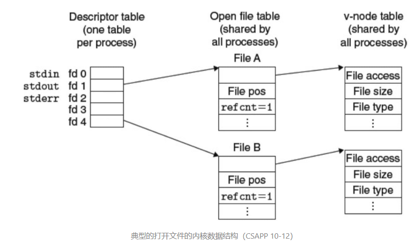
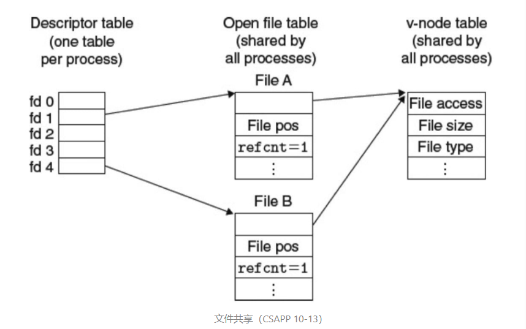
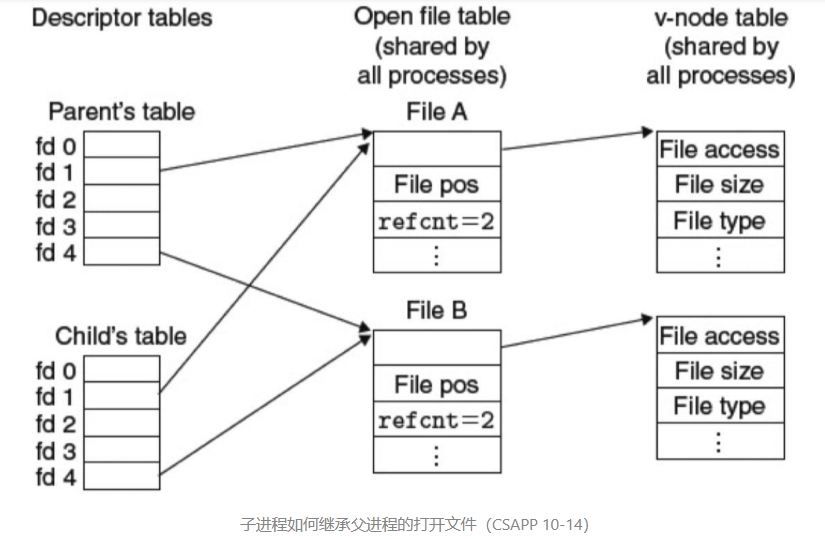

# 系统级I/O

输入和输出`I/O`是在`主存`和`外部设备`之间复制数据的过程.

+ `输入操作`是从I/O设备复制数据到主存
+ `输出操作`是从主存复制数据到I/O设备

**Unix I/O**

一个Linux文件就是m个字节序列.

所有的I/O设备都被模型化文件，而所有的输入和输出都被当做对应文件的读和写.这种将设备映射为文件的方式，允许Linux内核引出一个简单、低级的`应用接口`，称为 `Unix I/O`，这使得所有的输入和输出都能以一种统一且一致的方式来执行.

- 打开文件。一个应用程序通过要求内核打开相应的文件，来宣告它想要访问一个 I/O 设备。内核返回一个小的非负整数，叫做`描述符`，它在后续对此文件的所有操作中标识这个文件。
- Linux shell 创建的每个进程开始时都有三个打开的文件：`标准输入`（描述符为 0）、`标准输出`（描述符为 1）、`标准错误`（描述符为 2）。
- 改变当前的文件位置、读写文件、关闭文件等。

**文件**

每个Linux文件都有一个类型(type)来表明他在系统中的角色：

- `普通文件`（regular file）：包含任意数据。应用程序常常要区分`文本文件`（text file）和`二进制文件`（binary file），文本文件是只含有 ASCII 或 Unicode 字符的普通文件；二进制文件是所有其他文件。对内核而言，文本文件和二进制文件没有区别。Linux 文本文件还包含了一个文本行（text line）序列，其中每一行都是一个字符序列。
- `目录`（directory）：包含一组`链接`（link）的文件，其中每个链接都将一个`文件名`映射到一个文件（注意这个文件可能又是另一个目录）。每个目录至少有两个文件（`.`、`..`）。
- `套接字`（socket）：用来与另一个进程进行跨网络通信的文件。
- 其他类型：`命名通道`（named pipe）、`符号链接`（symbolic link）、`字符和块设备`（character and block device）。

**共享文件**

可以用许多种不同的方式共享Linux文件.内核用三个相关的数据结构来表示打开文件：

- `描述符表`（descriptor table）：每个进程都有它独立的描述符表，它的表项是由进程打开的文件描述符来索引的。每个打开的`描述符表项`指向`文件表`中的一个`表项`。
- `文件表`（file table）：打开文件的集合是由一张文件表来表示的，所有的进程共享这张表。每个文件表的表项组成包括当前的文件位置、引用计数（reference count），以及一个指向 v-node 表中对应表项的指针。关闭一个描述符会减少相应的文件表项中的引用次数。当引用次数为零时，内核会删除这个文件表表项。
- `v-node 表`（v-node table）：同文件表一样，所有的进程共享这张 v-node 表。每个表项包含了 stat 结构中的大多数信息，包括 `st_mode` 和 `st_size` 成员。

在这个示例中，两个描述符引用不同的文件，没有共享。

多个描述符也可以通过不同的文件表表项目来引用同一个文件。例如，如果以同一个 filename 调用 open 函数两次。`关键思想`是每个描述符都有它自己的文件位置，所以对不同描述符的读操作可以从文件的不同位置获取数据。

这个例子展示了两个描述符通过两个打开文件表表项共享同一个磁盘文件。

我们也可以理解父子进程是如何共享文件的。假设在调用 fork 之前，父进程有如图 10-12 所示的打开文件。然后，图 10-14 展示了调用 fork 后的情况。子进程有一个父进程描述符表的`副本`。父子进程共享相同的打开文件表集合，因此共享相同的文件位置。一个很重要的结果是，在内核删除相应文件表表项之前，父子进程必须都关闭了它们的描述符。

**标准I/O**

C 语言定义了一组高级输入输出函数，称为`标准 I/O 库`，为程序员提供了 `Unix I/O` 的较高级别的替代。标准 I/O 库将一个打开的文件模型化为一个`流`。对于程序员而言，一个流就是一个指向 `FILE` 类型的结构的`指针`。每个 ANSI C 程序开始时都有三个打开的流 `stdin`、`stdout` 和 `stderr`。