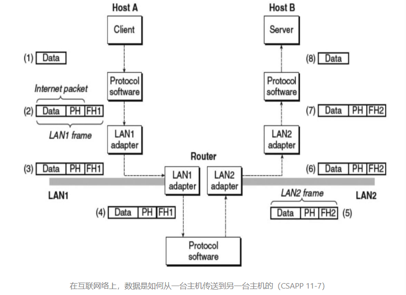
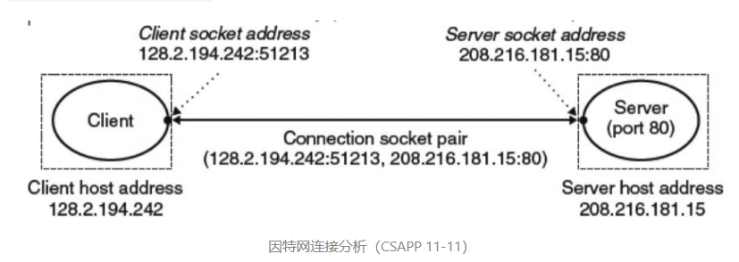
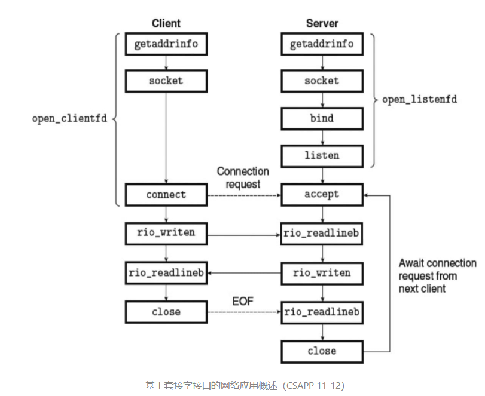

# 网络编程

**客户端-服务器编程模型**

每个网络应用都是基于`客户端-服务器`模型的.采用这个模型一个应用是由一个服务器进程和一个或多个客户端进程组成.服务器管理某种资源，并且通过操作这种资源为它的客户端提供某种服务.

客户端-服务器模型中的基本操作是事务.该事务，没有数据库事务的任何特性.一个客户端-服务器事务由四步组成：

1. 当一个客户端需要服务时，它向服务器发送一个`请求`，发起一个`事务`。
2. 服务器收到`请求`后，解析它，并以适当的方式操作它的`资源`。
3. 服务器给客户端发送一个`响应`，并等待下一个`请求`。
4. 客户端收到`响应`并处理它。

**注意：**认识到客户端和服务器是`进程`，而不是常提到的机器或者主机，这是很重要的。

**网络**

如果不同的网络有不同的帧大小的最大值，该怎么办？路由器如何知道该往哪里转发帧呢？当网络拓扑变化时，如何通知路由器呢？如果一个包丢失了又会如何呢？虽然如此，这个示例抓住了互联网络思想的精髓，`封装是关键`。

**全球IP因特网**

全球 IP 因特网是最著名和最成功的互联网络实现。

因特网的客户端和服务器混合使用`套接字接口`函数和 `Unix I/O` 函数来进行通信。通常将`套接字接口`函数实现为`系统调用`，这些系统调用会陷入内核，并调用各种内核模式的 TCP/IP 函数。

**IP地址**

一个 IP 地址是一个 32 位无符号整数。网络程序将 IP 地址存放在 IP 地址结构中。

~~~c++
/* IP address structure */
struct in_addr 
{
  uint32_t s_addr; /* Address in network byte order (big-endian) */
};
~~~

把一个标量地址存放在结构中，是套接字接口早期实现的不幸产物。为 IP 地址定义一个标量类型应该更有意义，但是现在更改已经太迟了。TCP/IP 为任意整数数据项定义了统一的`网络字节顺序`（network byte order）（大端字节顺序），即使主机字节顺序（host byte order）是小端法。

**套接字接口**

一个套接字是链接的一个断点。每个套接字都有相应的`套接字地址`，是由一个因特网地址和一个 16 位的整数`端口`组成的，用`地址: 端口`来表示。

当客户端发起一个连接请求时，客户端套接字地址中的端口是由内核自动分配的，称为`临时端口`（ephemeral port）。然而，服务器套接字地址中的端口号通常是某个`知名端口`，是和这个服务对应的，记录在 `/etc/services`。

一个连接是由它两端的套接字地址唯一确定的。这对套接字地址叫做`套接字对`（socket pair），由元组表示：`(cliaddr:cliport, servaddr:servport)`。

**起源**

从 Linux 内核的角度来看，一个套接字就是通信的一个端点。从 Linux 程序的角度来看，套接字就是一个有相应描述符的打开文件。

~~~c++
/* IP socket address structure */
struct sockaddr_in {
  uint16_t        sin_family;   /* Protocol family (always AF_INET) */
  uint16_t        sin_port;     /* Port number */
  struct in_addr  sin_addr;     /* IP address */
  unsigned char   sin_zero[8];  /* Pad to sizeof(struct sockaddr) */
};

/* Generic socket address structure (for connect, bind, and accept) */
struct sockaddr {
  unit16_t        sa_family;    /* Protocol family */
  char            sa_data[14];  /* Address data */
};

/* For casting */
typedef struct sockaddr SA;
~~~

定义套接字函数要求一个指向通用 sockaddr 结构的指针，然后要求应用程序将与协议特定的结构的指针强制转换成这个通用结构。