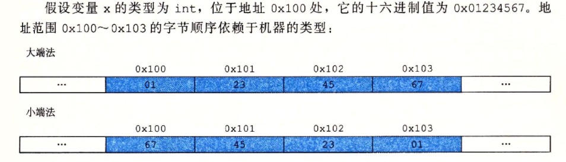
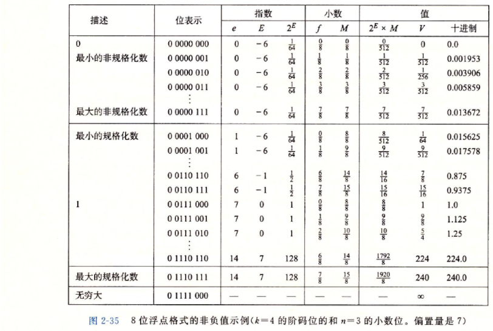

# 信息的表示和处理

**字节顺序**

字节顺序分为*大端序*和*小端序*。大多数机器使用的都是小端序。

**补码**

- 为了在正数的基础上实现负数的表达，将数据的最高位设置为符号位。当符号位为0时，当前数据表示为正数；当符号位为1时，当前数据表示为负数。
- 故以32位int类型为例，其正数范围为`0x00000001 ~ 0x7fffffff`；负数范围为`0x80000000~0xffffffff`.取值范围为`-2147483648~2147483647`.

+ 取值范围不是对称的，负数的范围比正数的范围大一。故在int类型中，不是所有的负数都存在其相反数。

**有符号整数和无符号整数**

- 通过强制类型转换来转换无符号/有符号类型，其数据的**位值不变**，但改变了**解释这些位的方式**。

**IEEE浮点表示**

- 二进制小数表示的例子: 0.00112=0.1875100.00112=0.187510
  - 0.00112=0×0.12+0×0.012+1×0.0012+1×0.000120.00112=0×0.12+0×0.012+1×0.0012+1×0.00012
  - 0.187510=0×0.510+0×0.2510+1×0.12510+1×0.0625100.187510=0×0.510+0×0.2510+1×0.12510+1×0.062510
  - 二进制与十进制之间的关系是一一对应的

- IEEE浮点标准用V=(−1)s×M×2EV=(−1)s×M×2E的形式来表示一个浮点数：
  - 符号(sign)，ss决定这数是正数还是负数。
  - 尾数(significand)，M是一个二进制小数。
  - 阶码(exponent)， EE的左右就是为浮点数加权，这个权重是2E2E（阶码可为负）

+ 浮点数的位级表示方式

~~~c++
float:
位序号：   31 | 30           23 | 22                           0 |
        +-------------------------------------------------------+
位表示： |  s |     exp         |       frac                     |
        +-------------------------------------------------------+

double:
位序号：   63 | 62    52 | 51                                  0 |
        +-------------------------------------------------------+
位表示： |  s |     exp  |                frac                   |
        +-------------------------------------------------------+
~~~

+ 浮点数中的阶码并非真正的2exp2exp，而是需要减去一个偏移。该偏移为offset=2n−1−1offset=2n−1−1，其中n为阶码位数。真正的阶码为2exp−offset

~~~c++
// float类型
int offset = pow(2, 7) - 1;
int trueExp = exp - offset;
~~~

浮点数编码的值有4钟不同的情况

- **规格化** 的。exp != 0 && exp != 255
- **非规格化** 的。exp == 0
- 特殊情况
  1. **无穷大** 。exp == 255 && frac == 0

+ 尽管浮点数可表达的范围较大，但当浮点数越来越大时，其精度会越来越小；当浮点数越来越小时，其精度也会越来越大。不管精度如何变化，这其中始终存在一个范围。