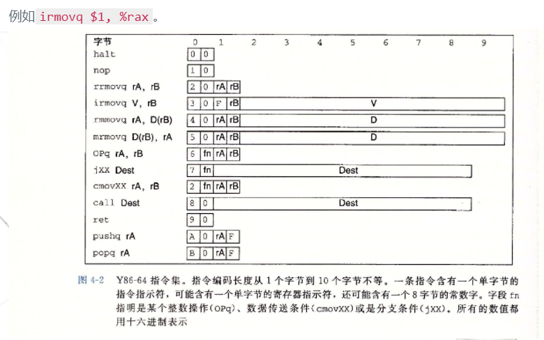
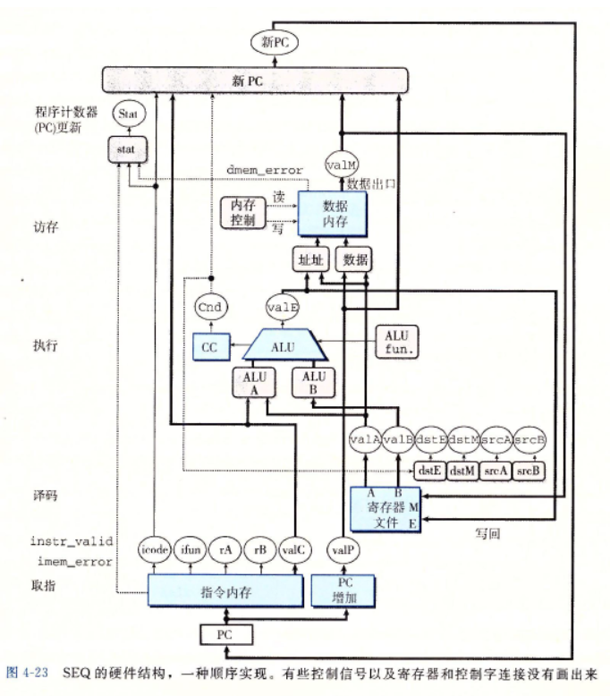
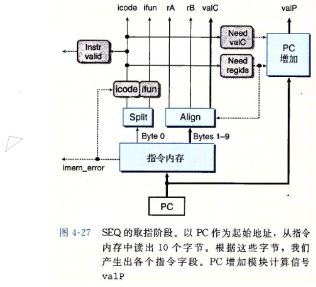
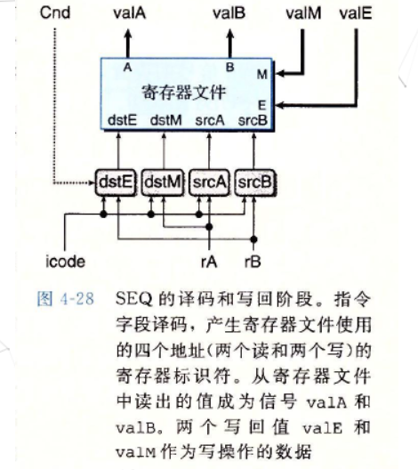
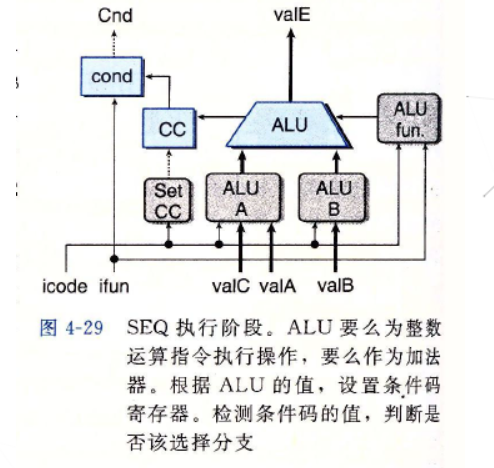
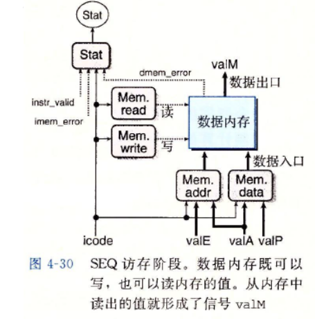
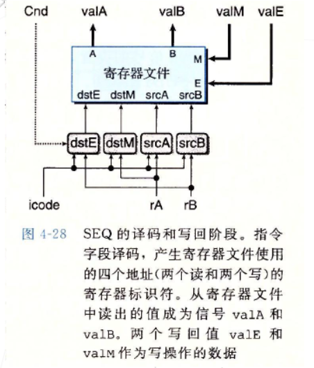
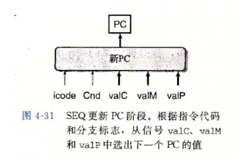
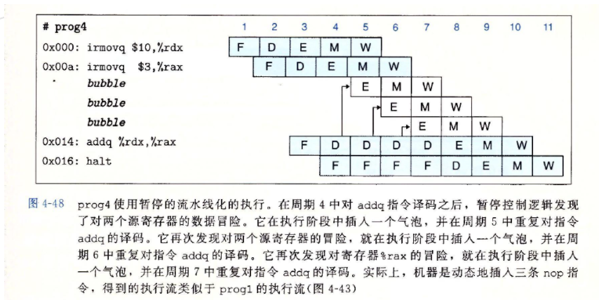
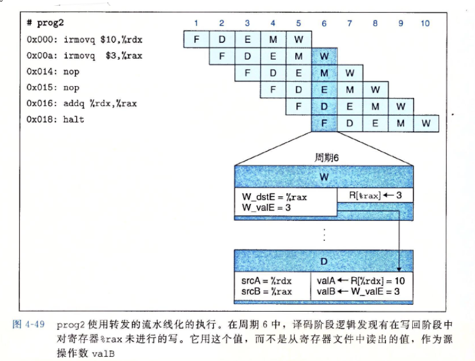

# 处理器体系结构

**Y86 -64指令集体系结构**

指令系统是计算机软件和硬件交互的接口，程序员根据指令系统设计软件，处理器根据指令系统实现硬件.

由于x86-64指令系统过于复杂，为了方便学习和理解，CSAPP数参照x86-64指令系统自定义了一个相对简单的指令系统Y86-64,该指令系统包括定义各种状态单元，指令集以及他们的编码，编程规范以及异常事件的处理这几部分.

**1.程序员可见状态**

程序员可见状态：用汇编代码写程序的人，也可是产生机器级代码的编译器，可见状态指的是每条指令都会去读取或者修改处理器某些部分：例如 **内存，寄存器，条件码，程序计数器，程序状态**.

- 可见状态
  - DMEM: 内存
  - RF: 程序寄存器
  - CC: 条件码
  - PC: 程序计数器
  - Stat: 程序状态。状态码指明程序是否运行正常或发生某个特殊事件

**Y86-64指令**

类比x86-64的指令集，Y86-64指令集做了一些相应的简化,将x86-64中的`movq`指令分成了四种不同的指令.

重定义的数据传送指令显示指明了源操作数和目的操作数的格式.指令名字的第一个字母表示了源操作数的类型，源操作数可以是立即数(i),寄存器(r),内存(m).指令名字的第二个字母指明了目的操作数的类型，目的操作数可以是寄存器和内存.

**2.3指令编码**

- 每条指令需要1~10个字节不等。

- 每条指令的第一个字节表明指示的类型。其中高4位是*代码*(code)部分，低4位是*功能*(function)部分。

  功能值只有在一组相关指令共用一个代码时才有用。

  以下是部分指令的具体字节编码

  ~~~asm
  注：方括号中的数据，是指令第一个字节的十六进制表示
  
  整数操作指令    分支指令                    传送指令
  addq [60]     jmp [70]  jne [74]    rrmovq [20] cmovne [24]
  subq [61]     jle [71]  jge [75]    cmovle [21] cmovge [25]
  andq [62]     jl  [72]  jg  [76]    cmovl  [22] cmovg  [26]
  xorq [63]     je  [73]              cmove  [23]
  ~~~

  指令的长度与指令功能相关，有些需要操作数的指令编码就更长一点。

  - 可能有附加的*寄存器指示符字节*(register specifier byte)，用于指定1~2个寄存器。

  - 有些指令需要一个附加的*常数字*(constant word)。这个立即数成为指令的某个操作数

    

**Y86-64异常**

- 在现代处理器中，当某些代码发生了某种类型的

  异常(exception)，此时处理器会执行异常处理程序。如果程序员没有手动设置异常处理程序，则CPU会执行默认的处理程序。

  > 大多数情况下默认的处理程序只会简单的关闭程序。

程序的状态码，描述程序执行的总体状态

代码值为1时：程序正常执行，其他三个代码表示程序发生了某种类型异常

代码值2：表示处理器执行了一条停止指令(halt)

代码值3：表示程序试图从非法地址读取数据或者向非法地址写入数据.

代码值4：程序遇到了非法指令.

**数字电路与处理器设计**

处理器内部，寄存器文件和算术逻辑单元(ALU)是串联的，寄存器文件的输出端口与ALU是输入端口相连.图中ALU从寄存器文件中读取操作数，然后执行减法操作，最后将计算结果写入到寄存器文件中.

寄存器文件的功能表述：

它有一个读端口和一个写端口，端口数据位宽是64位.规定读写操作共用地址线，我们定义了15个程序寄存器，所以地址线宽设计成4位即可满足寻址要求.此外还有时钟信号和复位信号以及写使能信号.

上述的定义可以用硬件描述语言(HDL)对寄存器文件进行行为级建模常用的硬件描述语言有两种Verilog和VHDL.

执行写操作需要三个参数：寄存器的ID，写入的数据，以及数据能否写入.

**逻辑门**

逻辑门是数字电路的基本计算单元，与门，或门，非门等.他们输出等于输入按位执行布尔运算.

逻辑门实际上由晶体管级的电路实现，晶体管通常只的是基于CMOS工艺的.一种叫N沟道MOS晶体管，简称N管；另外一种叫P沟道MOS晶体管，简称Р管。

N管和P管都有三个信号段，栅极，源极，漏级.可以将一个P管和一个N管串联实现非门.将二者逻辑连在一起作为输出，栅级连在一起作为输入，然后P管的源级接电源，N管的源级接地.

当输入为高电平时，N管导通，P管不导通，输出为0。

当输入为低电平，P管导通，N管不导通，输出为1。

**组合电路和HCL的布尔表达式**

在CMOS工艺中，与门和或门实现起来不如与非门和或非门高效，所以在设计CMOS电路的时候最好使用与非门、或非门以及非门来实现，这些基本的门结构都可以P管和N管组合来实现。

寄存器文件的内部存储部件是由D触发器来实现的.

用Verilog来描述电路比逻辑门要简单的多，Verilog语言的语法跟C语言有许多类似的地方，但表达的含义与C语言有着本质的区别，Verilog程序是并行执行的，而C程序是串行执行的，所以硬件设计人员需要从电路的角度来理解Verilog语言，而不是软件的思维。

Verilog语言，首先需要搞清楚**组合逻辑电路**与**时序逻辑电路**的区别，这两种电路的主要差异在于是否含有存储单元，其中组合逻辑电路的输出值仅由当前的输入状态来决定，而时序逻辑电路的输出值不仅与当前输入的状态有关，而且与原来的状态也有关。

用Verilog做设计只用三种语句：第一个是assign语句，用于描述组合逻辑；第二个是always语句，用于描述时序逻辑，其中posedge clock表示在时钟上升汾的时候变化；最后一个是模块调用语句。学会这三种语句，所有的设计都够了。

**SEQ阶段**

所有Y86-64指令所需要的计算可以被组织成6个基本阶段，分别为**取指、译码、执行、访存、写回以及更新PC**。

1.**取指阶段**

- 以PC作为第一个字节的地址，指令内存硬件单元会一次从内存中读出10个字节。并将第一个字节分割成两个4位的数，用于计算指令（icode）和功能码(ifun)。

- PC增加硬件单元会根据当前PC以及CPU内的信号来生成下一条指令的PC。

  newPC = oldPC + 1 + r + 8i （r为当前指令是否需要寄存器指示字节，i为需要的常数字节数）

  > 注意，此时只是计算，还没有设置下一条的PC

  

2、**译码阶段**

+ 寄存器文件有两个读端口A和B，从这两个端口同时读取寄存器值valA和valB

  

3、**执行阶段**

- 执行阶段包括ALU，该单元更具`ifun`信号的设置，对输入的`aluA`、`aluB`执行特定操作。

- 指令阶段还包括条件码寄存器。每次运行时，ALU都会产生三个与条件码相关的信号——零、符号、溢出。

- 标号为`cond`的硬件单元会根据条件码和功能码来确定是否进行条件分支或条件数据传送。

  

4、**访存阶段**

+ 该阶段的任务为读写程序数据。读写的对象除了主存以外，还包括寄存器文件

  

5、**写回阶段**与译码阶段类似，都是针对寄存器文件的操作，不同的是译码阶段是读寄存器文件，写回阶段是写寄存器文件。

6、**更新PC**

+ 根据指令的类型以及是否选择分支来设置新的PC。如果没有跳转，则使用取指阶段计算出的新PC值。

  

并不是所有的指令执行都要经历这6个阶段.

**Y86-64处理器硬件结构**

**5.1取值阶段的硬件设计**

取值阶段以程序计数器PC的值作为起始地址，取指操作每次冲指令内存中读取10个字节，这是因为在取指操作前不发判断当前指令的长度，Y86-64指令系统的最长指令占10个字节，一次从内存中取出10个字节可以保证一次取指操作至少可以获得一条完整的指令.

接下来将10个字节分成两个部分，一部分1个字节，另一个部分占9个字节.标号为`split`硬件单元处理第一部分，将第一个字节分成两个部分，每一部分占4个比特位.根据指令系统的定义这两个字段分别为指令代码和指令功能，用`icode`和`ifun`表示根据`icode`可以确定当前指令的状态信息，先可以判断这条指令是否为一条合法指令，如果`icode`在0x0到0xB之间，那么这条指令就是一条合法指令，如果不是则表示当前指令属于非法指令.此外根据`icode`还可以判断当前1指令是否包含寄存器指示符字节，以及是否包含常数字节.既然通过icode可以获得当前指令的长度，那么指令内存中下一条指令的地址，就可以通过当前PC值加上当前指令的长度计算出来。

剩余9个字节是如何处理的，标号为Align的硬件单元可以产生寄存器字段和常数字段。当need_regids等于1时，表示该指令包含寄存器指示符字节，那么第一个字节将被分成两部分，每一部分占4个比特位，然后分别装人寄存器指示符rA和rB中；当need regids等于0时，表示这条指令没有寄存器指示符字节，此时rA、rB这两个字段会被置为0xF；当指令中只含有一个寄存器操作数时，同样另外一个字段也会被置为0xF.

如果该指令含有常数, Align单元还产生常数字段valC，同样需要根据信号need_regids的值来判断。当need_regids等于1时，第2字节到第9个自己表示常数字段valC；当need_regids等于0时，第1个字节到第8个字节表示常数字段valC。

**5.2译码阶段的硬件设计**

译码阶段是从寄存器文件中读取数据，在Y86-64处理器中寄存器文件有两个读端口，它支持同时进行两个读操作，两个读端口的地址输人为srcA和srcB，从寄存器文件中读出的数值通过valA和valB输出。标号为srcA和srcB的圆角矩形块可以产生寄存器的ID值，产生寄存器的ID值需要指令代码icode以及寄存器指示值rA和rB。

读取寄存器的数据，需要rA和rB比较容易理解，那么为什么还需要指令代码icode呢？

例如`push`指令，该指令的寄存器指示符中只含有目的寄存器的ID值，当执行压栈操作时，还需要获得栈顶指针`rsp`的值。不仅仅是`push`指令，实际上对于图中这四条指令，在译码阶段都是需要读寄存器rsp的内容，所以译码阶段不仅需要rA和rB信号，还需要icode信号。

**5.3执行阶段的硬件设计**

执行阶段核心部件是算术逻辑单元`ALU`,它根据指令功能`ifun`来判断对输入操作数进行何种运算，每次运行`ALU`都会产生三个与条件码相关的信号--零，符号，溢出.

不过，我们只希望ALU在执行算术逻辑指令时才会设置条件码，当ALU计算内存引用地址以及对栈进行操作时，并不会设置条件码。因此，图中Set_CC会根据指令代码icode来挫制是否要更新条件码寄存器。

标号为Cond的硬件单元会根据指令功能和条件码寄存器产生一个Cnd信号，对于跳转指令，如果cnd等于1，执行跳转；如果cnd等于0，则不执行跳转。

对于ALU，不仅可以执行算术逻辑指令，还要涉及内存地址的计算以及栈指针的增加或减少的操作。

**5.4访存阶段的硬件设计**

访存阶段的任务就是从内存中读数据或者写入内存中.

读控制块进行读操作，写控制块进行写操作.此外还有内存地址和输入数据的控制块.访存阶段的最后操作会根据图中信号来计算状态码.

**5.5 写回阶段的硬件设计**

写回阶段是将数据写入到寄存器文件.

两个写入端口为M和E，对应地址输入为dstE和dstM.注意当执行条件传送指令，写入操作还要根据执行阶段计算出的cnd信号，当条件不满足将目的寄存器设置为0xF来禁止写入寄存器文件.

**5.6更新PC阶段的硬件设计**

PC的值可能有三种情况：

1. 如果执行指令是函数调用指令Call，那么新的PC值就等于Call指令的常数字段.
2. 如果执行指令是函数返回指令ret，指令ret在访存阶段会从内存中读出返回地址，这个返回地址就是新的PC值.
3. 如果执行指令是跳转指令jxx，当cnd信号等于1满足跳转条件，新的PC值等于跳转指令的常数字段.不满足跳转指令就和其他指令一样，PC等于当前PC加上指令的长度.

**流水线冒险**

- 将流水线技术引入一个待反馈的系统，当相邻指令间存在相关时会导致问题。

  > 这里的*相关*有两种形式：
  > 1.数据相关。下一条指令会用到当前指令计算出的结果。
  > 2.控制相关。一条指令要确定下一条指令的位置。

  这些相关可能会导致流水线产生计算错误，称为冒险(hazard)。其中也分为*数据冒险*和*控制冒险*。

- 避免冒险的方式

  - 暂停(stalling)。暂停技术阻塞一组指令在它们所处的阶段，而允许其他指令继续通过流水线，直到冒险条件不再满足。其处理方法为：每次要阻塞一条指令在译码阶段，就在指令阶段插入一个气泡（bubble）。气泡类似nop指令，不会更改寄存器、内存、条件码与程序状态。

+ 转发(formarding)。将结果值直接从一个流水线阶段传到较早阶段的技术称为数据转发，也称旁路(bypassing)。

- 为了提高CPU的运行速度，应尽量避免流水线冒险