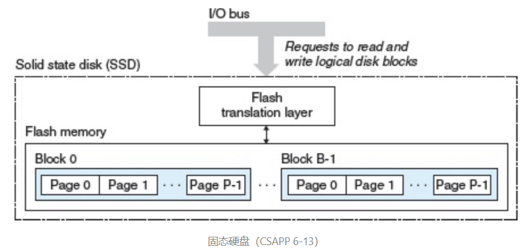
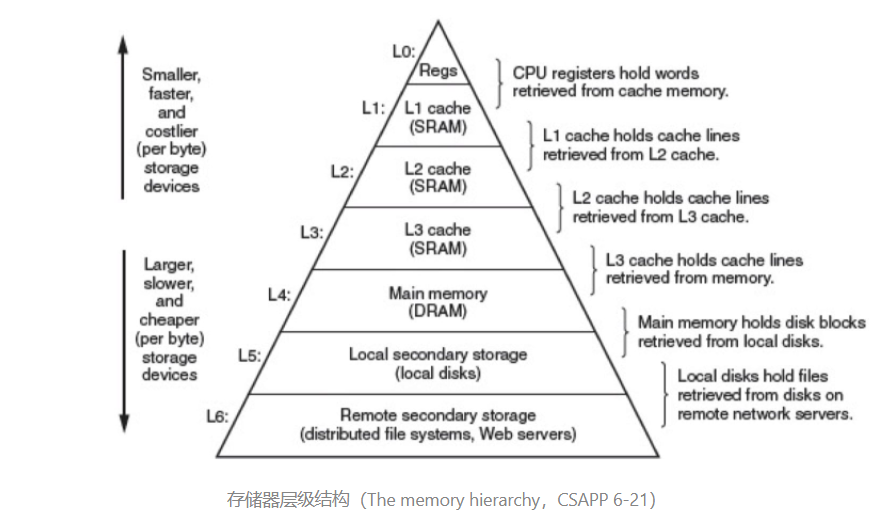
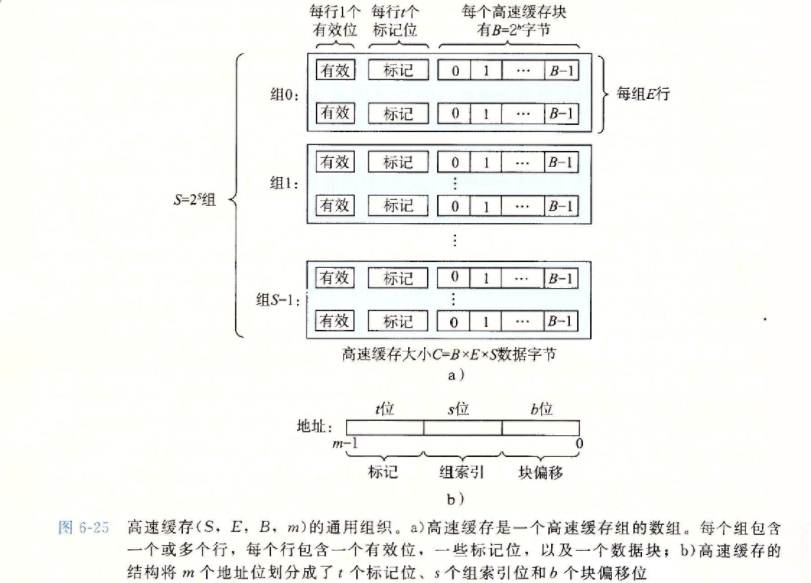
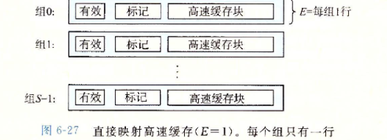
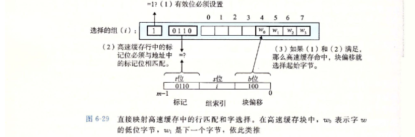
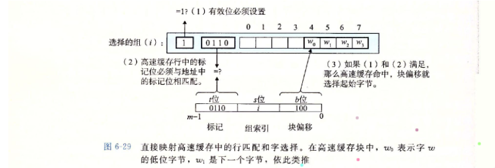
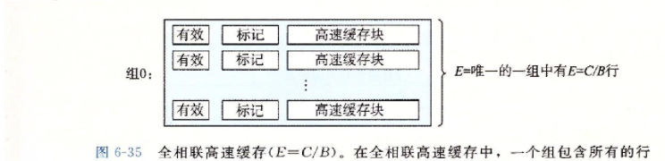
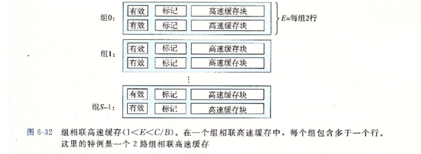
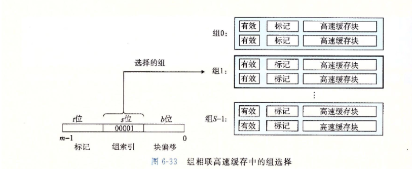
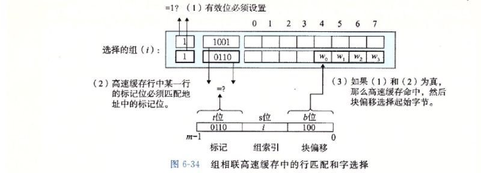

# 六、存储器的层次结构

**随机访问存储器**

随机访问存储器（Random-Access Memory，RAM）分为两类：`静态`（SRAM）的和`动态`（DRAM）的。

**磁盘**

磁盘是由`盘片`（platter）构成的，每个盘片有两面或者称为`表面`（surface），表面覆盖着磁性记录材料，每个表面上的`磁道编号`是一致的。每个表面是由一组称为`磁道`（track）的同心圆组成。每个磁道被划分为一组`扇区`（sector）。扇区之间`间隙`（gap）分隔开，这些间隙中不存储数据位。间隙存储用来标识扇区的格式化位.

**固态硬盘**

固态硬盘（Solid State Disk，SSD）是一种基于`闪存`的存储技术。一个 SSD 封装由一个或多个`闪存芯片`和`闪存翻译层`（flash translation layer）组成，`闪存芯片`代替传统磁盘中的机械驱动器，而`闪存翻译层`是一个硬件 / 固件设备，扮演与磁盘控制器相同的角色，将对`逻辑块`的请求翻译成对底层物理设备的访问。

**存储器的层次结构**

**1. 局部性**

+ 一个良好的计算机程序通常具有良好的局部性
+ 程序倾向于引用临近与其他最近引用过的数据项的数据，或者最近引用过的数据项本身.这种倾向局部性原理.
+ 局部性通常有两种不同的形式，分为时间局部性和空间局部性
  + 时间局部性：被引用过的一次内存位置很可能在不远将来被多次引用
  + 空间局部性：如果一个内存位置被引用一次，那么程序很可能在不远将来引用附近的一个内存位置

+ 具有良好局部性的程序比局部性差的程序运行更快.

**2.高速缓存**

+ Cache是一种小容量的高速缓冲存储器，由`SRAM`组成，直接制作在CPU芯片内，速度几乎和CPU一样快.
+ 程序运行，CPU使用的一部分数据/指令会预先成批拷贝在Cache中，当CPU需要从内存读/写数据或指令时先检查Cache,若有直接从Cache中读取，而不用访问主存储器.
+ 由于程序访问的局部特征，大多数情况下CPU可以直接从这个高速缓存中取得指令和数据，不必在访问主存，这大大提高了访问速度.
+ Cache的通用组织：每个存储器地址有 m 位，形成 M=2m次方 个不同的地址。这样一个机器的高速缓存被组织成一个有 S=2s次方 个高速缓存组的数组。每个组包含 E 个`高速缓存行`。每个行是由一个 B=2b 字节的`数据块`组成的，一个`有效位`指明这个行是否包含有意义的信息，还有 t = m-(b+s) 个`标记位`，它们唯一地标识存储在这个高速缓存行中的块。
+ 

+ 有效位
  + 有效位为0表示信息无效，为1表示信息有效
  + 开机或复位，所有高速缓存行有效位为0
  + 某行被替换后使其为1
  + 某行被装入新块使其为1
  + 通过使v=0冲刷Cache(例如：进程切换)

Cache冲刷指令为操作系统所用，对操作系统程序员是不透明的.

**a.直接映射高速缓存**

+ 每个组只有一行的高速缓存称为直接映射高速缓存.

+ 高速缓存请求数据的流程
  + 组选择：从内存地址中的特定偏移抽出s个组索引，这些位被解释成一个对应无符号整数高速缓存组号.

+ + 行匹配：直接映射高速缓存中每组只有一个高速缓存行.如果当前行有效位已经设置，并且标记tag匹配，则缓存命中.

  + 字选择：根据后b位的块内偏移来获得所需的字

    

  + 行替换：如果缓存不命中，则需要从下一级存储层次结构中取出请求块，并驱逐并替换高速缓存行.

+ 优点：唯一映射，命中时间小
+ 缺点：缺失率高，关联度低.

**b.全相联高速缓存**

+ 全相联高速缓存是一个包含所有高速缓存行的组组成的
+ 全相联高速缓存结构简单

+ 全相联高速缓存中的行比配和子选择和上面类似，组只有一行所有默认选择组0

+ 由于全相联高速缓存电路必须并行搜索许多相匹配的标记，构成一个又快又大的相联高速缓存十分困难，而且造价昂贵.因此全相联高速缓存只适合做小的高速缓存.

例如虚拟内存系统中的翻译备用缓冲器.

**c. 组相联高速缓存**

+ 组相联高速缓存是上面两种高速缓存的结合体

+ 组相联高速缓存的组匹配

+ 组相联高速缓存的行匹配与字匹配

+ 组相联高速缓存的不命中.

  + 当数据不命中，虚替换该组中的某一行。常用替换算法有：

    + 随机替换算法（rand）
    + 先进先出算法（FIFO）
    + 最近最少用LRU
    + 最近不常用LFU

  + LRU是一张栈算法，它的命中率随组的增大而提高.

    LRU实现时，通过给每一个cache行设定一个计数器，根据计数器的值来记录主存块的使用情况.

**d. 写策略**

+ 保持Cache中的数据和主存中数据一致.

  例如当多个设备云讯访问主存，多个CPU都带有各自的Cache共享主存.

+ 写命中：要写的单元在Cache中
  + 直写：同时写Cache和主存单元.、
  + 回写：只写Cache不写主存，缺失时一次写回，每行有个修改位，大大降低主存带宽要求，但控制可能很复杂.

+ 写不命中：要写的单元不再Cache中
  + 写分配：将主存装入Cache，然后更新相应单元，利用空间局部性，单每次都要从主存中读入一个块
  + 写不分配：直接写主存单元，不把主存装入Cache.

**3.编写高速缓存友好的代码**

+ 确保代码高速缓存友好的基本方法
  + 让常见的情况运行块
  + 尽量减少每个循环内部的缓存不命中数量.

+ 编写高速缓存友好的代码的重要问题
  + 对局部变量的反复引用，因为编译器能将他们缓存在寄存器中(时间局部性)
  + 步长为1的引用模式是最好的，存储器层次结构中所有层次上缓存都是数据存储为连续的块(空间局部性)

~~~c++
#include <iostream>
#include <ctime>
using namespace std;

int main()
{
  const int m = 10000;
  const int n = 1000;
  const int testNum = 1000;
  int total = 0;
  int** nums = new int* [m];
  for (int i = 0; i < m; i++)
  {
    nums[i] = new int[n];
    for(int j = 0; j < n; j++)
      nums[i][j] = (i%10) * (j%10);
  }
  clock_t t1 = clock();
  // 高速缓存友好的代码
  total = 0;
  for (int a = 0; a < testNum; a++)
    // 索引顺序为 i,j
    for (int i = 0; i < m; i++)
      for (int j = 0; j < n; j++)
        total += nums[i][j];

  clock_t t2 = clock();
  // 高速缓存不友好的代码
  total = 0;
  for (int a = 0; a < testNum; a++)
    // 索引顺序为 j, i
    for (int j = 0; j < n; j++)
      for (int i = 0; i < m; i++)
        total += nums[i][j];

  clock_t t3 = clock();
  cout << "t1: " << t1 << " t2: " << t2 << " t3: " << t3 << endl;
  cout << "高速缓存  友好代码所需时间: " << t2 - t1 << endl;
  cout << "高速缓存不友好代码所需时间: " << t3 - t2 << endl;

  return 0;
}
~~~

