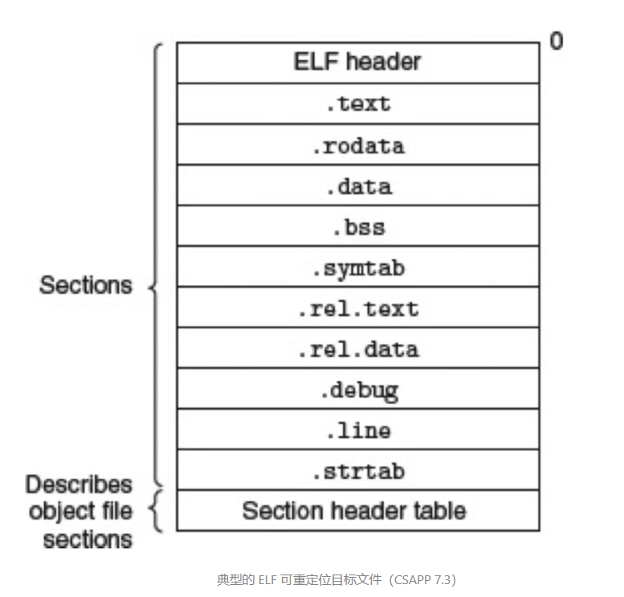
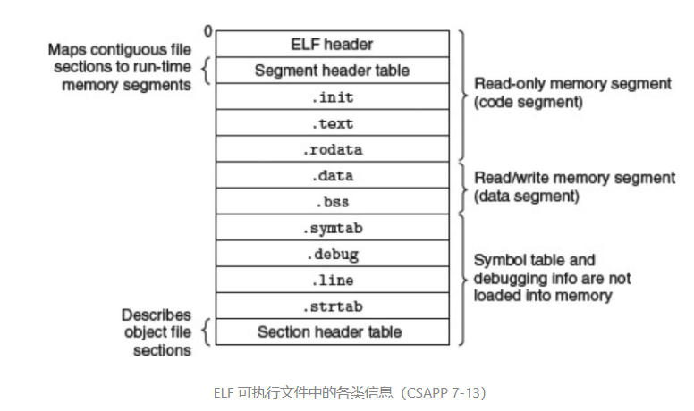
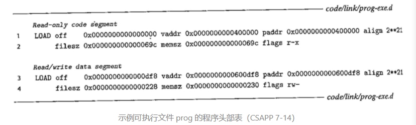
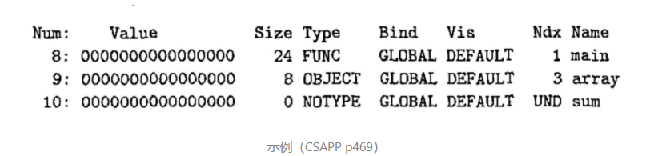
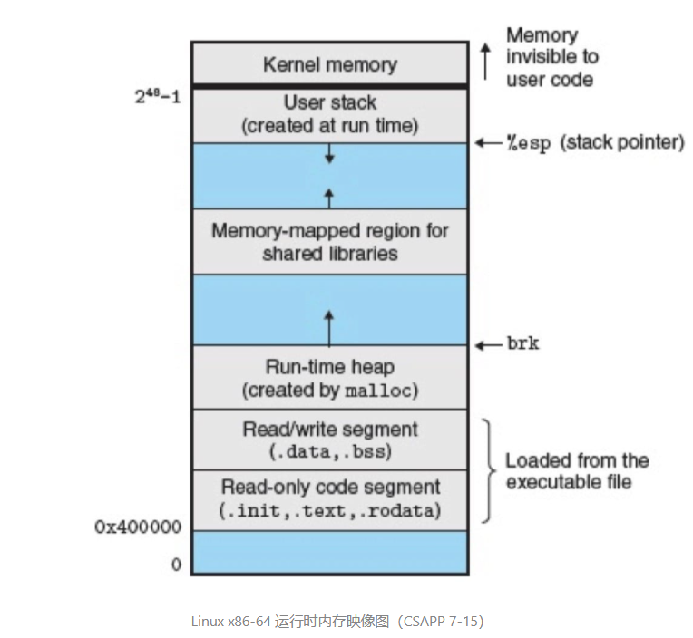
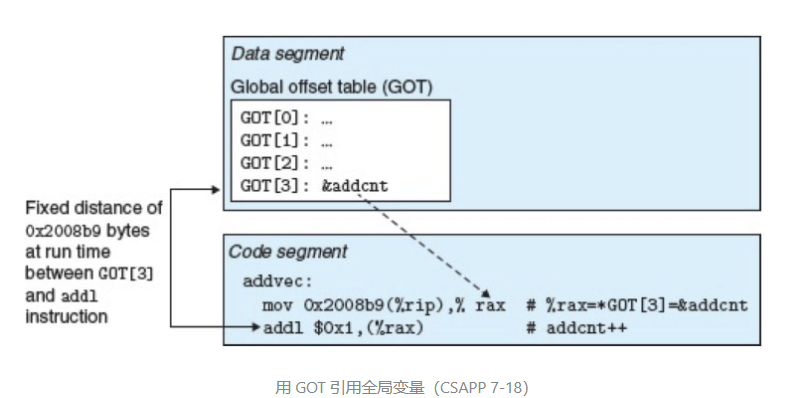

# 连接

链接：是将各种代码和数据片段收集并组合曾为一个单一文件的过程，这个文件可被加载到内存并执行.链接可以指向于编译时，也可指向于加载时，甚至可以执行于运行时.**链接是由连接器的程序自动执行的**.

以下内容基于：Linux 的 x86-64 系统和 ELF-64 标准。

## 编译器驱动程序

编译器驱动程序需要时调用语言预处理器，编译器，汇编器，链接器.如GCC驱动程序：

+ C预处理器(`cpp`)将C的源程序`main.c`翻译成ASCII码中间文件`main.i`
+ C编译器(`ccl`)将`main.i`翻译成一个ASCII汇编语言文件`main.s`
+ 汇编器(as)将`main.s`翻译成一个可重定位目标文件`main.o`
+ 连接器(`ld`)将`main.o`和`sun.o`以及一些必要的系统目标文件组合起来，创建一个可以执行目标文件.
+ shell调用操作系统中一个叫`加载器`(loader)的函数，将可执行文件中的代码和数据复制到内存，然后控制转移到这个程序的开头.

## 静态链接

静态链接：静态连接器以一组可重定位的目标文件和命令行参数作为输入生产一个完全链接的，可以加载和运行的可执行目标文件作为输出.

为了构造可以执行文件，连接器必须完成下两个任务：

+ 符号解析:将每个符号引用和一个符号关联起来(绑定到一个唯一的定义)
+ 重定位：确定每个符号的最终内存地址，并修改那些对目标的引用.

汇编器：生成符号表.

连接器：对可重定位目标文件进行符号解析和重定位.

## 目标文件

基本事实：目标文件存粹是字节块的集合，包含程序代码或者程序数据，甚至包括引导连接器和加载器的数据结构.连接器将这些块连接起来，确定被链接块运行时的位置，并且修改代码和数据块中的各种位置.

目标文件的三种形式：

+ 可重定位目标文件：于其他可充定位目标文件合并，创建一个可执行目标文件.(编译器、汇编器)
+ 可执行目标文件：可以被直接复制到内存并执行.(连接器)
+ 共享目标文件：一种特殊类型的可重定位目标文件，可以在加载或运行时被动态地加载进内存并链接.

一个目标模块就是一个字节序列，而一个目标文件就是一个以文件形式存放在磁盘中的目标模块.

各个系统的目标文件格式不同（风格相似）：

- Unix：`a.out`（沿用至今）
- Windows：`可移植可执行格式`（Portable Executable，PE）
- Mac OS：`Mach-O 格式`
- 现代 x86-64 Linux 和 Unix 系统：`可执行可链接格式`（Executable and Linkable Format，ELF）

## 可重定位目标文件

ELF头(ELF header)一个以16字节序列开始，描述生成文件系统的字大小和字节顺序.剩下的部分是帮助连接器语法分析和解析目标文件的信息：

+ ELF头的大小
+ 目标文件的类型(上面三种)
+ 及其类型(如x86-64)
+ 节头部表（section header table）的文件偏移
+ 节头部表中条目的大小、数量（该表记录着不同节的位置和大小）

一个典型的 ELF 可重定位目标文件包含下面几个节：

- `.text`：已编译程序的机器代码。
- `.rodata`：只读数据，比如 printf 语句中的格式串和 switch 语句的跳转表（Jump Table）。
- `.data`：已初始化的全局、静态变量。
- `.bss`：未初始化以及所有被初始化为 0 的全局、静态变量。这个节并不占实际的空间，仅仅是一个占位符；直到运行时才在内存中分配这些变量（初始值为 0）。
  - 它起始于 IBM 704 汇编语言中的「块存储开始（Block Storage Start）」，或者把它看成是「Better Save Space」的缩写。
- `.symtab`：符号表，它存放着程序中定义和引用的函数和全局变量的信息（实体存在于 .data）。然而，**和编译器中的符号表不同，.symtab 符号表不包含局部变量的条目**。
- `.rel.text`：一个 .text 节中位置的列表，当链接器把这个目标文件和其他文件组合时，需要修改这些位置。一般而言，任何调用外部函数或者引用全局变量的指令都需要修改。
- `.rel.data`：被模块引用或定义的所有全局变量的重定位信息。（存放重定位条目，后面会讲到）
- `.debug`：调试符号表，只有在 -g 选项调用编译器驱动程序时才能得到，其条目是程序中的局部变量和类型的定义，以及所有全局变量。
- `.line`：原始 C 程序的行号和 .text 节中机器指令之间的映射，也需要 -g 选项才能得到。
- `.strtab`：一个字符串表，其内容包括 .symtab 和 .debug 节中的符号表，以及节头部中的节名字，其就是以 null 结尾的字符串的序列。

## 可执行目标文件

可执行目标文件包含加载程序到内存并运行所需的所有信息，可分三段：

+ 代码段，只读.
+ 数据段，只写.
+ 不加载到内存的符号表和调试信息.

+ `ELF头`：描述文件的总体格式，包括程序的入口点
+ `.text`、`.rodata`、`.data`：与可重定位目标文件中的节是相似的，只是这些节已经被重定位到它们最终的运行时内存地址（所以没有`.rel` 节）。
+ `.init`：定义一个小函数叫`_init`，程序初始化会调用它

ELF可执行文件被设计很容易加载到内存，可执行文件的连续的片被映射到连续的内存段.可执行目标文件的程序头部表描述了这种映射关系.

- `off`：目标文件中的偏移。
- `vaddr/paddr`：内存地址。
- `align`：对齐要求。
- `filesz`：目标文件中的段大小。
- `memsz`：内存中的段大小。
- `flags`：运行时访问权限。

## 符号和符号表

在连接器的上下文中，有三种不同的符号：

+ `全局符号`（全局变量、函数）
+ `外部符号`（extern）
+ `局部符号`（static，注意不是函数块内的局部变量，链接器不关心这个）

符号表是由`汇编器`构造。.symtab 节中包含 ELF 符号表，其是一个包含若干条目的数组。条目的格式如下：

~~~c++
/* 符号表的条目（CSAPP 7-4） */
typedef struct {
  int   name;       /* String table offset */
  char  type:4,     /* Function or data (4 bits) */
        binding:4;  /* Local or global (4 bits) */
  char  reserved;   /* Unused */
  short section;    /* Section header index */
  long  value;      /* Section offset or absolute address */
  long  size;       /* Object size in bytes */
} Elf64_Symbol;
~~~

每个符号会被分到目标文件的某个节（如 .data 或者 .text），该节由 section 字段来表示。该字段有三个特殊的伪节（pseudosection），它们没有对应实际的条目：

- `ABS`：不需要被重定位的符号。
- `UNDEF`：未定义的符号，也就是当前目标文件的引用，在其他地方被定义。
- `COMMON`：未被分配位置的未初始化的数据目标，它与 .bss 区别是：
  - COMMON：未初始化的全局变量。
  - .bss：未初始化的静态变量，以及初始化为 0 的全局或静态变量。

## 符号解析

链接器解析符号引用的方法是：将每个引用与它输入的可重定位目标文件的符号表中的一个确定的符号定义关联起来。当编译器遇到一个不是在当前模块中定义的符号时，**会假设该符号是在其他某个模块中定义的，生成一个链接器符号表条目，并把它交给链接器处理**。

所有的编译系统都提供一种机制，将所有相关的目标模块打包成为一个单独的文件，称为`静态库`（static library），它可以作为链接器的的输入，然后链接器输出可执行目标文件。

在 Linux 系统中，静态库以一种称为`存档`（archive）的特殊文件格式存放在磁盘中。存档文件是一组连接起来的可重定位目标文件的集合，有一个头部用来描述每个成员目 w 文件的大小和位置，其以后缀`.a` 标识。

~~~
gcc -static -o prog2c main2.o ./libvector.a
# 等价于
gcc -static -o prog2c main2.o -L. -lvector
~~~

- `-static` 参数告诉编译器驱动程序，链接器应该构建一个完全链接的可执行目标文件，无需再进一步链接。
- `-lvector` 参数是 libvector.a 的缩写。
- `-L.` 参数告诉编译器在当前目录下查找 libvector.a。

命令行上的库和目标文件的顺序非常重要.如果定义一个符号的库出现在引用这个符号的目标文件之前，那么引用就不能被解析，链接就会失败.一般准则是将库放在命令行的几位.如果满足依赖需求，可以在命令行上重复库.

~~~
gcc goo.c libx.a liby.a libx.a
# foo.c 调用 libx.a 中的函数，libx.a 调用 liby.a 的函数，liby.a 中又调用 libx.a 的函数
# 或者将两者合并为一个单独的存档文件
~~~

## 重定位

在`链接器`完成符号解析后，链接就知道它的输入目标模块中的代码节和数据节的确切大小。在重定位这个步骤中，链接器将合并输入模块，并为每个符号分配运行时地址。重定位一般由两步完成：

+ 重定位节和符号定义

  - 将所有相同类型的节合并为同一类型的新的聚合节
- 将运行时内存地址赋值给新的聚合节，赋值给输入模块定义的每个节，以及输入模块定义的每个符号
    此时，程序中的每条指令和全局变量都有唯一的运行时内存地址了。
+ 重定位节中的符号引用
  - 修改代码节和数据节中对每个符号的引用，使得它们指向正确的运行时地址，此步依赖于可重定位目标模块中称为`重定位条目`（relocation entry）的数据结构

**可重定位条目**

当汇编器生成一个目标模块时，它并不知道数据和代码最终将放在内存中的什么位置。所以，汇编器遇到对最终位置未知的目标引用，就会生成一个`重定位条目`，告诉链接器在合并成可执行文件时如何修改这个引用。代码的重定位条目放在`.rel.text`，已初始化数据的重定位条目放在`.rel.data` 中。

~~~c++
/* ELF 重定位条目（CSAPP 7-9） */
typedef struct {
  long offset;    /* Offset of the reference to relocate */
  long type:32,   /* Relocation type */
       symbol:32; /* Symbol table index */
  long addend;    /* Constant part of relocation expression */
} Elf64_Rela;
~~~

- `offset`：需要被修改的引用的节偏移。
- `symbol`：标识被修改引用应该指向的符号。
- `type`：告知链接器如何修改新的引用。
- `addend`：符号常数，对引用值进行偏移调整。

ELF定义了32种不同重定位类型.但我们只关系最基本两种重定位类型：

+ `R_X86_64_PC32`:重定位一个使用32位PC相对地址的引用.一个PC相对地址就是距离程序计数器(PC)的当前运行值的偏移量.当 CPU 执行一条使用 PC 相对寻址的指令时，它将在指令中编码的 32 位值上加上 PC 的当前运行值，得到有效地址（如 call 指令的目标），PC 值通常是下一条指令在内存中的地址。

+ `R_X86_64_32`:重定位使用32位绝对地址的引用.通过绝对寻址，CPU直接使用在指令编码的32位值作为有效地址，不需要进一步修改.

## 加载可执行目标文件

要运行可执行目标文件 prog，我们可以在 Linux shell 的命令行中输入它的名字.

shell 通过调用某个驻留在存储器中称为`加载器`（loader）的操作系统代码来运行 prog 程序。任何 Linux 程序都可以通过调用 execve 函数来调用加载器。

每个 Linux 程序都有一个运行时内存映像。在 Linux x86-64 系统中，代码段总是从地址 `0x400000` 处开始，后面是数据段。运行时堆在数据段之后，通过调用 malloc 库往上增长。堆后面的区域是为共享模块保留的。用户栈总是从最大的合法用户地址（248 - 1）开始，向较小内地址增长。栈上的区域，从地址 `$2^{48}$` 开始，是为内核（kernel）中的代码和数据保留的，所谓内核就是操作系统驻留在内存的部分.

由于 .data 段有对齐要求，所以代码段和数据段之间是有间隙的。此外，链接器还会使用地址空间布局随机化技术（ASLR）。虽然每次程序运行时这些区域的地址都会改变，但是它们的`相对位置`是不变的。

**加载C程序的过程：**

1.在`程序头部表`的引导下，加载器将可执行文件的片复制到代码段和数据段.

+ Linux系统中的每个程序都运行在一个进程的上下文中，由自己的虚拟地址空间
+ 当shell运行一个程序时，父shell进程生产一个子进程.子进程通过调用`execve`函数调用启动加载器.
+ 加载器删除子进程现有的虚拟内存段，并创建一组新的代码，数据，堆和栈段.
+ 通过将虚拟地址空间的页映射到可执行文件的页大小的片.

2.加载器跳转到程序的入口点，就是`_start`函数的地址，这个函数就是在系统目标文件`ctrl.o`中定义的.

3.`_start`函数调用系统启动函数`_libc_start_main`,该函数定义在`lib.so`中.

4.`_libc_start_main`函数调用用户层的`main`函数，处理其返回的值，并在需要的时候返回给内核.

**注意：**加载过程中没有任何从磁盘到内存的数据复制（只是构建了引用、映射关系）。直到 CPU 引用一个被映射的虚拟页时才会进行复制，此时，操作系统利用它的页面调度机制自动将页面从磁盘传送到内存。

## 动态链接共享库

静态链接库存在的问题：

- 静态库和所有的软件一样，需要定期维护和更新。如果应用程序员需要使用一个库的最新版本，他们必须以某种方式了解到该库的更新情况，然后`显式`地将他们的程序与更新了的库重新连接。
- 几乎每个 C 程序都使用标准 I/O 函数，比如 printf 和 scanf。在运行时，这些函数的代码会被复制到每个运行进程的文本段中，会造成内存系统资源的极大浪费（内存的一个有趣的属性就是不论系统的内存有多大，它总是一个稀缺资源）。

**解决的基本思路：**当创建可执行文件时，静态执行一些链接，然后在程序加载时，动态完成链接过程.

`共享库`是一个目标模块，在运行或加载时可以加载到任意的内存地址，并和一个在内存中的程序链接起来.这个过程称为`动态链接`，在linux系统中长使用`.so`后缀来表示.微软操作系统大量的使用了共享库，他们称为`DLL`动态链接库.两种共享方式：

+ 对于一个库只有一个`.so`文件.所以引用该哭的可执行目标文件共享这个`.so`文件中的代码和数据，而不是静态库的内容那样被复制和嵌入到引用他们呢的可执行文件中.
+ 在内存中，一个共享库的`.text`节的一个副本可以被不同正在运行的进程共享.

比如，我们需要使用向量例程的共享库 `libvector.so`，我们调用编译器驱动程序，给编译器和链接器如下指令：

~~~
# 构建动态链接库 libvector.so（-fpic 指示编译器生成位置无关代码）
gcc -shared -fpic -o libvector.so addvec.c multvec.c
# 使用 libvector.so
gcc -o prog main.c ./libvector.so
~~~

链接器只是复制了一些重定位和符号表信息，它们使得运行时可以解析对 `libvector.so` 中代码和数据的引用。

**注意：**（静态）链接器（`ld`）在加载器（`execve`）`之前`，而动态链接器（`ld-linux.so`）是在加载器`之后`。

在动态链接中，`prog`程序包含一个`.interp`节，其中有动态链接器的路径名，动态链接器本身就是一个共享目标（如在 Linux 系统上的 `ld-linux.so`）。加载器会加载和运行这个动态连接器.然后动态链接器执行下面的重定位来完成链接任务：

+ 重定位`libvector.so`的文本和数据到一个内存段
+ 重定位`prog`中所有对`libvector.so`定义的符号的引用.

最后动态连接器将控制传递给应用程序.

## 运行时加载共享库

动态链接是一项强大有用的技术。下面是一些现实世界的例子：

- `分发软件`：微软 Windows 应用的开发者常常利用共享库来分发软件更新。在替换旧版本后，下一次用户在运行程序时，它将自动链接和加载新的共享库。

- `构建高性能 Web 服务器`：早期的 Web 服务器通过使用 fork 和 execve 创建一个子进程，并在该子进程的上下文中运行 CGI 程序来生成动态内容。然而，现代高性能的 Web 服务器可以使用基于动态链接的方法来生成动态内容。它将每个生成动态内容的函数打包在共享库中。当一个来自 Web 浏览器的请求到达时，服务器动态地加载和链接适当的函数，然后调用它。

Linux 系统为动态链接器提供了一个简单的接口，允许应用程序在运行时加载和链接共享库：

~~~c++
#include <dlfcn.h>
void *dlopen(const char *filename, int flag);  /* NULL if it fails */
void *dlsym(void *handle, char *symbol); /* return an address of a symbol */
int dlclose(void *handle);
const char *dlerror(void);  
~~~

## 位置无关代码(PIC)

多个进程如何共享程序的一个副本？

一种方法是给每个共享库分配一个事先预备的专用的地址空间片。但是它会造成一些严重的问题：

- 它对地址空间的使用效率不高，因为即使一个进程不使用这个库，那部分空间还是会被分配出来。
- 它难以管理，我们必须保证没有片会重叠。
- 每次当一个库修改后，我们必须确认已分配给它的片是否还适合它的大小。
- 如果创建了一个新的库，我们还必须为它寻找空间。

要避免这些问题，现代系统通过一种方式编译共享模块的代码段，使得把它们加载到内存的任何位置而无需链接器修改。使用这种方法，无限多个进程可以共享一个共享模块的代码段的单一副本（但每个进程还是有自己的读写数据块）。

可以加载而无需重定位的代码称为`位置无关代码`（Position-Independent Code，PIC）。共享库的编译必须总是使用 `-fpic` 这一选项（GCC）。

在一个 x86-64 系统中，对同一个目标模块中符号的引用是不需要特殊处理使之成为 PIC，可以用 PC 相对寻址来编译这些引用，构造目标文件时由`静态链接器`重定位。然而，对于共享模块定义的外部过程和全局变量的引用需要一些特殊的技巧。

**PIC数据引用**

编译器通过运用以下这个事实来生成对全局变量的引用：无论我们在内存中的何处加载一个目标模块（包括共享目标模块），`数据段与代码段的距离总是保持不变`。因此，代码段中任何指令和数据段中任何变量之间的距离都是一个运行时的`常量`。

编译器利用这个事实，在数据段开始的地方创建了一给表，叫做`全局偏移量表`（Global Offset Table，GOT）。在 GOT 中，每个被这个目标模块引用的全局数据目标都有一个 8 字节条目。编译器还为 GOT 中每个条目生成一个重定位记录。在加载时，动态链接器会重定位 GOT 中的每个条目，使得它包含目标的正确的绝对地址。每个引用全局目标的目标模块都有自己的 GOT。

下图展示了 `libvector.so` 共享模块的 GOT：`libvector.so` 中的 addvec 例程通过 `libvector.so` 中的 GOT 间接引用了全局变量 addcnt。这里的关键思想是：对 GOT [3] 的 PC 相对引用中的偏移量是一个运行时常量（下图中是 `0x2008b9`）。（PC 指向的是 addl 这条指令）

因为 addcnt 是由 `libvector.so` 模块定义的，编译器可以利用代码段和数据段之间不变的距离，产生对 addcnt 的直接 PC 相对引用，并增加一个重定位，让连接器在构造这个共享模块时解析它。

**PIC函数调用**

假设程序调用一个由共享库定义的函数。编译器没有办法预测这个函数的运行 d 地址，因为定义它的共享模块在运行时可以加载到任意位置。正常的办法是为该引用生成一条重定位记录，然后动态链接器在程序加载时再解析它。不过，这种方法不是 PIC，因为它需要链接器修改调用模块的代码段。GNU 编译系统使用了一种很有趣的技术来解决这个问题，称为`延迟绑定`（lazy binding），将过程地址的绑定推迟到第一次调用该过程时，能避免动态链接器在加载时进行成百上千个其实并不需要的重定位。

延迟绑定是通过两个数据结构之间简洁但又有些复杂的交互来实现的，这两个数据结构是 `GOT` 和`过程链接表`（Procedure Linkage Table，PLT）。如果一个目标模块调用定义在共享库中的任何函数，那么它就有自己的 GOT 和 PLT。GOT 是数据段的一部分，而 PLT 是代码段的一部分。

- `GOT[0]` 和 `GOT[1]` 包含动态链接器在解析函数地址时用到的信息，而 `GOT[2]` 是动态链接器在 `ld-linux.so` 模块中的入口点。其余的每个条目对应于一个被调用的函数，其地址需要再运行时被解析。
- `PLT[0]` 是一个特殊条目，它跳转到动态链接器中。`PLT[1]` 调用系统启动函数`__libc_start_mian`，它初始化执行环境并调用 `main` 函数。从 `PLT[2]` 开始的条目调用用户代码调用的函数。

两者系统工作的方式有点复杂，了解一下有这么个东西就好

## 库打桩机制

Linux 链接器支持`库打桩`（library interpositioning），它允许你截获对共享库函数的调用，取而代之执行自己的代码。使用打桩机制，你可以追踪对某个特殊库函数的调用次数，验证和追踪它的输入和输出值，或者甚至把它替换成一个完全不同的实现。

基本思想：给定一个需要打桩的`目标函数`，创建一个`包装函数`，它的原型与目标函数完全一样，然后使用某种特殊的打桩机制，欺骗系统调用包装函数而不是目标函数。包装函数通常会执行自己的逻辑，然后调用目标函数，再将目标函数的返回值传递给调用者。

打桩可以发生在编译时（.I）、链接时（–wrap f）、加载或运行运行。