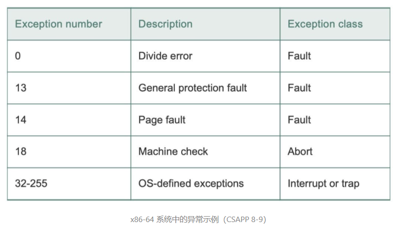
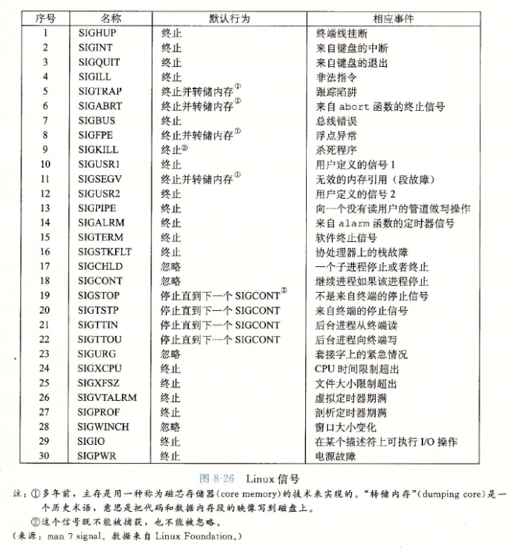

# 异常控制流

现代系统通过使控制流发生突变来做出反应.一般我们把这些突变称为`异常控制流`(`EFC`).异常控制流发生在计算机系统的各个层次.如：

+ `硬件层`：硬件检测到的事件会触发控制突然转移到异常处理程序
+ `操作系统层`：内核通过`上下文切换`将控制从一个用户进程转移到另一个用户进程.
+ `应用层`：一个进程可以发送`信号`到另一个进程，而接收者将会突然转移到它的一个`信号处理程序`.

## 异常

- 现代系统通过使控制流发生突变来对各种系统状态的变化做出反应，这种突变称为**异常控制流**(Exceptional Control Flow, ECF)。异常控制流发生在计算机系统的各个阶段，例如上下文切换、发送与接受信号，以及应用程序通过使用*陷阱*(trap)或*系统调用*(system call)的ECF形式，向操作系统请求服务。

- 在任何情况下，当CPU检测到*事件*发生时，它会通过一张叫做*异常表*(exception-table)的跳转表，跳转至处理特定异常的*异常处理程序*(exception handler)进行处理。

- 异常处理完成后，会发生以下三种情况中的一种

  - 控制流返回当前指令(即引起异常的指令，例如缺页异常)
  - 控制流返回下一条指令
  - 终止当前被中断的程序

- 异常的类别

  | 类别            | 原因              | 异步/同步 | 返回行为             |
  | :-------------- | :---------------- | :-------: | :------------------- |
  | 中断(interrupt) | 来自I/O设备的信号 |   异步    | 总是返回到下一条指令 |
  | 陷阱(trap)      | 有意的异常        |   同步    | 总是返回到下一条指令 |
  | 故障(fault)     | 潜在可恢复的错误  |   同步    | 可能返回到当前指令   |
  | 终止(abort)     | 不可恢复的错误    |   同步    | 不会返回             |

+ 中断
  - 一些I/O设备或芯片通过向CPU上的某个引脚发送信号，并将异常号放至系统总线上来触发中断。
  - 在当前指令执行完成后，CPU注意该引脚上的电压变为高电平，则获取异常号并调用中断处理程序，最后将控制流返回到下一条指令。
+ 陷阱
  - 陷阱是一种*有意*的异常，其最重要的用途是在用户程序与内核间提供一个*系统调用*接口。利用该接口可进行读/写文件，加载程序等等。
  - 执行syscall指令会导致一个异常处理程序的陷阱，该程序会解析参数并调用适当的内核程序。
+ 故障
  - 故障由错误情况引起，它可能被故障处理程序所修正。
  - 其中一个经典的故障示例是**缺页异常**。
+ 终止
  - 终止是不可恢复的致命错误造成的后果，通常是一些硬件错误

**Linux/x86-64 系统中的异常**

`0~31` 的号码对应的是由 Intel 架构师定义的异常，因此对任何 x86-64 系统都是一样的。`32~255` 的号码对应的是操作系统定义的中断和陷阱。

- `一般保护故障`：许多原因都会导致不为人知的一般保护故障（general protection fault），通常是因为一个程序引用了一个未定义的虚拟内存区域，或者是因为程序试图写一个只读的文本段。Linux 不会尝试恢复这类故障。Linux shell 通常会把这个一般保护故障报告为`段故障`（segmentation fault）。
- `机器检查`：是在导致故障的指令执行中检测到致命的硬件错误时发生的。机器检查处理程序不返回控制给应用程序。

**Linux/x86-64系统调用**

Linux 提供几百种系统调用，当应用程序想要请求内核服务时可以使用，包括读文件、写文件或是创建一个新进程。每个系统调用都有唯一的整数号，对应于一个到内核中跳转表的偏移量。

C程序用`syscall`函数可以直接调用任何系统调用.然而实际几乎没有必要这么做.对于大多数系统调用，标准 C 库提供了一组方便的`包装函数`。这些包装函数将参数打包在一起，以适当的系统调用指令陷入内核，然后将系统调用的返回状态传递回调用程序。在本书中，系统调用与这些包装函数统称为`系统级函数`。

~~~c++
int main() 
{
  write(1, "hello, world\n", 13);
  _exit(0);
}
~~~

write 函数的第一个参数发送到 stdout，第二个参数是要写的字节序列，第三个要写的是字节数。其汇编版本如下：

~~~
main:
  movq $1, %rax         # write is system call 1
  movq $1, %rdi         # Arg1: stdout has descriptor 1
  movq $string, %rsi    # Arg2: hello world string
  movq $len, %rdx       # Arg3: string length
  syscall               # Make the system call
~~~

## 进程

- **进程**(process)是*一个执行中程序的实例*。系统中的每个程序都运行在某个进程的**上下文**(context)
- 进程上下文由程序运行所需的状态组成，包括内存中的代码与数据、栈、寄存器内容、环境变量、文件描述符集合等等。
- 进程这个抽象类型提供了一种假象：程序独占CPU与内存。其中程序占用CPU的控制流称为逻辑流，注意与CPU的物理流不一样。
- 一个逻辑流的执行时间在时间上与另一个流重叠，称为*并发流*(concurrent flow)。
  多个流并发执行的一般现象称为*并发*(concurrency)。
  一个进程和其他进程轮流运行的概念称为*多任务*(multitasking)。
  一个进程执行它的控制流的一部分的每一时间段叫做*时间片*(time slice).
  如果两个流并发的运行在不同的处理器或计算机上，则这些流称为*并行流*(parallel flow)。它们**并行运行，并发执行。**
- 内核模式
  - 一个运行在内核模式的进程可以执行指令集中的任何指令，并且可以访问系统中的任何内存位置。
  - 与之相反的是，用户模式中的进程不允许执行*特权指令*(privileged instruction)，例如停止处理器，改变模式位，或清空cache等操作。同时也不允许直接访问内核区中的数据与代码，只能通过异常处理程序进入内核模式。

**进程控制**

- 进程总是处于下面三种状态之一
  - **运行**：运行中的进程正在CPU上执行或等待被执行。
  - 停止：进程的执行被挂起(suspended)，并且不会被调度。
    - `SIGSTOP, SIGTSTP, SIGTTIN, SIGTTOU`信号会使一个运行中的进程停止
    - `SIGCONT`信号会使一个暂停的程序再次开始执行。
  - 终止：进程永远的停止了。进程终止的三个原因：
    - 收到某个信号，其中该信号的默认行为是终止当前进程。
    - 从主程序返回
    - 调用exit函数。

- 回收子进程

  - 当一个进程由于某种原因终止时，该进程会被内核保存在一种已终止的状态，直到它被父进程回收(reaped)。

  - 当回收完成后，内核将子进程退出状态传递给父进程并抛弃已终止的进程。

  - 其中，一个终止但尚未被回收的进程称为*僵尸进程*(zonbie)。

  - 若父进程已经终止了，则该子进程称为孤儿进程，内核会安排init进程成为该子进程的父进程，并回收该僵尸进程。

    > init进程的pid为1，它不会终止，是所有进程的祖先。

- sleep函数会使当前进程休眠。需要注意的是，休眠的进程可能因为一个信号中断而提前返回。

## 系统调用错误处理

当 Unix 系统级函数遇到错误时，它们通常会返回 `-1`，并设置全局整数变量 `errno` 来表示什么出错了。

**进程控制**

Unix 提供了大量从 C 程序中操作进程的系统调用。

新创建的子进程几乎但不完全与父进程相同。子进程得到与父进程用户级虚拟地址空间相同的（但是独立的）一份`副本`，包括代码和数据段、堆、共享库以及用户栈。子进程还获得与父进程任何打开文件描述符相同的副本，这就意味着当父进程调用 fork 时，子进程可以读写父进程中打开的任何文件。父进程和新创建的子进程之间最大的区别在于它们有不同的 PID。

- 调用一次，返回两次
- 并发执行
- 相同但是独立的地址空间
- 共享文件
  - 父进程和子进程都把它们的输出显示在屏幕上。原因是子进程继承了父进程所有的打开文件。当父进程调用 fork 时，stdout 文件是打开的，并指向屏幕。自己成也继承了这个文件，因此它的输出也是指向屏幕的。

fork 函数是有趣的（也常常令人迷惑），因为它只被`调用一次`，却会`返回两次`（called `once`, but returns `twice`）：一次是在调用进程（父进程）中，一次是在新创建的子进程中。在父进程中，fork 返回子进程的 PID。在子进程中，fork 返回 0。

但是在 exit 函数运行之后，进程占用的资源并没有被完全释放，需要进一步的进程回收。

## 信号

- Linux*信号*(signal)是一种更高层的软件形式的异常。它允许进程和内核中断其他进程。

- 信号提供了一种机制，通知用户进程发生了这些异常。

- 以下是linux系统上支持的信号列表

  

- 传递一个信号到目的进程的步骤

  - 发送信号
    - 内核通过 更新目的进程上下文的某个状态，发送一个信号给目标进程
  - 接收信号
    - 进程可以忽略信号，终止或者通过执行信号处理程序来捕获这个信号。
    - 每个信号类型都有一个预定义的默认行为。
      - 进程终止
      - 进程终止并转储内存
      - 进程停止(挂起)直到被SIGCONT信号重启
      - 进程忽略该信号

- 信号是不排队的。如果待接受信号里已经存在当前类型的信号，则当前信号会被丢弃。

- 使用信号时，需要考虑是否存在**条件竞争**

## 非本地跳转

C 语言提供了一种用户级异常控制流形式，称为`非本地跳转`（nonlocal jump），它将控制直接从一个函数转移到另一个当前正在执行的函数，而不需要经过正常的`调用-返回栈规则`。非本地跳转是通过 `setjump` 和 `longjump` 函数来提供的。