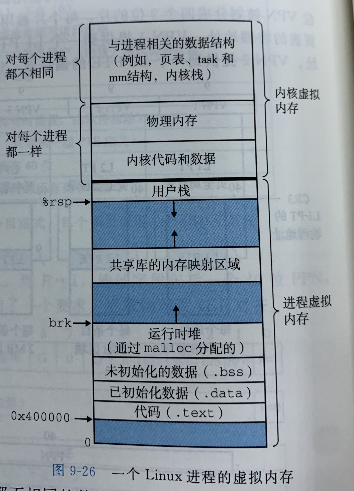
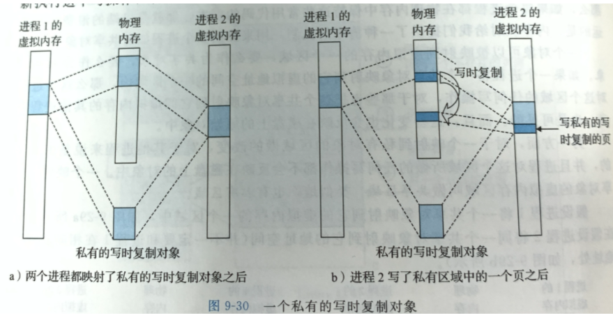
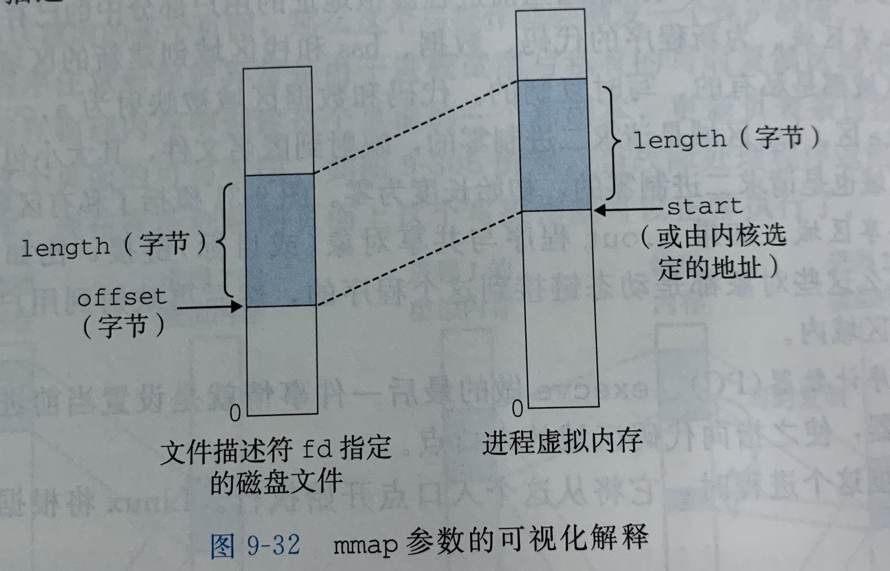
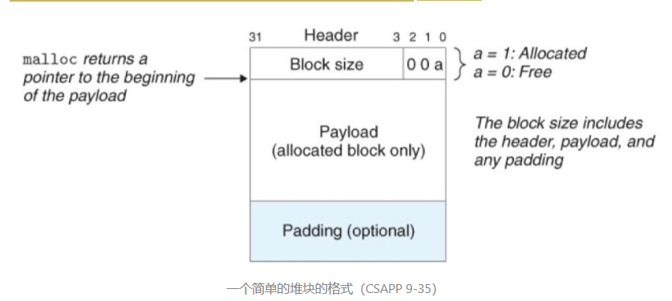
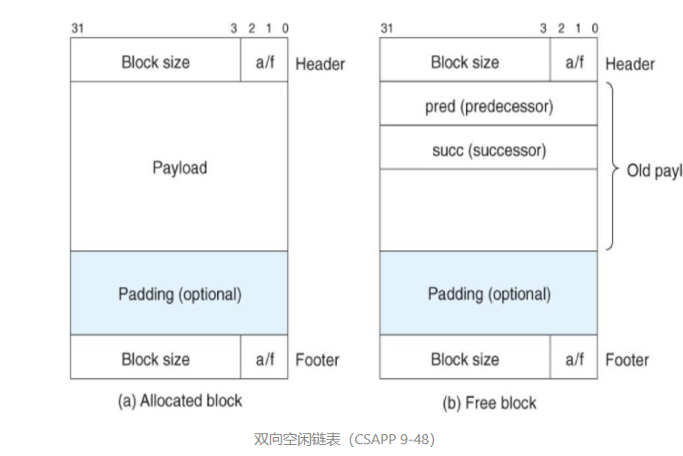

# 虚拟内存

**虚拟内存**

为了更有效的管理内存并减少出错，现代操作系统提出了一种对主存的抽象概念，叫做虚拟内存(VM)。它为每个进程提供了一个大的、一致的、私有的地址空间。

虚拟内存提供了三个重要的能力：

+ 对主存来说：它将主存看做是一个存储在磁盘上的地址空间的高速缓存，在主存中只保存活动区域，并根据需要在主存和磁盘之间来回传送数据，通过这种方式，它有效的使用了内存.
+ 对每个进程来说：它为每个进程提供了一致的地址空间，从而简化了内存管理.
+ 它保护了每个进程的地址空间不被其他进程破坏.

**虚拟内存的作用**

虚拟内存的作用：

+ 作为缓存的工具：利用DRAM 缓存了来自更大的虚拟地址空间的页面
+ 作为内存管理的工具：它大大简化了内存管理，把虚拟地址空间分成固定的结构，从0x400000开始，分为代码，数据，堆...
+ 作为内存保护的工具：每个TPE(页表描述符)添加三个许可位作访问控制

**1.虚拟内存作为缓存工具**

页表：**页表是放在主存(DRAM)中**，我们通常使用术语SRAM缓存来表示位于CPU和主存之间的L1, L2, L3 高速缓存，用术语DRAM缓存来表示虚拟内存系统的缓存，它在主存中缓存虚拟页DRAM比SRAM要慢大约10倍，而磁盘要比DRAM慢大约10 000倍.

当我们中的许多人了解了虚拟内存的概念之后，第一印象是它的效率通常是非常低。因为不命中的处罚很大，我们担心页面调度会破坏程序性能。**实际上，虚拟内存工作得很好，这需要归功于我们的老朋友-局部性(locality)**
尽管在整个程序运行过程中**引用的不同页面的总数可能超出物理内存总的大小**，但局部性保证了在任意时刻，程序将趋向于一个较小的活动页面集合上工作，这个集合就做 工作集 或者 常驻集。
当然不是所有的程序都能展现良好的局部性。如果工作集的大小超过了物理内存的大小，那么程序将产生一种不幸的状态，叫做抖动(thrashing)，这时页面将不断的换进换出。

**2.虚拟内存作为内存管理工具**

一些早期的系统，例如DEC DPP-11/70，支持的是一个比物理内存更小的虚拟地址空间。然而，虚拟地址仍然是一个有用的机制，因为它大大简化了内存管理，并提供了一种自然的保护内存的方法。

按需页面调度和独立的地址空间的结合，对操作系统中内存的使用和管理产生了深远的影响：

- 简化链接。这样每个进程都要类似的内存格式，例如代码段总是从0x400000开始，数据段跟在代码段之后，中间有一段符合要去的对齐空白，栈占据用户进程地址空间的最高部分，并向下生长。这样的一致性极大的简化了链接器的设计与实现，允许链接器生成完全链接的可执行文件

- 简化加载。Linux加载器需要为代码和数据段分配虚拟页，有趣的是，加载器不需要从磁盘到内存实际复制任何数据，在每个虚拟页第一次被引用时，虚拟内存系统会按照需要自动调入数据页。

- 简化共享。每个进程都必须调用相同的操作系统内核代码，而每个C程序都会调用C标准库中的程序，比如printf。操作系统通过将不同进程的虚拟页面映射到相同的物理页面，实现多个进程共享这部分代码的一个副本

- 简化内存分配。当用户调用malloc等时，操作系统只需在虚拟地址空间分配k个连续页面，而对应的物理页面不要求连续

**3.虚拟内存作为内存保护的工具**

地址翻译以一种自然的方式提供了更好的访问控制，因为每次地址转换时硬件都会读取一个PTE，可以在PTE上添加许可位来控制访问。例如SUP表示内核模式下才能访问该页，READ和WRITE表示对页面的读写访问.

**Linux虚拟内存系统**

图强调了一个进程虚拟地址空间中内核态的数据结构，例如内核为每个进程维护了一个数据结构task_struct，包含了运行该进程所需要的全部信息(包括PID、指向用户栈的指针、可执行文件名字、PC等)

**共享对象**

共享对象和私有共享都可以被映射到虚拟内存，进程对共享对象的任何操作，对其他进程都是可见的，而且，这些变化会放映到磁盘上的原始对象中.私有对象使用一种叫做**写时复制(copy-on-write)**的巧妙技术被映射到虚拟内存中。

只要没有进程试图写，就继续使用共享物理内存中的对象的一个副本；当试图写时会触发保护故障，这时会在物理内存中创建一个新副本，更新页表项指向这个新副本。

**内存分配方式**

1.使用mmap函数的用户及内存映射
`void *mmap(void *start, size_t length, int port, int flags, int fd, off_t offset)`

2.动态内存分配

动态内存分配器维护了一个进程的虚拟内存区域-堆，像malloc，java中的gc
动态内存分配的程序具有更好的移植性，以及避免预先开闭额外的空间(例如动态数组大小)

**动态内存分配实现**

隐式空闲链表O(n总块数)：任何实际的分配器都需要一些数据结构，允许它来区别块的边界，以及区别已分配块和空闲块。大多数分配器将这些信息嵌入块本身。通过头部中的大小字段隐含地连接着空闲块的结构称为`隐式空闲链表`.

一个块是由 32 位的`头部`、`有效载荷`，以及可能的一些额外的`填充`组成的。头部编码了这个块的大小，以及这个块是已分配还是空心啊的。头部后面是调用 malloc 请求的`有效载荷`。有效载荷后面是一片不使用的填充块，其大小可以是任意的，为了实现某些分配器策略，以对付外部碎片，或者用来满足对齐要求。

分配器可以通过遍历堆中`所有的块`，从而间接地遍历整个空闲块的集合。特点：`简单`，但`开销大`。

显示空闲链表O(空闲块块数)：在隐式空闲链表中，因为块分配与堆块的总数呈线性关系，所以对于通用的分配器，隐式空闲链表是不适合的。一种更好的方法是将空闲块组织为某种形式的显示数据结构，即采用`显示空闲链表`（explicit free lists），如堆可以组织成一个`双向空闲链表`。

使用双向链表使首次适配的分配时间从`块总数`的线性时间减少到了`空闲块`数量的线性时间。不过，释放一个块的时间可以是线性的，也可能是个常数，取决于空闲链表中块的排序策略。

一种方法是采用`后进先出`（LIFO）的顺序维护链表，将新释放的块放置在链表的开始处。在这种情况下，释放一个块可以在常数时间内完成。

另一种方法是按照`地址顺序`来维护链表，其中链表中每个块都小于它后继的地址。在这种情况下，释放一个块需要线性时间的搜索来定位合适的前驱。但是，在首次适配上这种方法比 LIFO 排序有更高的内存利用率。

**垃圾收集**

垃圾收集器（garbage collector）是一种动态内存分配器，它自动释放程序不再需要的已分配块。这些块成为`垃圾`（garbage）。自动回收堆存储的过程叫做`垃圾收集`（garbage collection）。