# 操作系统基础

**1.什么是OS**

操作系统（OS）：是计算机硬件和应用之间的一层**软件**。上层应用使用**OS提供的接口**来使用计算机硬件。

**2.打开操作系统**

计算机执行的过程就是：**取指执行。**

**因此要将OS从磁盘/硬盘中，读到内存中，这样才可以正常运行。**

开机之后，计算机执行的第一句指令：

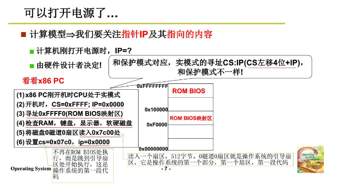

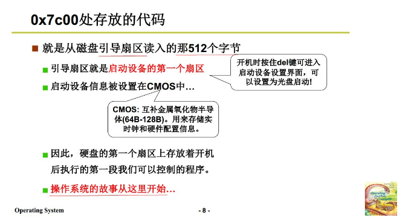

- 刚开始在FFFF0处，在BIOS区执行固定的程序。检查RAM，键盘显示器磁盘...
- **将0磁道0扇区的东西（操作系统的引导扇区，一个扇区512字节）读到0x7c00处**
- 跳到引导扇区执行启动程序。

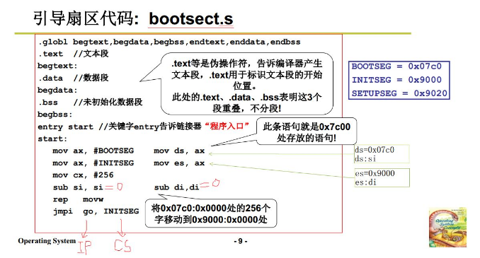

- 引导扇区代码bootsect.s，是汇编代码
- 地址都是段地址：偏移地址

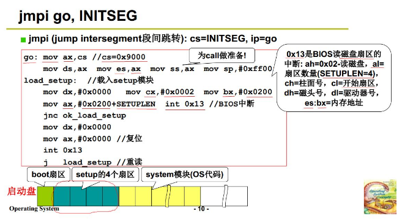

- **int 0x13是关键，BIOS开始读磁盘扇区的中断。**为setup读四个扇区，system模块继续读。

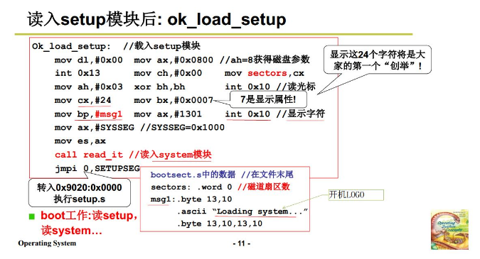

读了setup之后，进入ok_load_setup，**int 0x10是关键，BIOS中断，显示字符。**

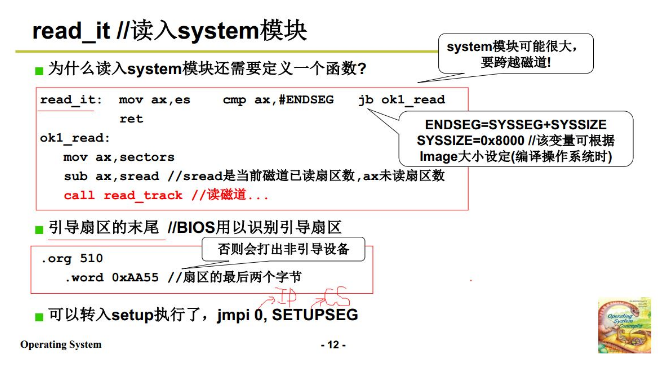

**3. 操作系统启动**

**将操作系统读入内存+完成初始化。**

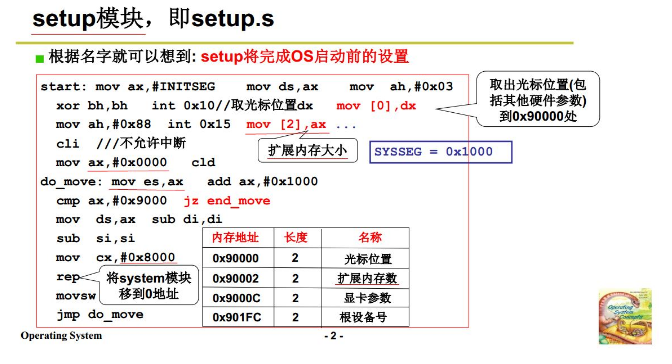

- int 0x15BIOS中断，**获得物理内存的大小，放在ax中，然后送到90002保存。**方便之后管理内存。
- 获得显卡参数、设备号等等信息，放在内存中，方便之后管理。
- **移动system模块到0位置。整个内存中，操作系统一直放在0地址处开始的位置**。

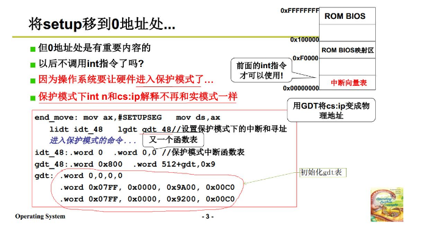

- 最后的gdt：xxxxx，**初始化gdt表。**

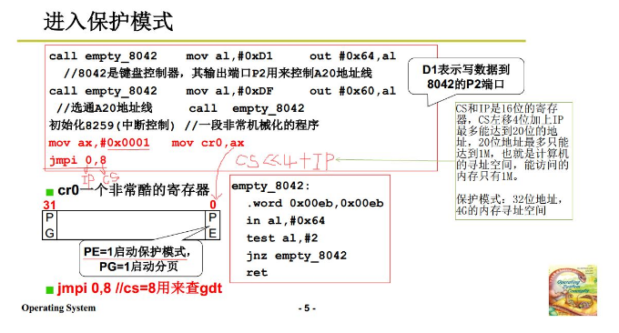

- setup最后执行一个jmpi 0,8，因为已经进入了保护模式，寻址方式进行改变，这个程序跳到零地址处，**即system模块。**
- 传统jmpi 0,8，即0给ip，8给cs，**偏移地址为cs左移4位+ip**，这样最多能表示20位，即1M的地址，太少了。需要改变寻址方式，切换到32位模式（保护模式），启动32位寻址模式（4G）。
- cr0最后一位如果为1，进入保护模式。

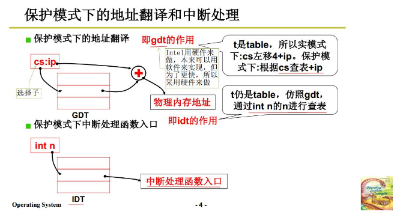

- **使用gdt得到地址。现在cs叫做选择子，存放的不再是地址，而是表中的下标，通过cs在表中（即gdt全局描述表）查找，再＋ip，得到地址。**
- gdt是**通过硬件实现的，速度很快。**
- 保护模式下的中断，也变为在IDT找，找中断处理函数的入口地址。

**system 模块**

system模块的第一部分的代码为head.s。

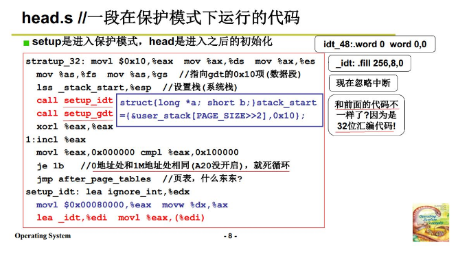

- head.s又做了许多事情，在保护模式下，与前面的16位汇编代码不同。

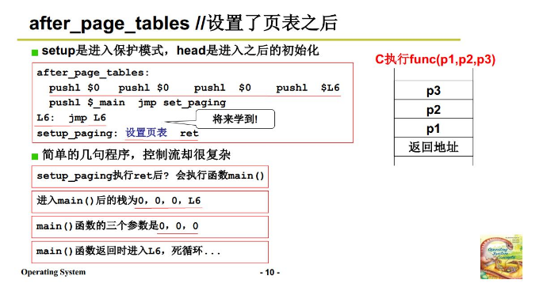

+ main永不停止，不会返回，main如果返回了，就进入L6，死循环。

+ main中执行各种初始化的函数。

**比如，mem_init执行内存初始化。**

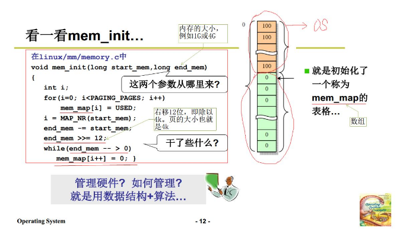

- 初始mem_map数组，每次解4k内存，4k作为一页。数组表格中保存哪些是内存是使用的，哪些没用。
- end_mem，即为总的内存，可以求出数组的尺寸大。

**4. 操作系统接口**

操作系统的接口：连接上层用户和操作系统软件，屏蔽了实现的细节。用户使用计算机：通过命令行、图形按钮、应用程序。**这是总体的使用，并不是真正的接口。**

**使用命令行的时候**：命令对应的是程序，编译完就是可执行文件，shell命令将可执行文件执行（申请CPU执行，使用一些函数）。

**图形按钮（鼠标点击、键盘按下）**：图形界面就是一个包括画图的C程序。**硬件系统实现一个消息队列，当鼠标/键盘点下之后，通过中断送入消息队列；应用程序要实现一个消息循环，getmessage，来拿出内部的这些消息，通过消息处理函数，完成该消息对应的功能。**

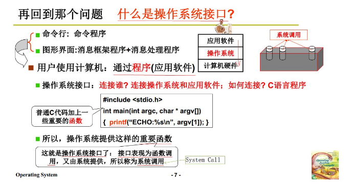

- **关键在于调用的重要函数，这就是操作系统的接口。**
- 称为**系统调用**。

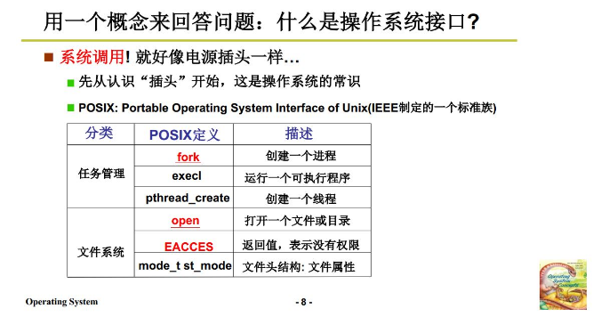

**5. 系统调用实现**

上层的函数，不能直接调用内核中的信息，不能直接jmp/mov，**需要使用系统调用提供的接口才可以进入到内核中，得到信息，这样更加安全。**

- 使用一种硬件设计，来将内核程序和用户程序进行隔离，**用户态和内核态。**
- DPL描述目标内存段的特权级，0表示是内核段。CPL描述当前的特权级。**当前特权级比目标更小（即当前特权更高），才可以访问。**

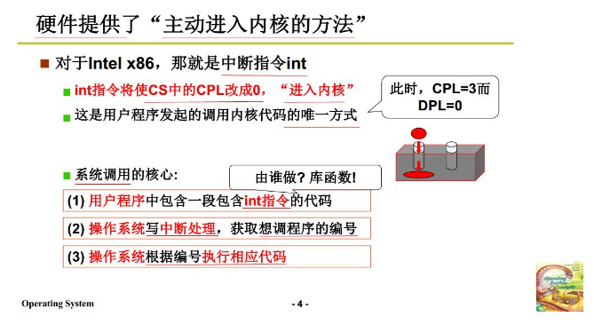

- 硬件提供了唯一的主动进入内核的方法，即中断。
- 系统调用的核心，**执行int 0x80指令，中断处理函数处理中断，根据该中断执行相应代码完成进入内核的操作。**

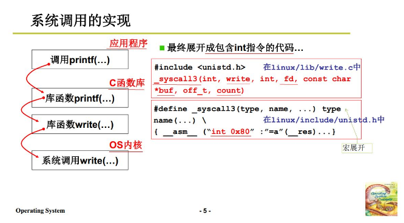

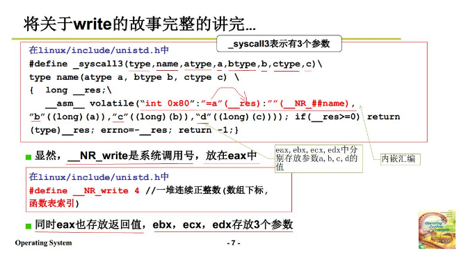

- 宏syscall3，展开汇编指令，把NR_write置给eax，**int 0x80调用中断**，进入内核。

**int 0x80：**

- 到IDT表中找到中断处理程序入口位置（使用system call函数），跳到那里执行，处理之后再回来。
- 会将DPL设为3，这样CPL=DPL，就可以进入内核了。

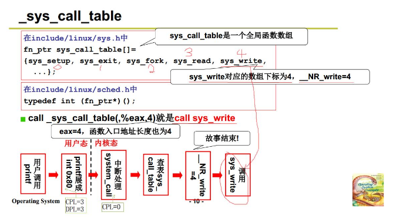

**6. 操作系统的历史**

- IBSYS监控系统（1955-1965）：批处理任务输入，然后输出.
- OS/360（1965-1980）：多道程序，多进程和进程管理.任务切换和调度为核心.
- MULTICS（1965-1980）：分时系统复用.核心任然是任务切换，充分利用系统资源，如虚拟内存.
- UNIX（1980-1990）：早期操作系统.
- Linux（1990-2000）：！！！

**7. 我们的任务**

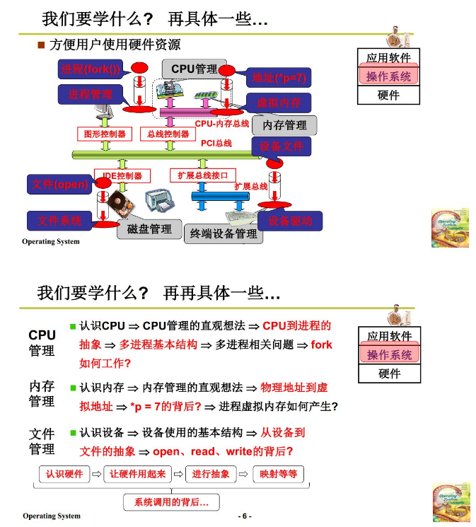