# 进程与线程

**1.CPU管理的直观想法**

- 自动取指执行。PC存放指令地址，取到地址，CPU执行指令，**PC会自动更改为下一个指令的地址。**
- 那么最简单的管理CPU方法，**设置好PC的初值即可。**
- 由于I/O指令比计算指令所需要的时间多得多，近似是10 ^ 6倍，**因此简单的设置PC初值，一个一个指令顺序执行，I/O执行的时间，CPU需要等待，因此效率非常低。**
- 让多道程序，交替执行，可以重复利用CPU，提高效率。**在一个CPU上交替执行多个程序，即并发。**

**CPU并发方式**

- 我们需要控制PC，在CPU等待的时候，切换到其他程序，等待结束还要可以切换回来。
- 同时切换回来的时候，**要恢复原来的执行状态（这些信息在切换出去的时候需要记录下来）**。

**进程**

进程是执行中的程序，记录程序运行的样子.进程会走走停停.进程需要记录寄存器，程序不需要.

**2. 多进程图像**

多进程图像：运行的程序就是进程，多个进程推进.	操作系统只需要将这些进程记录好，要按照合理的次序推进分配资源、进行调度.

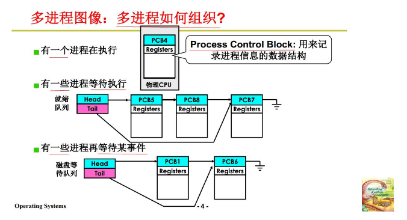

- 利用PCB这种数据结构来记录进程信息。

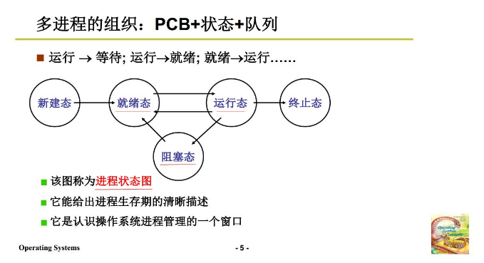

- 操作系统有序地维护这个进程状态图。
- PCB描述进程，队列中排队，状态表示进程的状态

**多进程的替换切换(队列操作+调度+切换)**

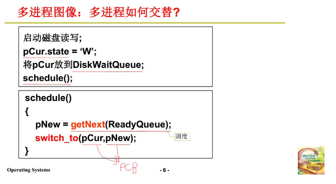

- **schedule()函数**：完成切换，从就绪队列中找到下一个进程（PCB），切换到下一个进程。
- **getNext()函数**：进行进程调度，即找到下一个进程。简单的方法有FIFO，引入优先级。
- **switch_to()函数**：进行切换，当前进程的一些信息保存到PCB，然后把下一个进程的PCB加载，就切换到下一个进程了。
- 多个进程可能会相互影响（因为都在内存中，可能会导致进程2直接访问了进程1的地址，导致进程1出错），因此可以限制对之前进程地址的读写，进行多进程的地址空间分离，进程之间地址互不影响，这是内存管理的主要内容。（虚拟内存）
- 多进程合作，核心在于进程同步（合理的推进顺序）。

**3. 用户级线程**

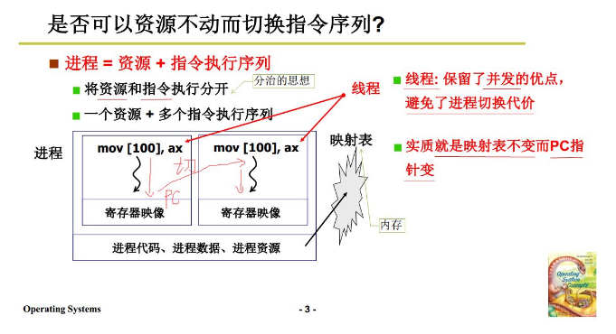

- 将资源和指令执行分开，**只需要切换PC，不需要切换内存中的映射表，则为线程。**
- 线程是有价值的，许多程序需要共享资源，因此不需要切换资源，使用线程即可。

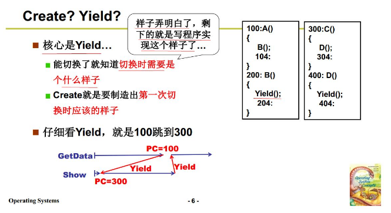

+ create创造第一次切换时的样子，yield进行切换（线程切换出去再切换回来）。

- 每个线程自己一个栈，只有yield可以切换栈。**TCB为线程控制块(Thread Control Block)与上面的PCB类似。**
- 204是在调用yield时候压栈的，**因此在yield结束的时候弹出204，因此不需要jmp 204，yield结束之后会弹出204，执行204的}，弹出104，返回到104，yield只需要切换栈即可。**按照原本的jmp，会多执行一次204。

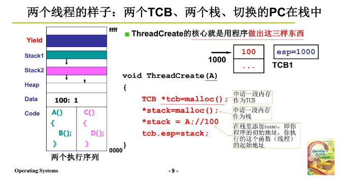

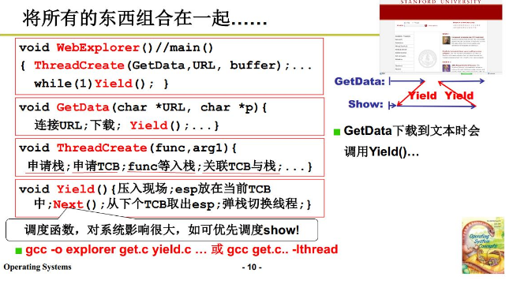

- yield都是用户级线程，只是在用户态切换，不进入内核。**如果某个线程需要使用硬件，那么需要经过内核，那么等待的时候，内核看不到该线程还有其他的线程一起运行，会直接切换到其他的进程。**这边应该执行的线程也会停止运行。
- 核心级线程schedule（内核级线程）可以进入内核，并发性更好。由操作系统完成，用户不可见。

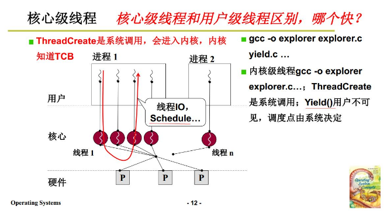

**4. 内核级线程**

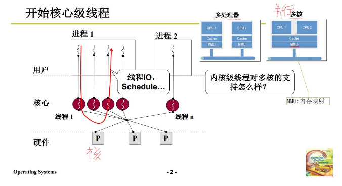

- 多处理器跟多核有区别，多处理器是每个处理器自己一套cache，MMU（相关映射），多核是多个CPU共用一套。
- **因此多核可以快速进行多内核级线程，因为共用MMU，不需要切换资源。注意只有内核级线程，OS才可以分配硬件，才能用到多核，核是OS管理的。**

- 两套栈，每个线程有一套栈（用户栈和内核栈）。
- 进入内核的时候（中断，进入内核），用到内核栈。

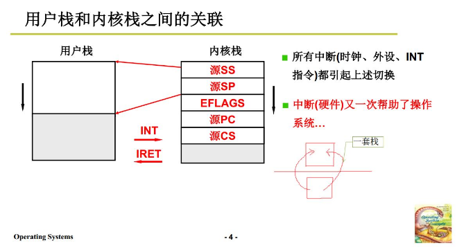

- INT中断，启用内核栈，通过指针与用户栈相连，内核栈存放用户栈当前执行到的位置，方便之后退回。
- **SS:SP即用户栈栈顶地址，CS:IP即用户程序开始的地址。**

进入内核之后：

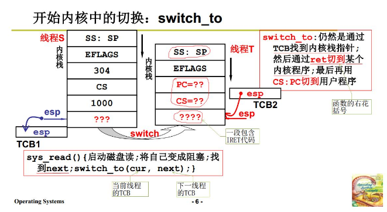

- 在内核中也会切换线程，switch_to。
- **比如S和T两个线程，首先进入S的内核（通过中断），需要切换时，在S的内核栈找到T的TCB，切换栈，到T的内核栈，使用iret中断返回指令，再切换到T的用户栈。**

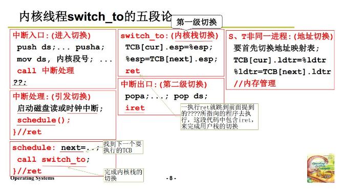

+ 如果是进程切换，还需要切换地址映射表（内存管理）。

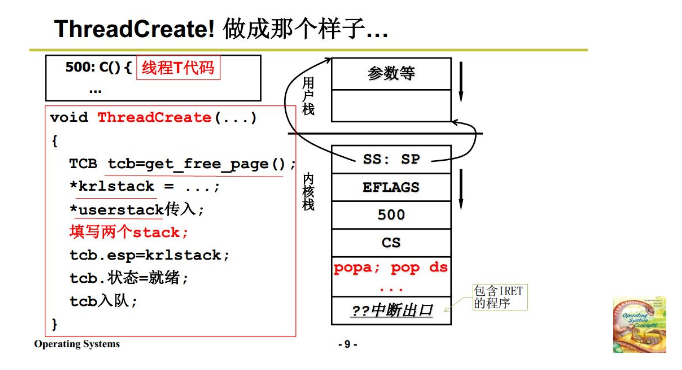

**5. 内核级线程实现**

核心是栈的切换。

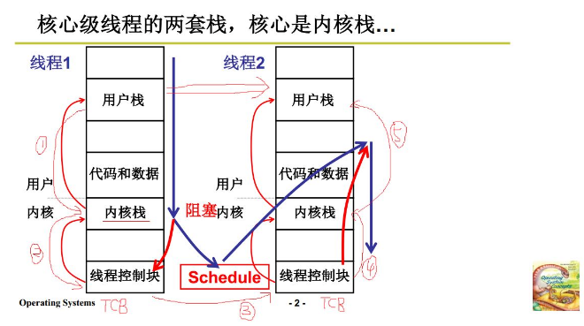

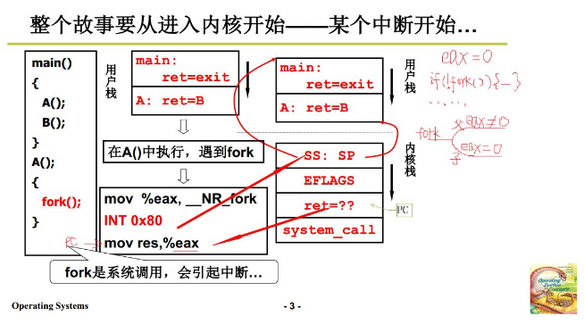

- fork系统调用，引起中断。在A中执行，遇到fork。
- 遇到 0x80，中断（找到当前内核栈，将SS,SP送入内核栈，然后执行system_call）

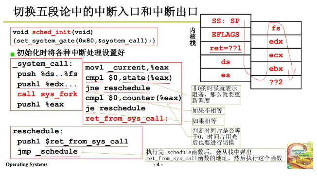

- 将用户态的现场情况，保存到内核栈中。
- 内核态中执行sys_fork，即中断函数的功能。
- **在中断函数执行过程中，发现可能需要等待，则就需要进行切换。**
- 即cmp比较，**状态state如果不为0，说明该线程阻塞，则schedule切换到其他线程。**
- cmp比较，counter不为0，则时间片用光了，也需要调度切换。
- 结束之后，进行中断返回函数，从内核栈回到用户态。

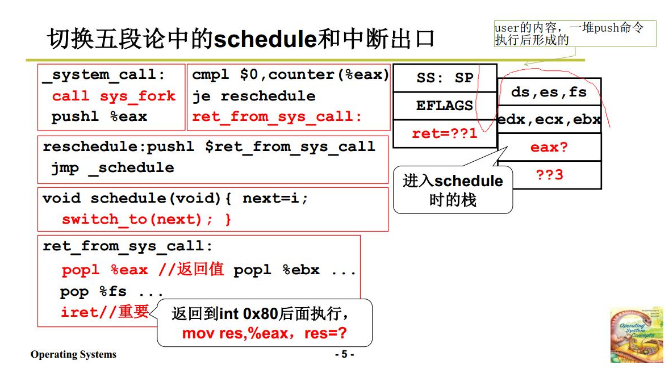

+ next即找到切换线程/进程的TCB，switch_to完成切换，next具体算法后面讲。

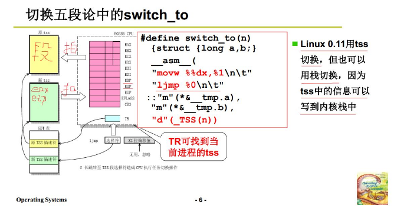

- 图里是基于TSS的切换，效率较慢；现在都使用内核栈的切换。
- tss是一个段，有描述符，因此也有选择子TR，用来找到这个段（TR找到描述子再找到段）。ljmp把新的段的的选择子给TR，因此找到新的tss。
- ljmp的解释：**把当前线程的现场保存到原tss中，找到新的段tssn，把新的tssn中的现场放到CPU中，继续tssn的线程的执行，就完成了切换。**
- ljmp的指令很慢，且不能流水，效率较低。

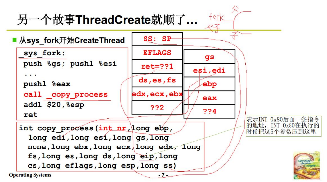

+ 创建线程，copy_process拷贝父进程，内核栈的内容，都作为该函数的参数传入。

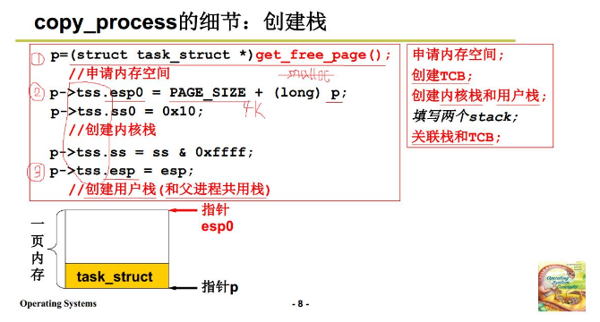

- get_free_page()，申请一页内存，**不能用malloc因为malloc是用户态的，这里是内核态。**
- 初始化tss，esp0内核栈，esp用户栈。

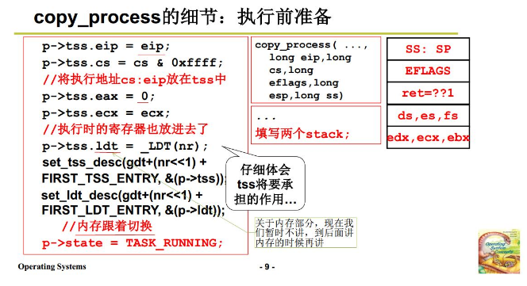

- 靠这个eax，eax=0，执行子进程，eax！=0，执行父进程。

**6. CPU调度策略**

获得next的过程，调度之后获得next，然后switch_to。

FCFS算法： 先来先服务策略.

SJF算法： 短作业优先算法.让短作业向前提.这样可以缩短周转时间.

优先级调度：任务的优先级应该动态调整，避免某些任务始终无法执行.

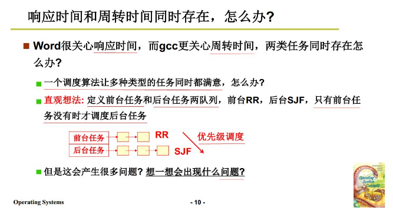

**7. 一个实际的schedule()函数**

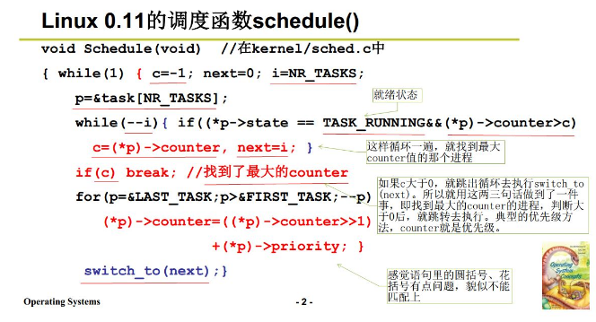

- while之后，找到最大的counter，每次找到counter最大的进程，跳去执行。
- counter既当做时间片轮转调度，又当做优先级调度。
- for循环，恢复时间片，且让使用了IO的那些进程的优先级增加。

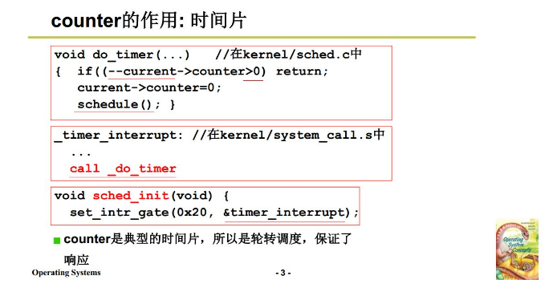

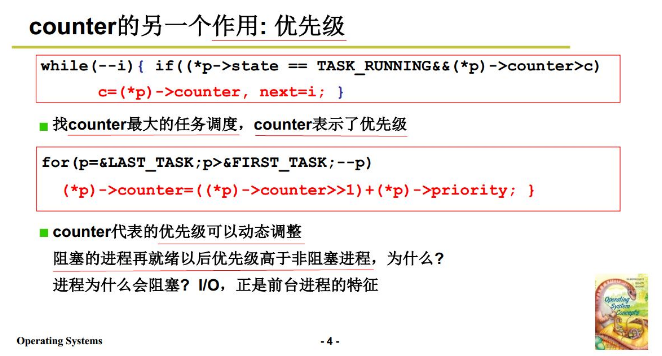

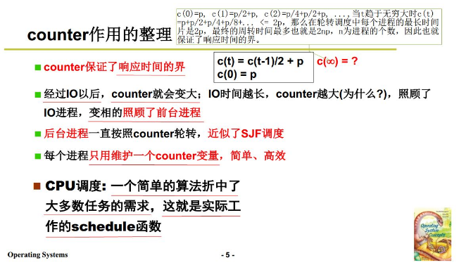

**8. 进程同步与信号量**

进程同步：靠信号量实现多个进程的合理有序推进.多个进程共同完成一个任务.

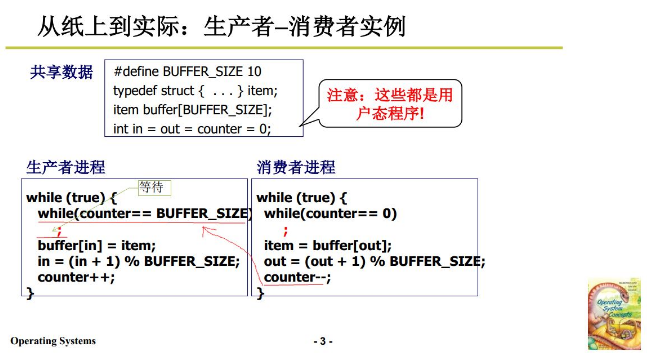

- 缓存区满了，不能继续生产了。又消费了一个，发送信号让生产者继续；
- 缓存区空了，不能消费了。又生产了一个，发送信号让消费者继续。

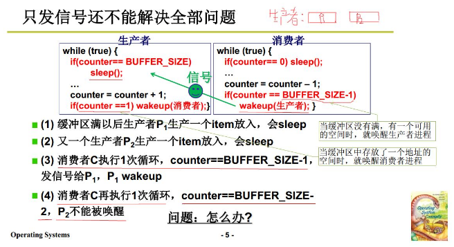

- 信号表达的信息太少了。
- 这里消费者只会发信号一次，把P1唤醒；P2不会被唤醒。
- 因为有两个生产者，需要使用另一种方式判断，不能只用counter，引入信号量。

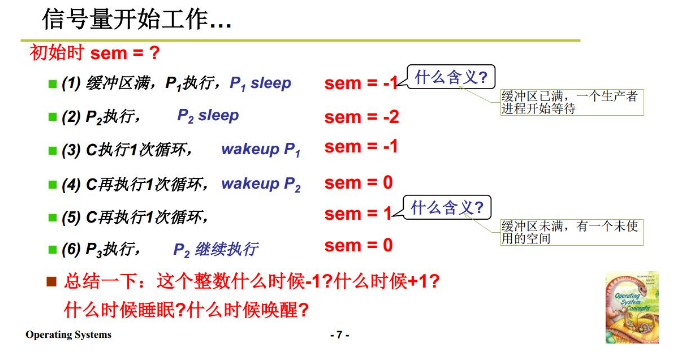

- 每睡眠一个，sem--
- 每唤醒一个，sem++
- 没有在睡眠的时候，C正常执行（消费者消费），sem++
- P生产者正常执行，sem--
- **sem信号量可以表示空闲的剩余缓冲区数，生产者执行，导致sem--，如果sem<=0，则sleep；消费者执行，sem++，如果此时sem<0，则唤醒P。**

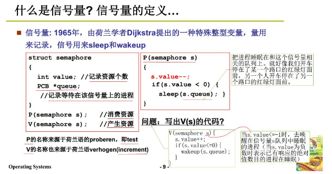

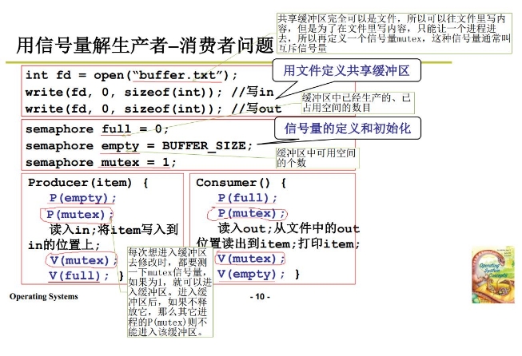

**9. 信号量临界区保护**

共同修改信号量可能会引发问题.

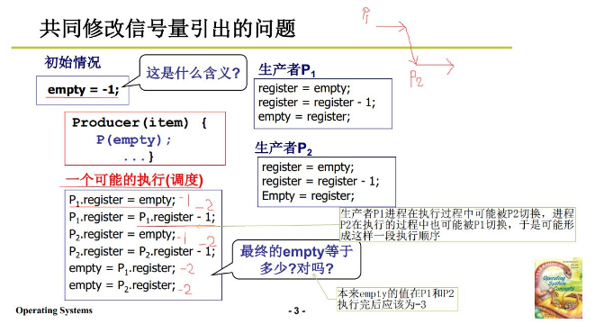

- 由于时间片调度的顺序问题，共同修改可能会导致共享的信号量出现错误。
- 调度顺序无法控制，因此需要对信号量进行保护。

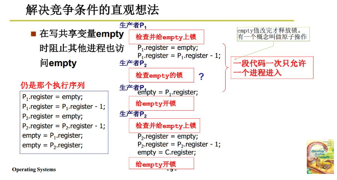

- 修改中途不会被竞争走，即一次只允许一个进程进入。
- 修改empty的代码，一次只有一个进程能进入。即临界区。

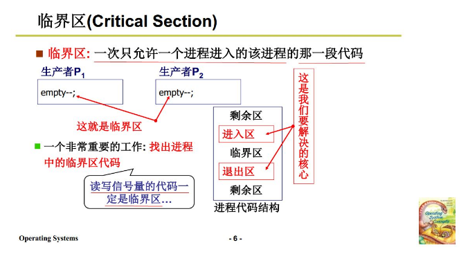

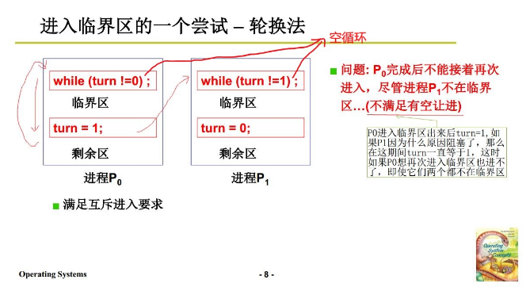

- 轮换法，互相轮换，即使轮到这个进程的时候，这个进程不需要进入，则空转。

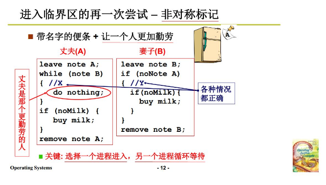

- 让一个人更加勤劳.

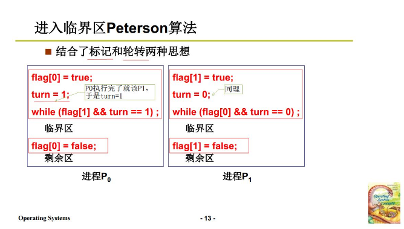

- 结合了标记和轮转的两种思想

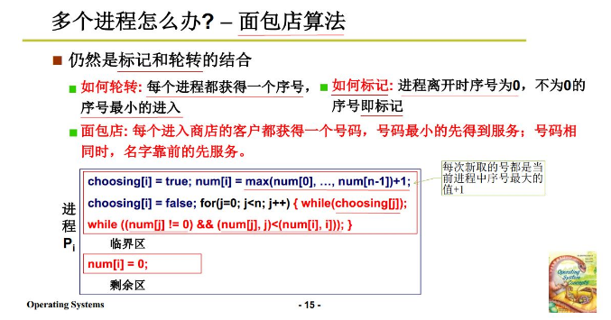

- 多个进程，面包店算法：while中，让最小号的进入，进入之后，将这个号置为0。

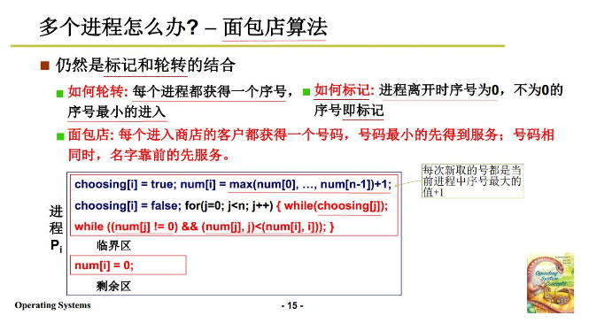

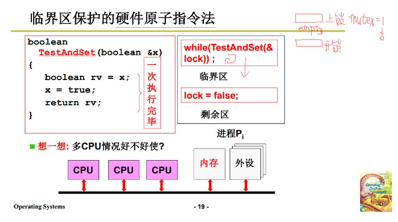

+ 对临界区进行上锁，即使用一个变量，但如果使用变量的话，**修改这个变量同时需要保护。**

+ 所以要使用硬件原子指令，这样就不会被打断。**通过硬件原子指令来修改这个整型变量，来进行上锁。修改变量的过程是硬件的，不会被打断。**

+ 多CPU同样适用。

**10 信号量的代码实现**

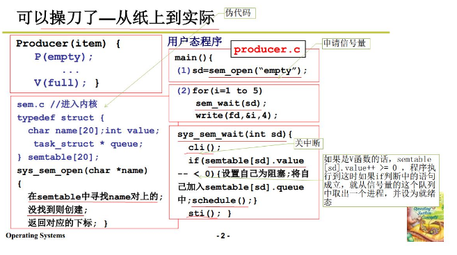

- cli和sti使用开关中断进行临界区保护。

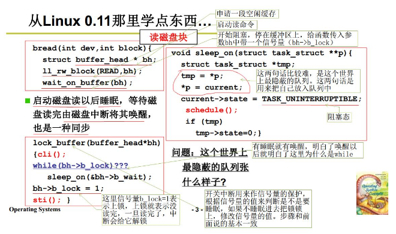

- 这里面使用while(信号量)来实现。
- 看sleep_on的原理，把自己放入队列中，然后把自己设为阻塞，然后调用schedule调度。

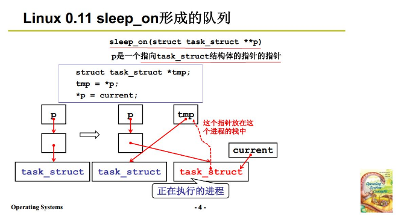

+ 当前进程的内核栈中可以找到tmp，tmp指向下一个进程的PCB，下一个进程的PCB可以从其内核栈中找到下一个tmp

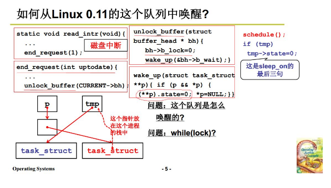

- 唤醒操作，把等待队列的第一个进程状态变为就绪态，继续执行剩下的语句，唤醒下一个进程，下一个进程同样完成上面的操作，唤醒下一个进程.
- **这种唤醒是把等待队列中所有进程都唤醒，因此使用的是while循环。**虽然唤醒了所有进程，但是还要挑选优先级高的先执行。

**11. 死锁处理**

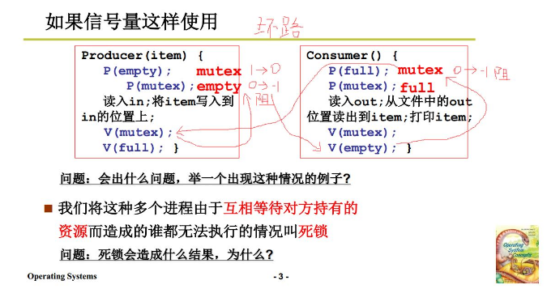

- 如果生产者和消费者的代码中，两个申请变量的命令顺序调换了、可能会导致死锁。
- **多个进程由于互相等待对方持有的资源而造成谁都无法执行的情况叫做死锁。**
- 死锁会导致这些进程无法工作，**那么多进程图像也无法正常进行，CPU利用率会很低，因为进程无法工作。**

普通PC机，直接忽略死锁，因为会经常开关机，死锁就消失了，且死锁出现的概率也不高。但是对长期不关机的服务器等设备，必须要处理死锁。

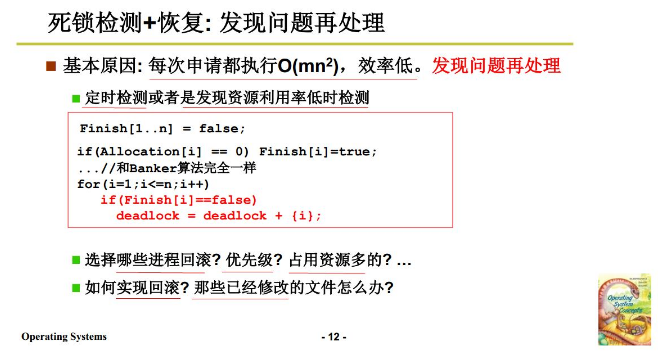

- 发现问题再处理。

- 选择某个进程回滚，然后使用银行家算法看是否可以。

  