# 内存管理

**1. 内存使用和分段**

内存使用：将程序存放到内存中，PC指向开始地址.

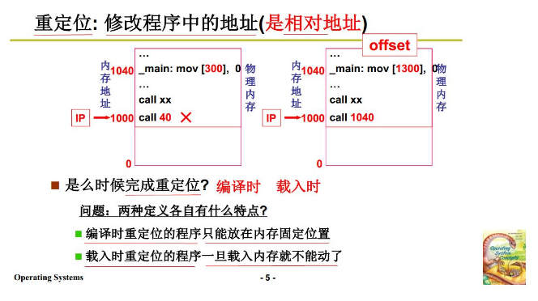

+ call 40 是相对地址(逻辑地址).物理地址应该是1040，IP+偏移量.
+ 重定位过程：找一段空闲内存，将程序放到这块，然后修改程序中的地址.

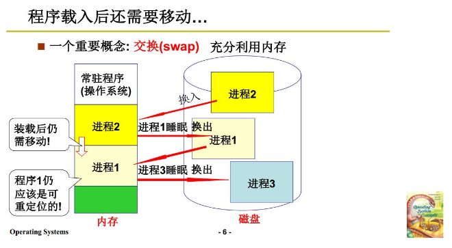

+ 阻塞的进程占着内存浪费，需要交换把它放到磁盘中，避免内存占用.
+ 所以运行时重定位更加好.

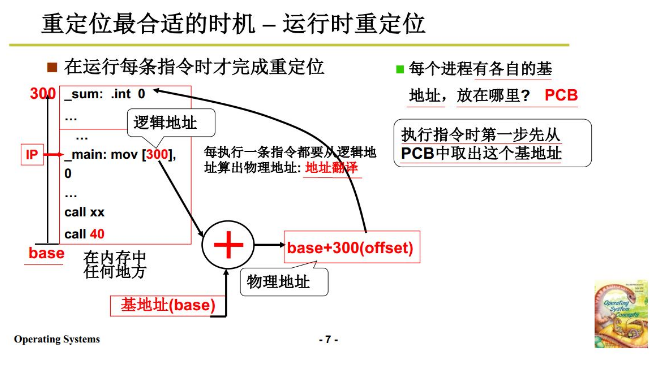

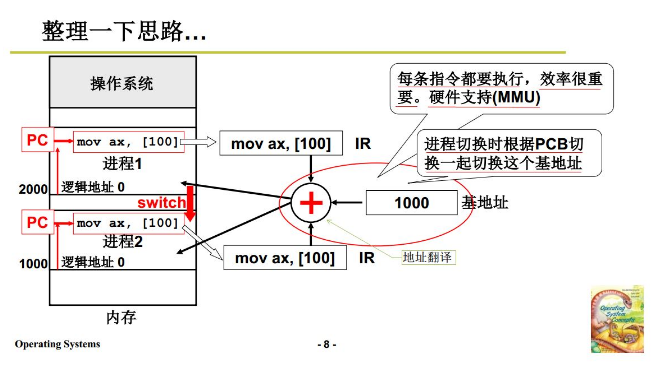

+ 执行的时候根据逻辑地址来算出物理地址：地址翻译.
+ PCB中保存了基地址的信息，进程进行切换时也需要切换.

整理：

+ 在内存中找到一个空闲的地方
+ 吧这块内存的基地址放到这个进程的PCB中
+ 每一条执行的指令进行地址翻译，找到实际的物理地址.
+ 进行进程切换之后，使用执行程序的PCB
+ 切换回来的时候，放在内存的另一块，要更新PCB中的基地址.
+ 这样继续进行的时候进行地址翻译，可以找到实际的物理地址.

引入分段：不是将整个存续一起放入内存中，要分段.

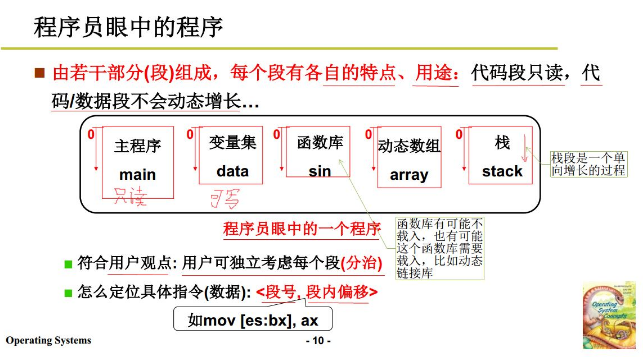

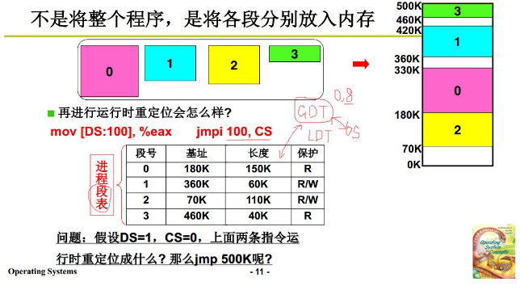

+ 每个段的基地址都不一样，需要保存.找指令物理地址的时候，从对应的基地址+偏移地址得到.
+ 类似与GDT+LDT，操作系统OS对应的进程段表就是GDT表，每个进程表就是LDT表.

**2. 内存分区和分页**

可变分区管理请求和分配：

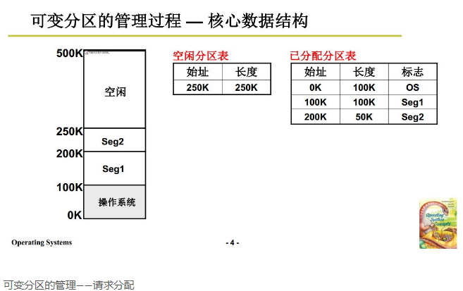

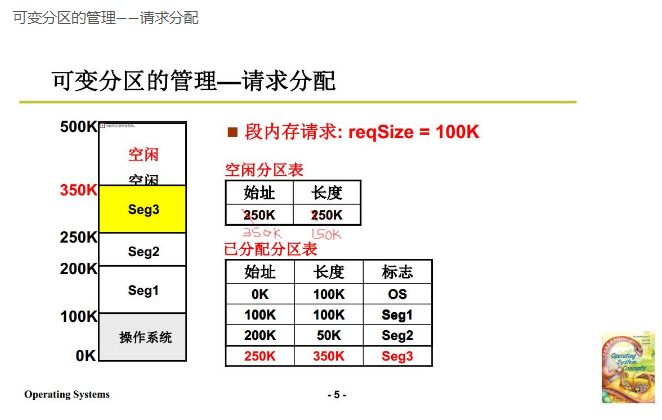

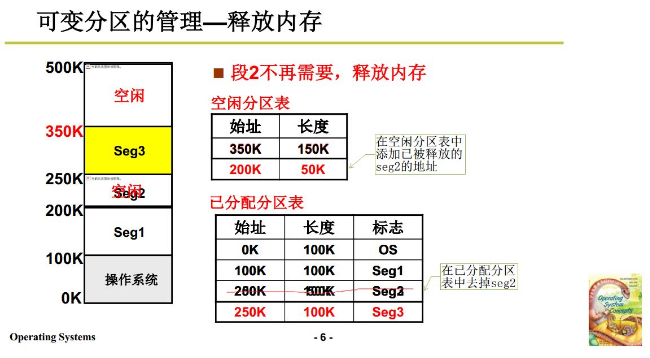

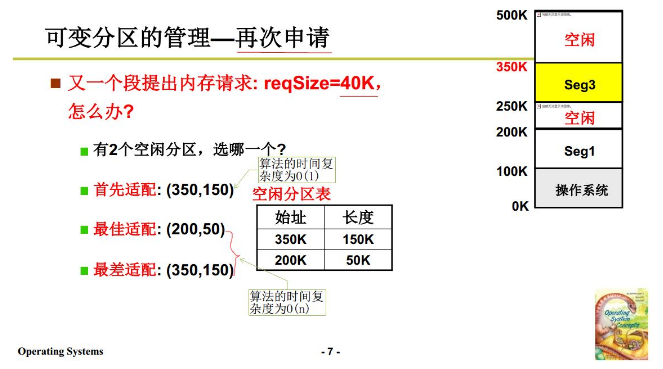

+ 最佳适配：每次都选择长度最接近的，最后会得到很多很细的空闲区 ,O(n)
+ 最差适配：每次选择长度最大的，最后得到的剩余分区会比较均匀，O(n)
+ 最先适配：选择最先找到的满足要求分区，O(1)

**上面的分割方式是对虚拟内存的管理，物理内存使用分页来管理**

引入分页：解决内存分区导致的内存效率问题。

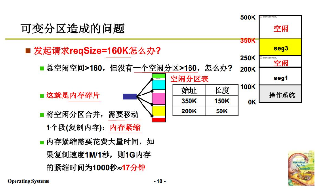

+ 会造成许多内存碎片，所以段必须连续存放，需要使用内存紧缩将空闲分区合并，花费大量时间.

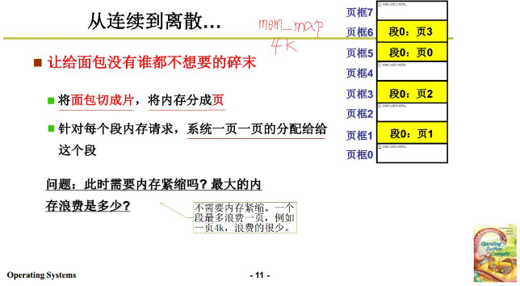

+ 将物理内存分为一页一夜的(mem_map,每4k分为一页)
+ 对端需要的内存向上取整，一页一页的分配给他，最多浪费内存不到一页.

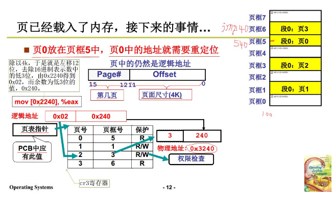

+ 需要对页表进行重定位，找到对应指令的物理地址完成地址翻译.
+ 使用MMU内存管理单元硬件来完成.

**3. 多级页表和快表**

为了提高内存空间利用率，页应该小，但是页小，页表就大.

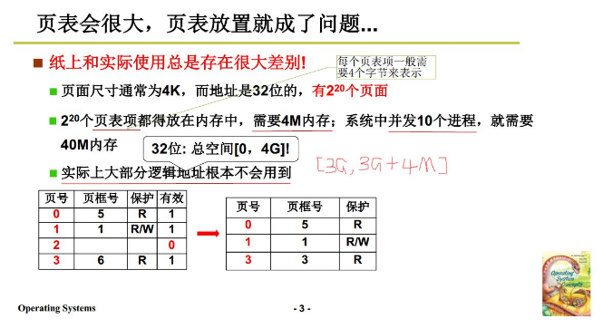

+ 如果页表不连续，查表不能直接找到位置，需要查找，速度慢.即使折半查找，也需要额外的运算量.
+ 所以页表必须连续，避免页表过大引入多级页表.

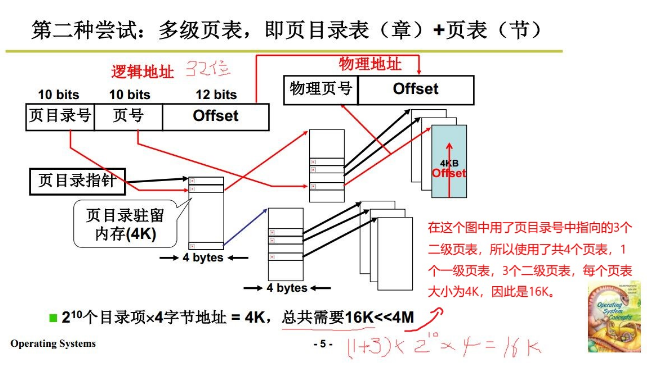

+ 页目录和页表都是连续的不需要进行查找，直接跳转.

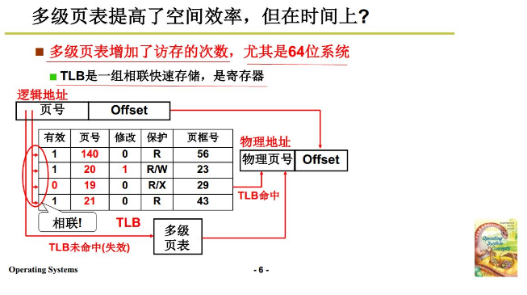

+ 多级页表增加了访存次数，每多增加一级页表，就多增加一次访存.
+ TLB快表，是寄存器，可以很快的找到最近使用的物理页号.
+ TLB没有命中再去多级页表查找，吧找到的结果放在TLB中.

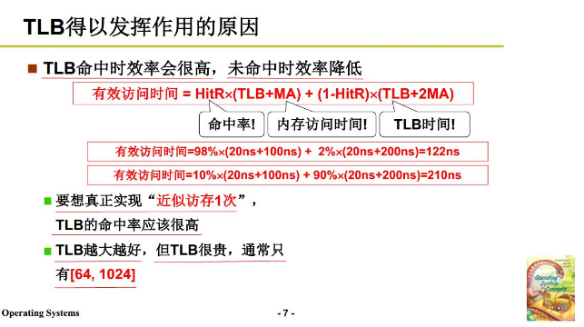

+ 程序地址访问具有局部性，一段时间访问的总在一定范围内，因此可以放在快表，这样效率很高，快表也不要很大.

**4. 段页结合的实际内存管理**

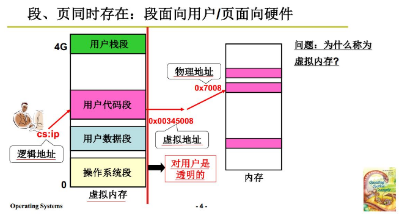

+ 段先映射到虚拟内存中的某个区域，虚拟内存不能直接使用，虚拟内存分割成页在映射到物理内存.这样就段和页结合了.

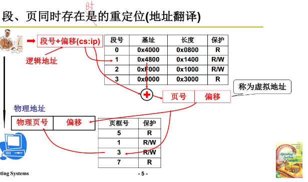

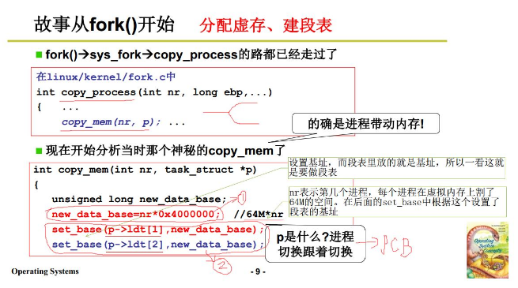

+ set_base设计基地址，做段表.把虚拟内存的基地址放到new_data_base
+ 完成了虚拟内存的分割，然后对段表填写.

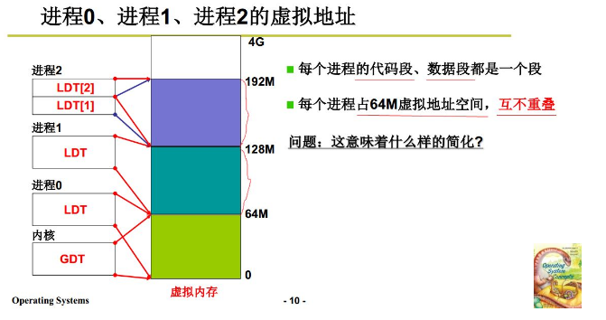

+ 共享一个页表的话，各进程不重叠
+ 现在大多数是每个进程有自己的页表.

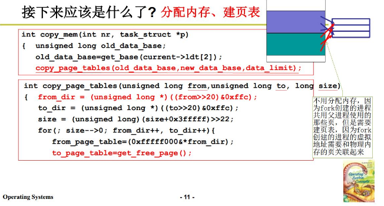

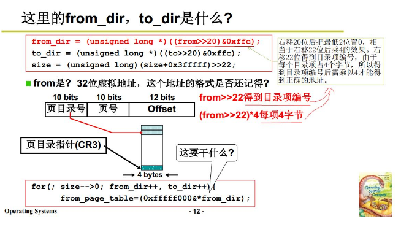

+ 右移22位乘4，则位右移4位，找到页目录指针.
+ to_dir是子进程的页目录，分配给它一个物理内存页，建立新的页，映射过去.

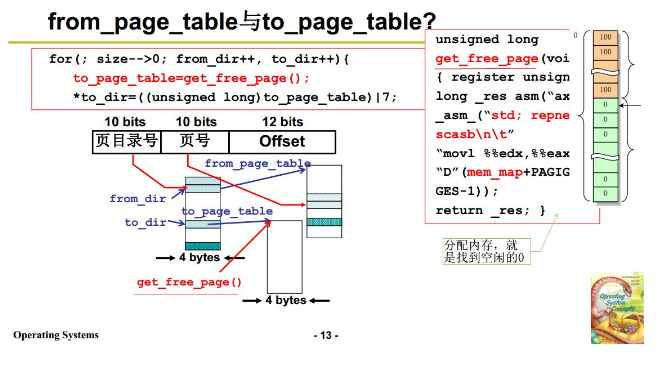

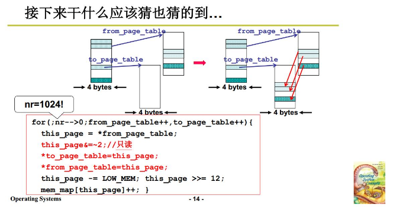

+ 接下来拷贝到子进程.

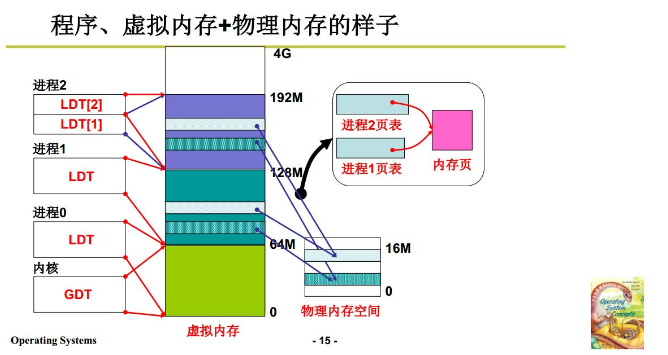

+ 程序使用内存.
+ 子进程执行时，找到的虚拟内存不同，映射到物理地址和父进程相同。
+ 父进程通过这段映射表实现地址的分离.

**5. 内存换入-请求调页**

段页同时存在的时候，要使用虚拟内存。将虚拟内存映射到物理内存，才完成了指令。

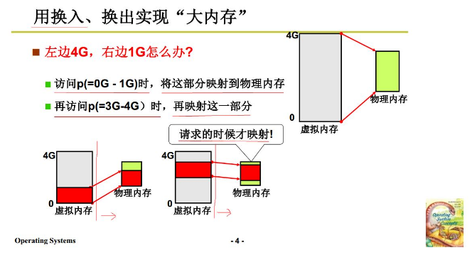

+ 如果虚拟内存大于实际的物理内存如4G：1G，那么就需要换入换出，来实现这个4G大的内存.先可以访问0-1G，映射到物理内存，再访问1-2G映射这一部分，这样就需要换入换出.

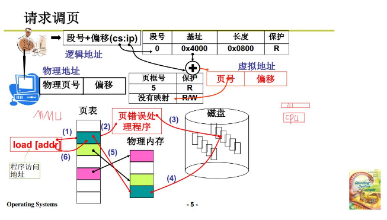

+ 对任意的虚拟地址，映射到物理页时，如果没有映射(即现在没在内存中，MMU查表得到)，那么请求换入(中断)，把这个页调入.
+ 整个换入过程对用户透明.

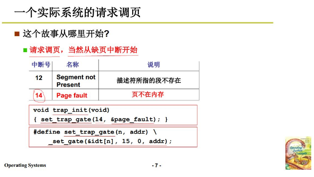

+ 14号中断是请求调页中断.在初始化的时候idt表中存放.

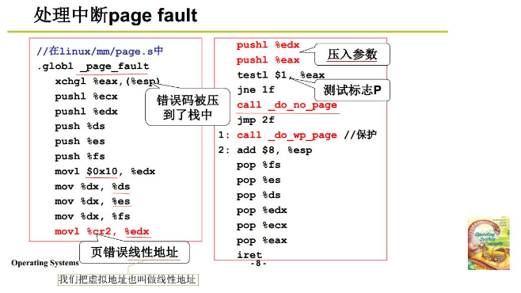

+ 页错误虚拟地址放在寄存器cr2中，压栈，作为后续调用C函数的参数.
+ do_no_page从磁盘中读进来这段虚拟地址放入内存.

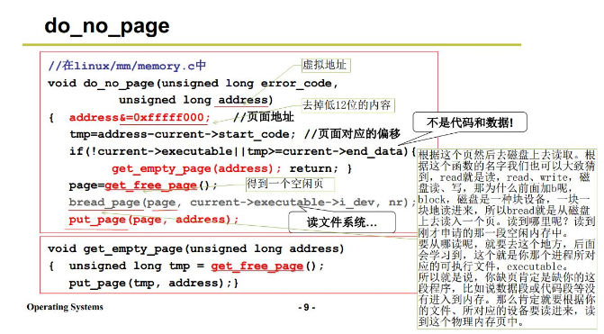

+ get_free_page得到物理空闲页
+ break_page从磁盘中读入这页
+ put_page把这个物理页与虚拟地址建立映射表

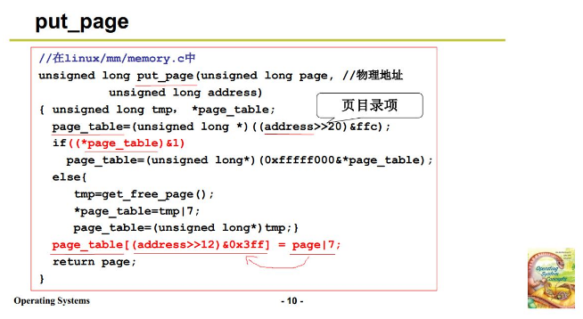

**6. 内存换出**

get_free_page不是总可以获得一个新的物理页，内存是优先的，需要选择一页淘汰，即换出.

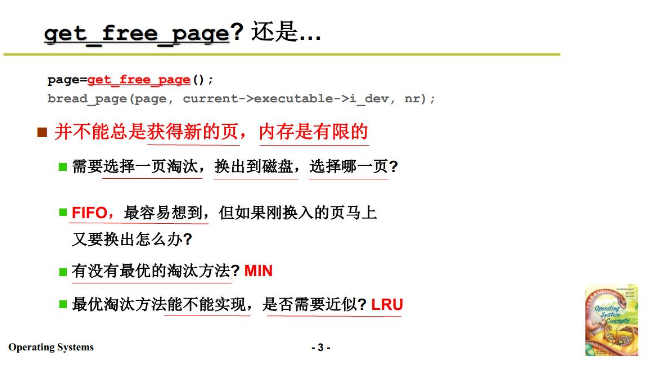

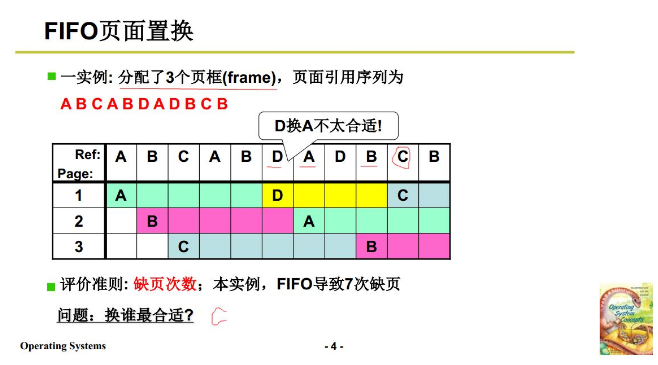

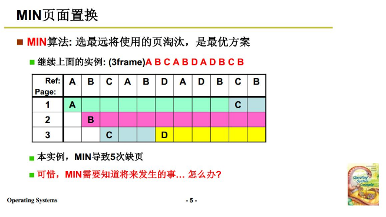

+ min算法虽然最优，但是需要知道将来发生的事，实际情况并不现实.

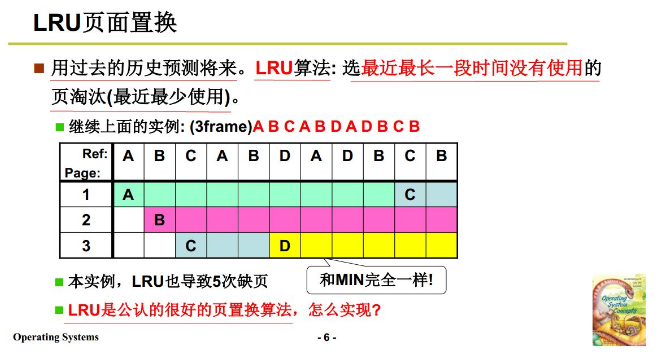

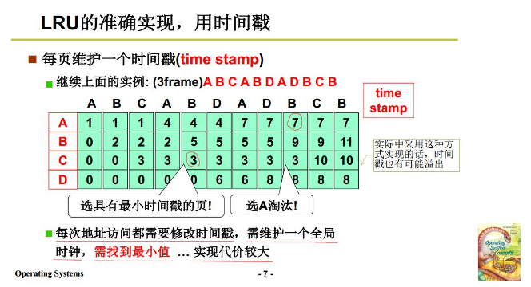

+ 选择时间戳最小的换出，时间戳最小表示最长时间没有使用
+ 算法代码编写简单，但放到实际操作系统困难，需要维护时间戳的表.

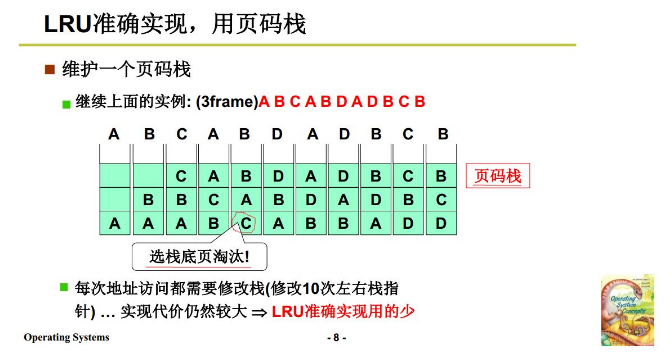

+ 每次将栈底的页淘汰.

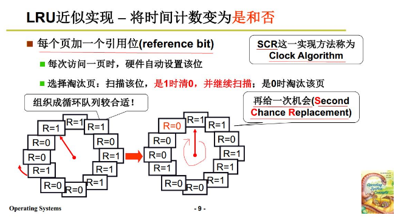

+ 访问过这一页就置为1，选择淘汰页的时候开始扫描如果为1置0相当于再来一次机会，如果为0则将其淘汰.

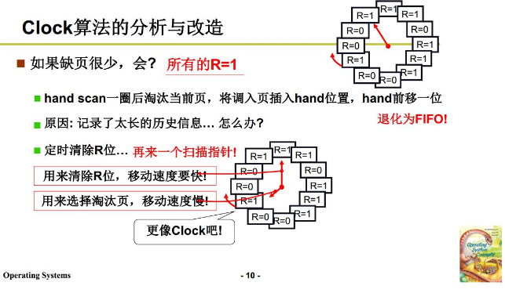

+ 两个指针，分针更快，定时清除R位，这样时针就更容易找到R=0的位置.
+ 没有记录更多的历史信息，提高效率.

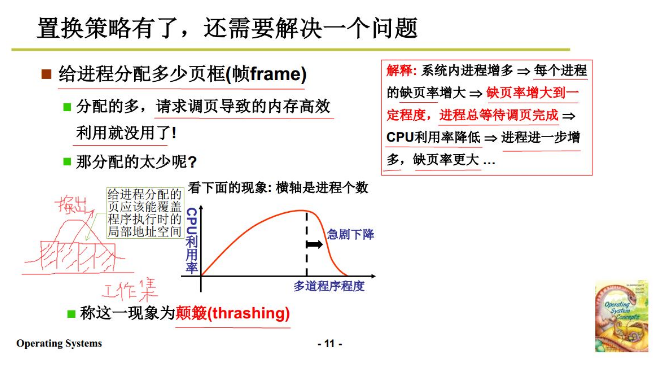

**内存管理的**

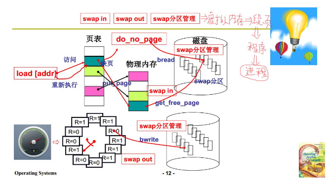