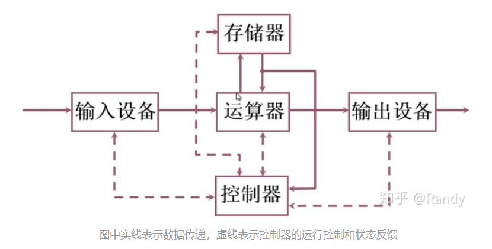
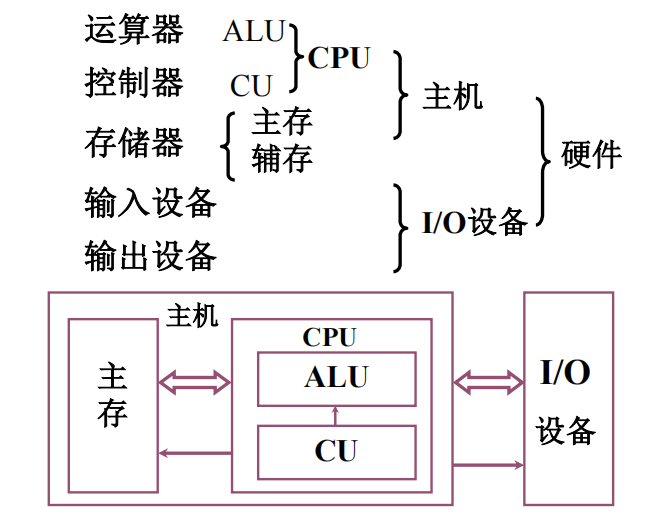
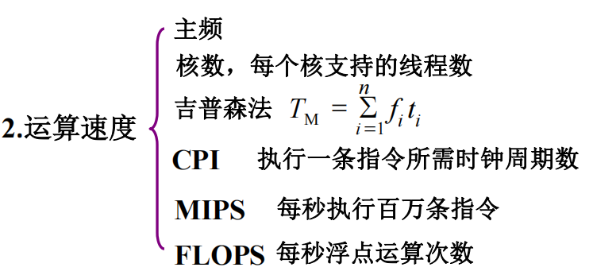
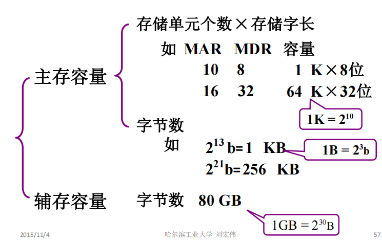

# 计算机系统简介

**1.冯诺依曼结构的硬件框图**

**冯诺依曼结构中计算机组成：**

+ **存储器：**存储程序指令和数据
+ **控制器：**控制程序指令的读取和执行
+ **运算器：**按指令对数据进行运算处理
+ **输入设备：**对接用户，输入程序指令和数据到存储器
+ **输出设备：**显示运算结果

**现代计算机硬件框图**

**2.计算机硬件的技术指标**

+ **机器字长：**机器字长指CPU一次能处理的数据位数，与CPU的寄存器位数有关（通常相等），我们常说的32位 64位CPU就是指机器字长.机器字长的大小会决定CPU的在执行某些指令时的效能，例如执行两个64位数据的加和操作，64位字长的CPU只需要一次累加操作就可完成，而8位字长的CPU就需要从低位到高位，8次累加操作才能得到答案.
+ **运算速度指标：**衡量运算速度有许多不同的衡量方法，因而产生了许多与运算速度相关的指标

+ **主频：**CPU时钟周期的频率，CPU的指令操作是在时钟信号控制下，每周期逐步完成的，因而主频在一定程度上能够反应CPU的运算速度.

+ **核心数：**CPU中每个核心都是能够独立执行某个程序/线程的处理器，高荷载下每个核心都能尽量保证自己的效率的稳定，但多核的优势也需要系统/程序进行对应的优化才能发挥作用，执行某些复杂的大型程序时，核心之间也需要相互配合才能完成工作，因而并不是多一个核心速度就能快一倍.

  主频与核心数只能说是硬件为了应对工作而进行的准备，因而并不能很好的反映实际的工作效率.

+ **基普森法：**是根据实际程序中每条指令的运行时间，相对于每条指令的出现频率进行加权平均，得到的计算机执行程序指令的平均时间，能够反应计算机硬件执行指令的快慢.

+ **CPI：**是执行一条指令需要的执行周期，同样是根据指令的出现频率，得到的加权平均指，能够反应计算机运行时，在离散的时钟周期下指令的执行效率.

+ **IPC：**是一个时钟周期下能够运行的最大指令数量，由于现代CPU采用**超标量体系**，可以在一个时钟周期内载入多条指令同时完成.

+ **IPS**是每秒能够完成的指令数量，**FLOPS：**是每秒能完成的的浮点运算次数

**3.存储容量**

存储器在计算机中分为**主存**和**辅存**

主存容量一般以，存储单元数量存储字长来表示，等于MAR长度*MDR长度.

**MDR：**主存数据寄存器，主存数据寄存器用来缓存从主存中读取的数据.

**MAR：**主存地址寄存器，主存地址寄存器用来读取主存时缓存地址.

计算机中的主存数据寄存器(MDR)，与主存地址寄存器(MAR)帮助完成CPU和主存储器之间的通信，MAR用来保存数据被传输到的位置的地址或者数据.

1024存储为理论值，实际厂家制造内存/硬盘时常以1000进制换算.