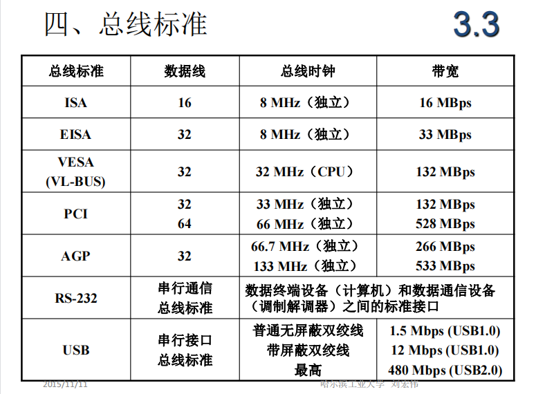
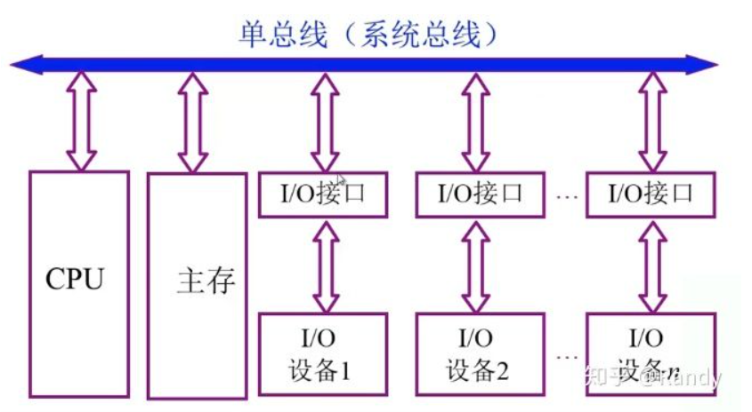
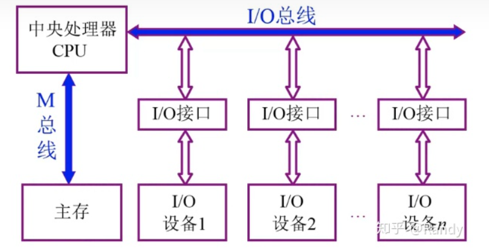
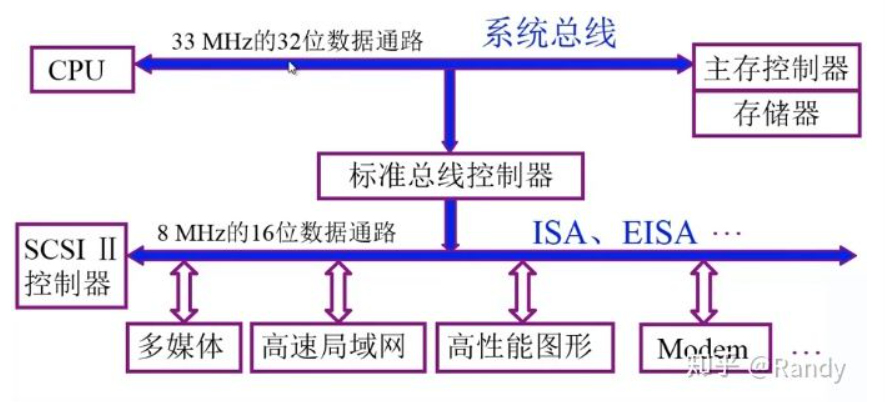
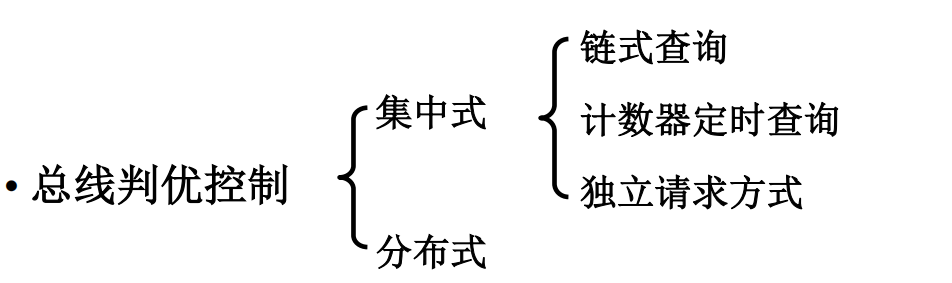
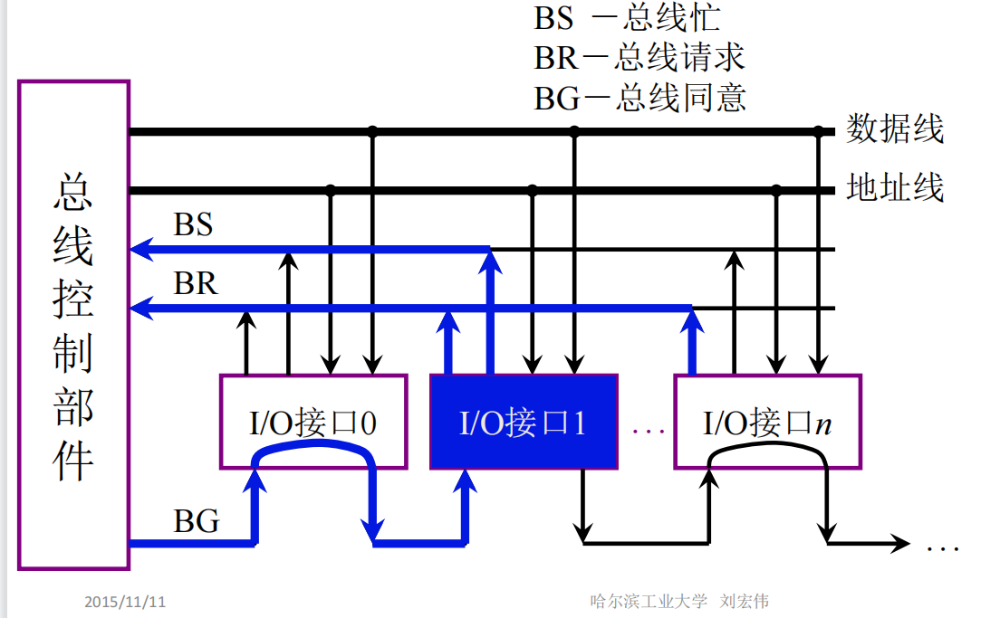
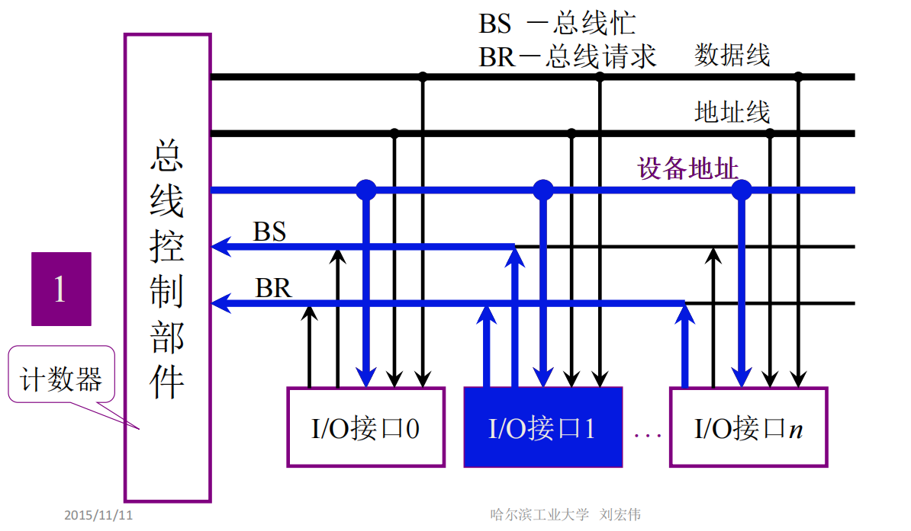
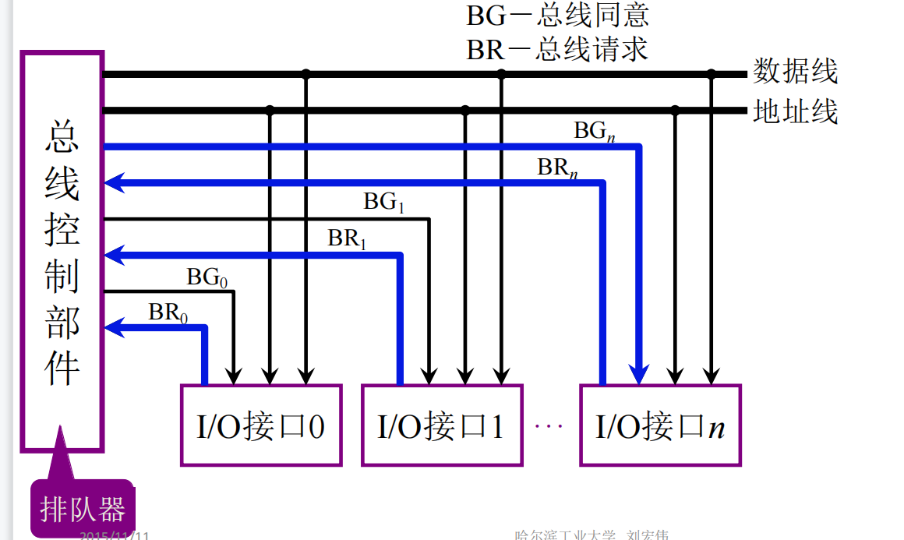
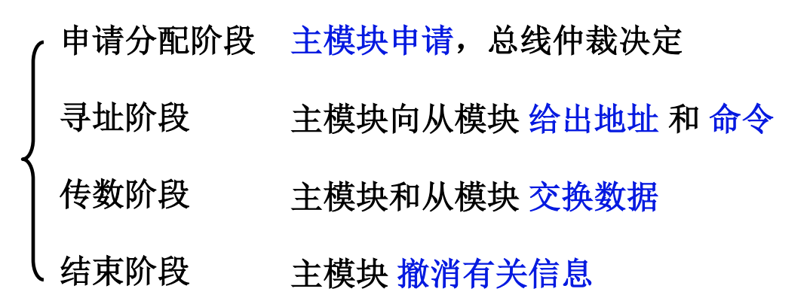
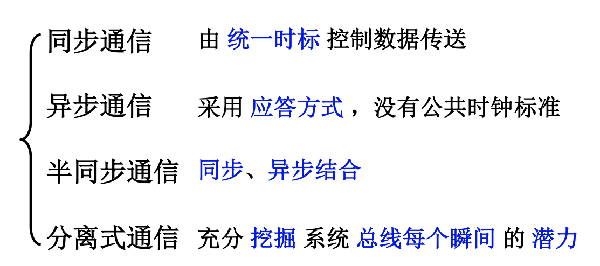

# 总线

**1.总线的基本概念**

将计算机各个部件**联接**起来，进行**信息的传输**交互才能发挥各部分的效能，构成计算机这个整体两两互联是联接的基本方式，但现代计算机的部件数量庞大，印刷电路板空间/制作工艺有限，于是将两两互联的线路扭合起来，形成公共的通路，每个部件只需接入公共通路就能和其它所有部件进行通信.

**总线（Bus）：**计算机各种功能部件之间传送信息的**公共通信干线**，是各个设备共享的传输介质，其本质是信号的公共传输线.

同一条总线上的同一时间只允一对设备进行相互通信.

**2.总线的数据传输方式**

总线进行数据传输有两种模式，一种是**串行传输**，另一种是**并行传输**.

**信道:**总线中能够传输一位二进制数据的通路.

串行传输只**使用一条信道**，逐位发送一串二进制数来传递数据.

并行传输则根据数据/变量的二进制组成，**使用多条信道**同时发送多位二进制数据.

**并行传输在短距下具有速度优势，串行传输在中长距下具有速度优势**.高速数据传输技术依托于传输频率上限不断提高，不受传输频率上限影响的串行传输成为高速数据传输的主流.计算机中数据传输，短距（板内，板间）以并行传输为主，长距（外设，计算机之间）以串行传输为主.

**3.总线的分类**

按照总线的位置可分为**片内总线**和**系统总线**

**片内总线：**芯片内部的总线，实现的是**单块芯片内部**各部件之间的传输通信.

**系统总线：**计算机**各个组成部件之间**的信息传输，实现**芯片与芯片之间**信息传输.

系统总线根据传输信息/信号类型的不同，又可分为**数据总线**，**地址总线**，**控制总线**

+ **数据总线：**双向的，其信道宽度与机器字长，存储字长有关.

+ **地址总线：**单向的，其信道宽度与存储地址长度，I/O地址长度有关.

+ **控制总线：**双向的，需要传输来自CPU的控制信号，来自设备的状态反馈，总线的使用许可，中断请求信息.

**通信总线：**计算机与计算机之间，计算机与其它设备进行**跨设备信息传输交换**的总线.

**4.总线特性及性能指标**

主板就是计算机中最大的总线，它提供了各个接口，让不同的部件能够连接在一起，从而构成整个计算机.

总线的性能指标：

+ **总线宽度：**数据线的根数.决定了总线能够同时传输的数据位数.

+ **标准传输率：**每秒传输的最大字节数.

+ **时钟同步/异步：**数据传输的收发是进行同步进行，还是非同步进行（异步为非同步的一种），以及使用怎样的时钟频率进行数据的收发.

+ **总线复用：**地址线和数据线的复用，复用性可以减少芯片的管脚数量，从而有利于芯片的封装.

+ **信号线数：**地址线，数据线，控制线的总和

+ **总线控制方式：**突发、自动、仲裁、逻辑、计数

+ **其他指标：**负载能力

**5.总线标准**

**6.总线结构（列举一些重点结构）**

**单总线结构：**就是**将所有设备都联接到一条总线上**，这种结构实现简单，扩展性强，但由于单总线**同一时间，只允许一对设备进行传输交互**，其它设备需要传输时就需要等待正在使用总线的设备释放总线，这种设计会导致系统中存在总线资源的抢占问题，容易成为系统的瓶颈.

例如当I/O设备与主存进行数据交换时，CPU就无法从主存中获取指令和数据，导致CPU停止运行大大影响效率.

**双总线结构：**以CPU为核心的系统结构中，以CPU中心发出两条总线，一条专用于与I/O设备传输数据，一条专用于与主存传输数据.

通过M总线这条专用总线，解决CPU与主存之间存在繁忙的数据交换，一定程度上提升了CPU的运行效率.但这样的结构依然存在问题，当主存与I/O设备之间需要传输数据时，就需要CPU作为中介才能完成数据传输，依然会打断CPU的运行

类似的还有三总线，四总线结构不做过多的介绍.

**现代计算机总线结构基础：**从主存发出两条总线，系统总线用于连接主存和其它部件（也包括CPU），存储总线专用于连接CPU.从而CPU能够与主存之间通过存储总线进行高速的信息交换，并通过系统总线完成其它部件之间的信息传输.

不过这种结构下，主存依然无法同时使用两条总线进行数据交换，现代的双口存储器依然需要使用**分时机制**来完成分别完成两条总线上的数据交换.（分时机制来达到复用的目的）

**实际计算机的总线设计：**

当下个人计算机使用的基本总线结构，系统总线连接CPU和主存，扩展出标准总线控制器，I/O总线，连接其它设备.

**7.总线控制**：当总线连接了多个设备时，由于**同一时间只允许一对设备使用总线进行相互通信**，因而设备在需要通信时会向总线发出**占用申请**，在得到占用许可后通过总线完成数据交换.

所以总线控制需要解决**判优控制**和**通信控制**问题

**判优控制：**当多个设备发送占用申请时，如何合理的分配总线资源.

+ **链式查询：**

  

  首先I/O设备从BR线向控制部件发送占用申请，之后控制部件通过BG线传输授权许可，**许可信号会链式寻访每个I/O设备**，轮询是否需要占用总线，当遇到需要占用总线的设备时，该设备**截取**控制权，BG线信息不再向后传输，获得控制权的设备通过BS线反馈通信信息，展开通信.

  链式寻访模式的一大优点是，我们会**按照优先级来布置BG线的寻访顺序**，优先级高的I/O设备可以接入靠前的接口，从而在同时发送占用申请时，能够被先轮询到，优先截取占用权

+ **计数器定时查询：**

  

  总线控制部件内部有一个**计数器**，当设备通过BR线向总线控制部件提出占用请求后，计数器下标会进行初始化，随后按一定方式进行递推，总线控制部件将根据计数器下标寻访对应的I/O设备

+ **独立请求模式：**相比前两种模式需要按一定顺序查找提出占用请求的设备，独立请求模式为每个I/O接口链接了专属的BR和BG线，从而可以进行独立的占用请求发送和应答

  

**通信控制：**使用总线完成通信时，如何保证数据传输的速度和准确性.

**四种通信控制模式：**

主要介绍一下分离式通信：充分提高了总线的有效占用.

1.各模块有权申请占用总线.

2.采用同步方式通信，不等对方回答.

3.各模块准备数据时，不占用总线.

4.总线被占用时，无空闲