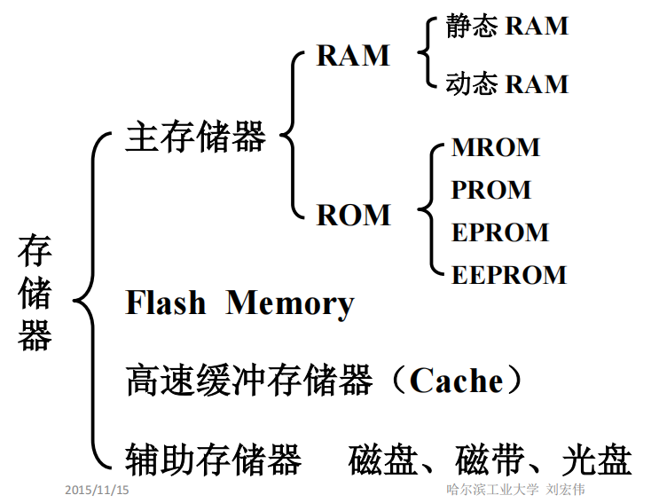
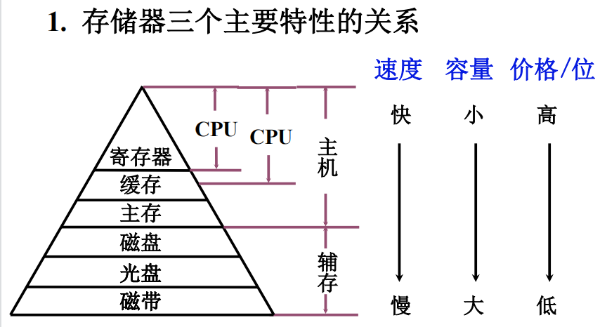
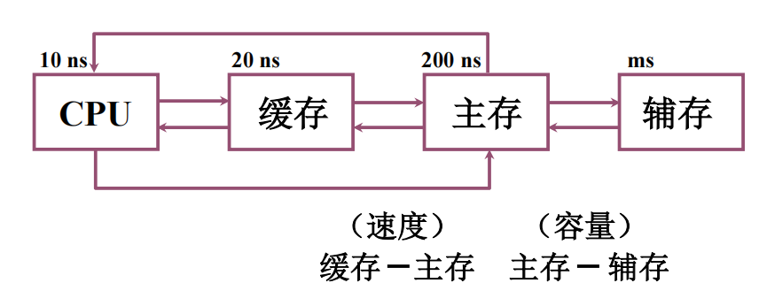

# 存储器

存储器是现代储存程序计算机中重要的组成部件之一，计算机运行时的程序指令，数据都保存在存储器中.

**存储器在计算机中的作用分类**

**主存储器**可分为RAM和ROM，易失性和非易失性，RAM容量小高速但断电后数据会丢失（内存），ROM容量大低速能在断电后保存数据（硬盘）.

**闪存**(Flash Memory)其实属于EEPROM(电擦除可编程只读存储器)，它的读取速度较ROM更快，可以进行反复擦写，并且能在断电后保存数据.**U盘**就属于闪存，一些高性能的微型计算机可能直接将闪存作为硬盘使用，就是所谓的**固态硬盘**.闪存不能像RAM那样以字节为单位改写数据，因而不能取代RAM

闪存也可以用做主辅存储器之间/寄存器主存之间的速度调剂，即**缓存**，我们可以在读取数据后提前预取附近位置的数据到缓存中，如果之后需要读取的数据恰好已经被保存到了缓存中，就可以直接读取缓存，称之为“**缓存命中**”.

**CPU寄存器和内存之间就会使用Cache高速缓存**，一些磁盘也会使用SSD阵列作为缓存提高读取速度.

辅助存储器是指光盘，磁盘，磁带一类外部低速存储器.

**2.存储器的结构层次**

**缓存-主存层次和主存-辅存结构层次**

由于主存容量有限，可能还需要主机外部可扩展的辅存来存储，因而主存---辅存之间会通过硬件接口和软件适配结合的方式，完成数据的传递交换，构成一个存储整体，称之为**虚拟存储器**

我们在进行程序编写时，看到的地址是对应虚拟存储器的**虚地址/逻辑地址**，在程序实际运行时，会通过一定的机制将虚地址转为真实的物理地址.

主存储器地址又称之为**物理地址/实地址**

接下来内容设计**RAM，ROM，存储器与CPU的链接，存储器的校验，高速缓存Cache，辅助存储器**主要设计芯片和数电知识有机会再学.