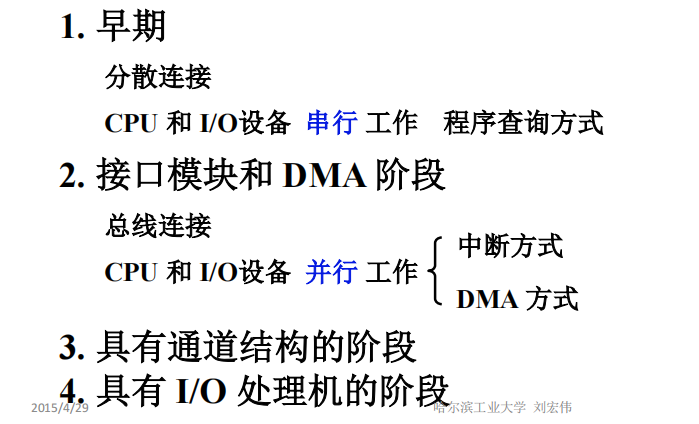
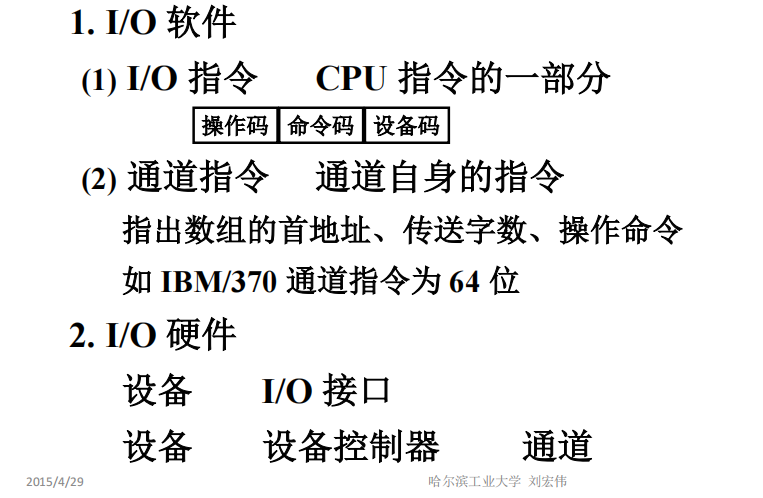
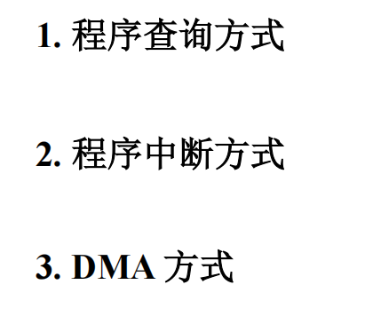
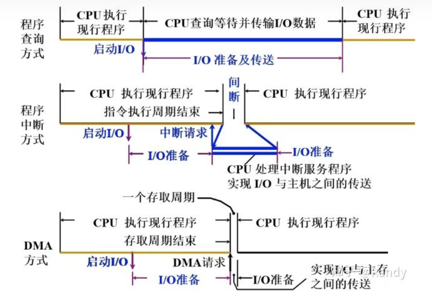
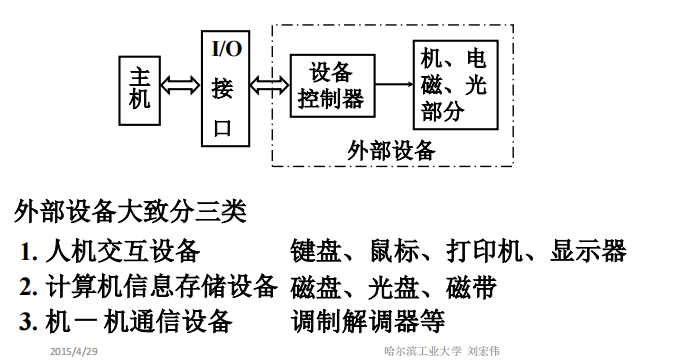
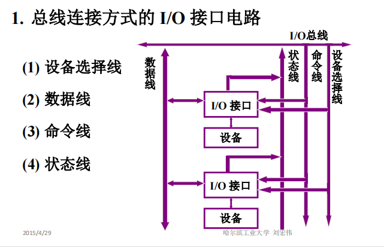
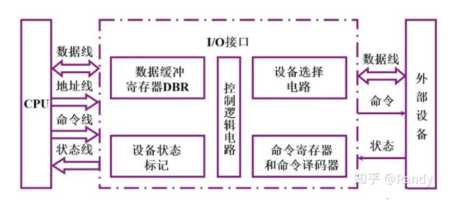
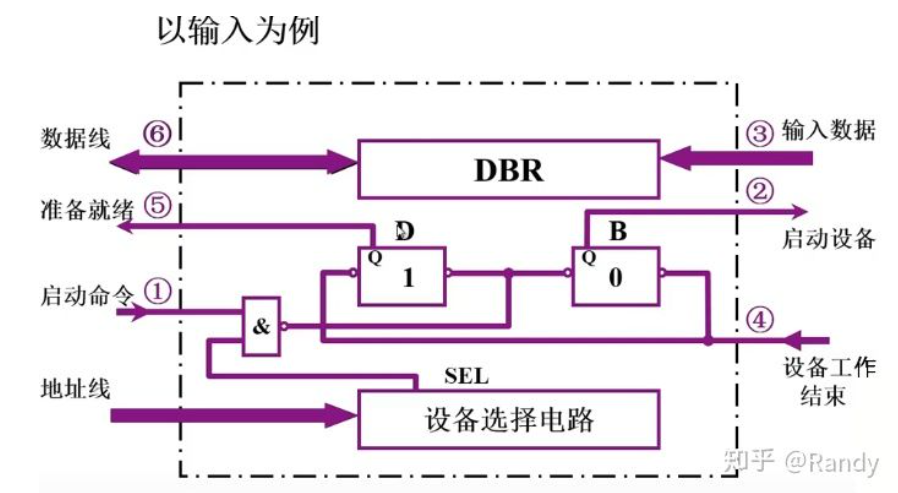
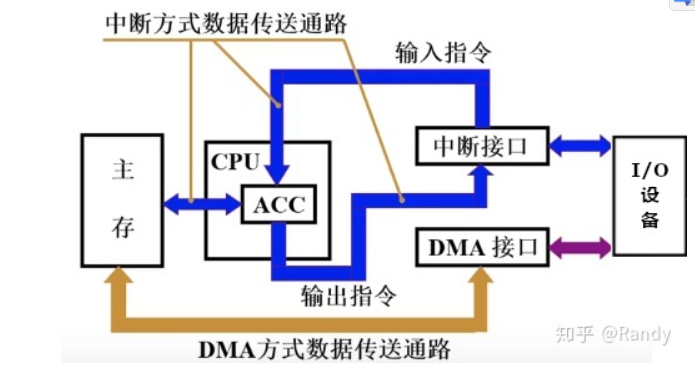
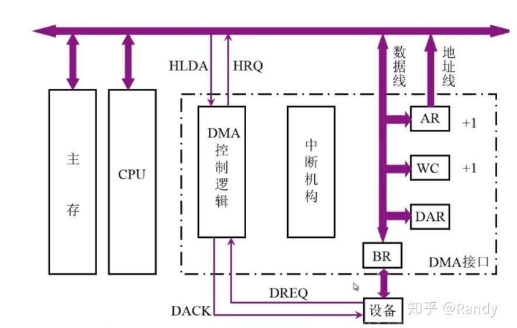

#  I/O 系统

I/O设备是能够被接入到计算机上运行的一切外部设备的总称，主要是为解决人机交互问题，为人类提供方便的输入设备，并将计算机的运算结果输出展示给人类.

**1发展历史**

1.早期阶段CPU与I/O设备**串行工作**，要求I/O设备运行输入输出时，CPU必须同步运行相应的程序.

2.计算机发展出现了**I/O接口，DMA控制器**，采用总线连接.CPU与I/O设备并行工作，出现了**中断**和**DMA**两种**传输控制方式**.

3.之后的发展中为了提高效率，使CPU与I/O设备真正独立并行，**逐渐将I/O设备的输入输出处理从主机中独立出来**，出现了具有**通道**结构的I/O接口.通道是具有专用运算处理器功能的DMA控制器，具有自己的指令集，能够独立运行通道程序，它可以对I/O设备的输入输出数据进行处理，控制连接在通道上的I/O设备直接与主机进行数据交换.

4.在通道之后，又出现了**I/O处理机**的理念，采用专用的微处理器连接控制I/O设备并完成数据处理

**2.I/O系统的组成**

**I/O软件**

分为**I/O指令**和**通道指令**

I/O指令是CPU指令的一部分，**程序员会将I/O指令编入应用程序**，从而在特定的时机接收I/O设备输入，或是将结果从I/O设备输出.

通道是具有小型处理器的DMA控制器，拥有自己的指令集，自己的控制器，可以独立运行通道程序，控制I/O设备与主机直接进行数据交互.

**I/O硬件**

包含**输入输出设备**和**接口**

通道模式下，设备通过硬件接口连接设备控制器，控制器连接子通道，子通道连接通道，按此顺序接入层次化通道结构进行工作

**4. I/O设备与主机信息传送的控制方式**

+ 程序查询方式：CPU在现行程序中遇到I/O设备读取命令时，向I/O设备发送读指令。在接到读指令后，I/O设备需要一定时间进行自身的准备工作，在此期间CPU会不断的查询I/O设备是否准备完成（**原地踏步等待**），直到I/O设备完成准备前CPU不进行任何其它工作.准备完成后I/O设备将状态触发器标识置为准备完成，CPU与I/O设备进行数据传输，先将数据读入CPU的寄存器中，再由CPU写入到内存中（**CPU一拖二**）

+ 程序中断方式：程序中断方式中将I/O设备的工作分为自身准备阶段和数据传输阶段.在CPU发出读/写命令后，I/O设备进入自身准备阶段时，CPU将继续执行其它工作（并行工作）.直到I/O设备准备完成，CPU将中断当前程序进程，跳转执行中断服务程序与I/O设备完成信息交换，之后再转回原来的程序进程.
+ DMA方式：当程序运行过程中出现I/O操作时，CPU向DMA控制器发送启动I/O的信号并继续执行其它工作I/O设备在DMA控制器的控制下完成准备工作，随后DMA控制器向CPU发送DMA请求.CPU接到请求后，会让出一个或数个存取周期，系统总线的占用权限，在此期间CPU不能使用系统总线，不能访问内存.DMA控制器在挪用的存取周期内，通过系统总线，控制I/O设备与主存完成信息交换.

**5. I/O设备**

**6. I/O接口**

接口其实是一个广义的概念，不仅用于程序和程序之间，更用于硬件和硬件之间，接口旨在制定一种控制/命令/传输的标准来统一不同的硬件/软件的实例.

对于I/O接口而言，即需要硬件制造上的接口标准，使外部设备能够接入计算机，又需要软件上的转换控制，使主机能够通过统一的指令来选择/启用外部设备进行工作，获取外部设备的工作状态.

**I/O接口的组成和功能**

接口的功能：

1.选址/设备选择功能，需要通过设备选择电路，对主机设备选择线上传递的I/O设备码/端口码进行判断匹配，控制I/O设备的启用与否

2.命令传送功能，需要命令寄存器、译码器，将主机命令线路发来的控制命令转换并向外部I/O设备的控制器传递命令

3.数据传输功能，需要数据缓冲寄存器，通过数据缓冲实现I/O设备与主机之间的传输速度匹配，主机与I/O之间通常使用并行传输，而I/O接口与设备之间通常使用串行传输，因此还需要实现 串 - 并 格式转换

4.反应设备的状态，需要各种触发器来记录和反应外部I/O设备的工作状态，主机通过I/O接口获取外部I/O设备的工作状态

5.实现电平转换，外部的I/O设备在接入主机后通过主机电源供电进行工作，主机中的电平与I/O设备所需的电平不一定相同，因此需要I/O接口在硬件上实现电平的转换

**I/O设备的连接电路**

**7.程序查询方式**

对于单个设备的程序查询，只需循环监测状态标记即可.对于多个设备则采取遍历的方式进行查询，直到查询到某个设备准备完成，遍历的顺序就是设备优先级的顺序

**程序查询方式的接口电路**

电路流程如下：

​	1.地址线/设备选择线路 上给出I/O设备的地址码/设备码，由I/O接口中的设备选择电路完成比对，输出选择信号并与启动信号过与门。选择设备并获得CPU启动指令的I/O接口，将完成状态触发器D置0，工作状态触发器B置1.

2. I/O设备控制器获得工作命令，响应工作状态/设备忙状态，开始准备数据

3. I/O设备准备好数据并传输到DBR数据缓存中，设备通过状态线向接口反馈工作结束信号

4. I/O接口获得设备工作结束信号后，完成状态触发器D置1，工作状态触发器B置0

5. CPU循环查询到完成状态触发器D置1，寻找时机开启数据交换

6. CPU通过数据总线从DBR中读取数据

**8.中断**

中断是一个广义的概念，是指CPU在运行程序的过程中，出现了某些特殊事件，CPU需要对当前程序运行的断点进行记录，并跳转执行中断服务程序.在程序中断控制方式中，CPU需要作为I/O设备向主机传递数据的处理器，所运行的中断服务程序便针对于此.当中断服务程序执行完成后，CPU会根据之前记录的程序断点，返回到原来执行的程序断点，继续向下运行原有程序.

**9. DMA方式**

DMA将CPU从数据传输处理器的角色中解放出来，进一步实现了外部设备数据传输的独立性.

**DMA和程序中断方式的数据通路对比**

DMA方式中I/O设备在DMA接口的控制下直接与主存进行数据交换.而程序中断方式中，CPU需要作为处理器，为I/O设备与主存间的信息交换服务.

**DMA组成和接口**

DMA接口所具有的功能如下：

1.向CPU提出总线占用申请

2.处理总线控制权的转交

3.获得控制权后，管理系统总线，控制数据传输

4.确定传输的首地址和长度，记录传输的字长并累加传输地址，保证传输的有序完成

5.传输结束时，给出操作完成信号移交总线控制权